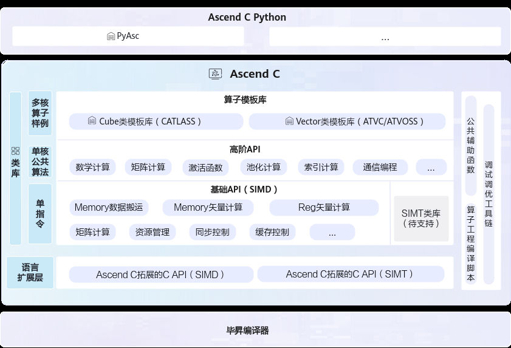
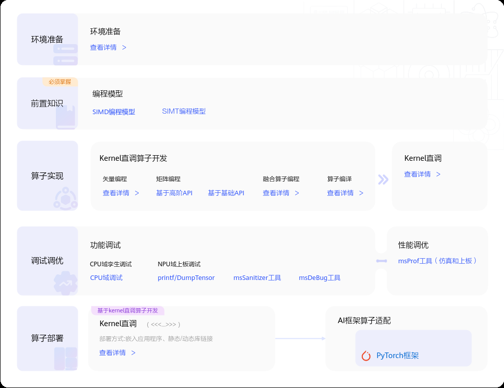
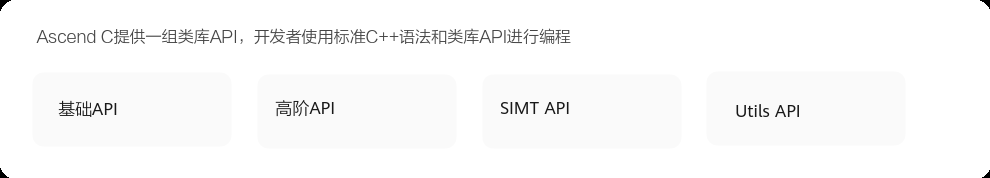

# 什么是Ascend C

> **Section**: 1.1  
> **PDF Pages**: 55–57  

---

<!-- page 55 -->

## 1入门教程

什么是Ascend C

环境准备

快速入门

## 1.1 什么是Ascend C

Ascend C是CANN针对算子开发场景推出的编程语言，原生支持C和C++标准规范，兼具开发效率和运行性能。基于Ascend C编写的算子程序，通过编译器编译和运行时调度，运行在昇腾AI处理器上。使用Ascend C，开发者可以基于昇腾AI硬件，高效的实现自定义的创新算法。您可以通过Ascend C主页了解更详细的内容。

Ascend C提供多层级API，满足多维场景算子开发诉求。

●语言扩展层 C API：开放芯片完备编程能力，支持数组分配内存，一般基于指针编程，提供与业界一致的C语言编程体验。

●基础API：基于Tensor进行编程的C++类库API，实现单指令级抽象，为底层算子开发提供灵活控制能力。

●高阶API：封装单核公共算法，涵盖一些常见的计算算法（如卷积、矩阵运算等），显著降低复杂算法开发门槛。

●算子模板库：基于模板提供算子完整实现参考，简化Tiling（切分算法）开发，支撑用户自定义扩展。

●Python前端：PyAsc编程语言基于Python原生接口，提供芯片底层完备编程能力，支持基于Python接口开发高性能Ascend C算子。

<!-- page 56 -->

快速入门

<!-- page 57 -->

成长地图

概念原理

## API 参考

