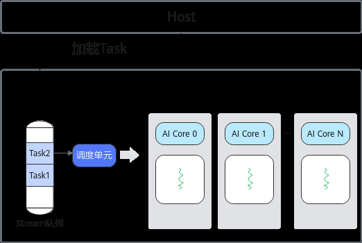

# 异构并行编程模型

> **Section**: 2.2.1  
> **PDF Pages**: 77–77  

---

<!-- page 77 -->

## 2.2 编程模型

## 2.2.1 异构并行编程模型

## Host-Device 异构协同机制

Ascend C异构并行编程模型是为应对异构计算架构的挑战而设计的，旨在解决传统编程模型在处理复杂计算任务时的效率和可扩展性问题。

异构计算架构分为Host侧和Device侧（Device侧对应AI处理器），两者协同完成计算任务。Host侧主要负责运行时管理，包括存储管理、设备管理以及Stream管理等，确保任务的高效调度与资源的合理分配；Device侧，会执行开发者基于Ascend C语法编写的Kernel核函数，主要完成批量数据的矩阵运算、向量运算等计算密集型的任务，用于计算加速。

如下图所示，当一个Kernel下发到AI Core（AI处理器的计算核心）上执行时，运行时管理模块根据开发者设置的核数和任务类型启动对应的Task，该Task从Host加载到Device的Stream运行队列，调度单元会把就绪的Task分配到空闲AI Core上执行。这里将需要处理的数据拆分并同时在多个计算核心上运行的方式，可以获取更高的性能。

图2-1 Kernel 调度示意图

Host和Device拥有不同的内存空间，Host无法直接访问Device内存，反之亦然。所以，输入数据需要从Host侧拷贝至Device侧内存空间，供Device侧进行计算，输出结果需要从Device侧内存拷贝回Host侧，便于在Host侧继续使用。

## 2.2.2 编程模型概述

AI Core是AI处理器的计算核心，AI处理器通过多个AI Core实现并行计算。与传统CPU相比，AI处理器因其内部拥有更多的计算单元和相应的向量计算指令，更适合模型训
