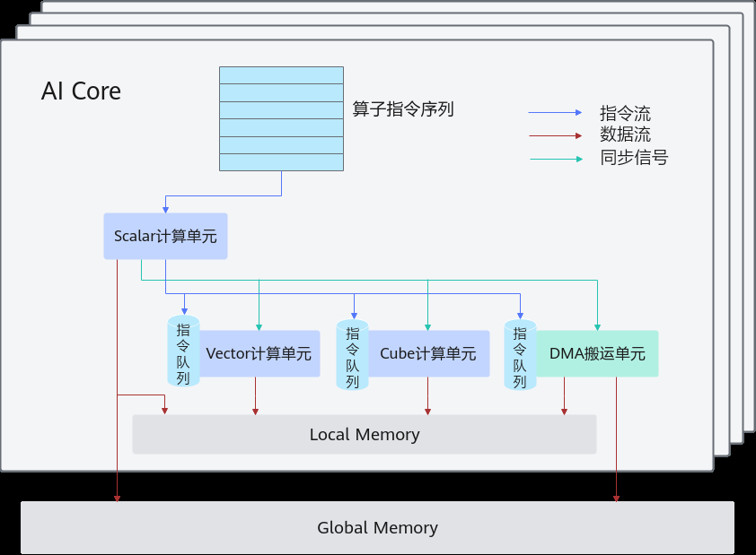

# 抽象硬件架构

> **Section**: 2.2.3.1  
> **PDF Pages**: 78–79  

---

<!-- page 78 -->

练和推理场景，这使得单个硬件指令能完成多组数据的计算。AI处理器提供了以下两种编程模型：

●SIMD（Single Instruction Multiple Data）：单指令多数据。通过单条指令多个数据的方式实现并行计算。

●SIMT（Single Instruction Multiple Thread）：单指令多线程。通过单条指令多个线程的方式实现并行计算。

AI CPU是位于Device侧的处理器，具备与AI Core相同的内存访问能力，能够直接访问Device侧的内存资源；同时，它也可以像Host侧的CPU一样进行数据计算。

表2-1编程模型分类

编程模型计算空间特点

SIMD编程AI Core适合矩阵计算、连续计算的矢量算子及融合算子场景，提供SIMD与SIMT混合的高级编程方式。

SIMT编程AI Core适用于离散访问场景、复杂分支控制场景。

AI CPU编程AI CPU作为AI Core计算的补充。

●SIMD编程：

适合矩阵计算、连续计算的矢量算子及融合算子场景。此外，结合这两种编程方式的SIMD与SIMT混合编程，可以充分利用两者的优点，实现更佳的性能和更高的效率。若需详细了解SIMD编程、SIMD与SIMT混合编程，请查阅2.2.3 AI CoreSIMD编程。算子开发基本流程请参阅3.3 SIMD算子实现。

●SIMT编程：

适用于离散访问场景、矢量算子的复杂分支控制场景，也便于熟悉SIMT算子开发的人员快速掌握AI处理器上的算子开发，目前仅支持Atlas 350 加速卡；关于SIMT编程的进一步学习，用户可参阅2.2.4 AI Core SIMT编程，了解详细的SIMT编程原理，阅读3.4 SIMT算子实现，学习SIMT算子开发的基本流程。

●AI CPU编程：

通常作为AI Core的补充，主要承担非矩阵类、逻辑比较复杂的分支密集型计算。您可通过阅读2.2.5 AI CPU编程，掌握AI CPU编程模型基础知识。

## 2.2.3 AI Core SIMD 编程

## 2.2.3.1 抽象硬件架构

AI Core是AI处理器的计算核心，AI处理器内部有多个AI Core。本章节将介绍AI Core的并行计算架构抽象，该抽象架构屏蔽了不同硬件之间的差异。使用Ascend C进行编程时，基于抽象硬件架构，可以简化硬件细节，显著降低开发门槛。如需了解更详细的硬件架构信息或者原理，请参考2.6 硬件实现。

<!-- page 79 -->

图2-2抽象硬件架构

AI Core中包含计算单元、存储单元、搬运单元等核心组件。

●计算单元包括了三种基础计算资源：Cube计算单元、Vector计算单元和Scalar计算单元。

●存储单元包括内部存储和外部存储：

–AI Core的内部存储，统称为Local Memory，对应的数据类型为LocalTensor。

–AI Core能够访问的外部存储称之为Global Memory，对应的数据类型为GlobalTensor。

●DMA（Direct Memory Access）搬运单元：负责数据搬运，包括Global Memory和Local Memory之间的数据搬运，以及不同层级Local Memory之间的数据搬运。

AI Core内部核心组件及组件功能详细说明如下表。

表2-2 AI Core 内部核心组件

组件分类组件名称组件功能

计算单元Scalar执行地址计算、循环控制等标量计算工作，并把向量计算、矩阵计算、数据搬运、同步指令发射给对应单元执行。

Vector负责执行向量运算。

Cube负责执行矩阵运算。
