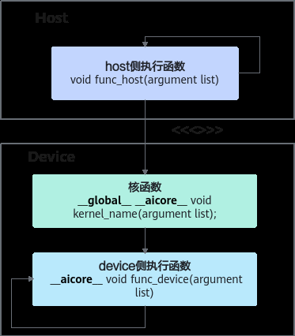

# 核函数

> **Section**: 2.2.3.2  
> **PDF Pages**: 80–82  

---

<!-- page 80 -->

组件分类组件名称组件功能

存储单元Local MemoryAI Core的内部存储。

搬运单元DMA（DirectMemory Access）

负责数据搬运，包括Global Memory和LocalMemory之间的数据搬运以及不同层级LocalMemory之间的数据搬运。

开发者在理解硬件架构的抽象时，需要重点关注如下异步指令流、同步信号流、计算数据流三个过程：

●AI Core内部的异步并行计算过程：Scalar计算单元读取指令序列，并把向量计算、矩阵计算、数据搬运指令发射给对应单元的指令队列，向量计算单元、矩阵计算单元、数据搬运单元异步的并行执行接收到的指令。该过程可以参考图1中蓝色箭头所示的指令流。

●不同的指令间有可能存在依赖关系，为了保证不同指令队列间的指令按照正确的逻辑关系执行，Scalar计算单元也会给对应单元下发同步指令。各单元之间的同步过程可以参考图1中的绿色箭头所示的同步信号流。

●AI Core内部数据处理的基本过程：DMA搬入单元将数据从Global Memory搬运到Local Memory，Vector/Cube计算单元完成数据计算，并把计算结果写回LocalMemory，DMA搬出单元把处理好的数据从Local Memory搬运回GlobalMemory。该过程可以参考图1中的红色箭头所示的数据流。

## 2.2.3.2 核函数

核函数（Kernel Function）是Ascend C算子设备侧实现的入口。Ascend C允许用户使用C/C++函数的语法扩展来编写设备端的运行代码，用户在核函数中进行数据访问和计算操作，由此实现该算子的所有功能。区别于普通的C++函数调用时仅执行一次，当核函数被调用时，多个核都执行相同的核函数代码，具有相同的函数入参，并行执行。

核函数定义时需要使用函数类型限定符__global__和__aicore__；其指针入参变量需要增加变量类型限定符__gm__，表明该指针变量指向Global Memory上某处内存地址；使用<<<...>>>内核调用符调用执行核函数，并指定调用时的执行核数。

以下是一个Add算子的核函数示例（代码片段）。

// 实现核函数__global__ __aicore__ void add_custom(__gm__ uint8_t* x, __gm__ uint8_t* y, __gm__ uint8_t* z){    // 初始化算子类，算子类提供算子初始化和核心处理等方法    KernelAdd op;    // 初始化函数，获取该核函数需要处理的输入输出地址，同时完成必要的内存初始化工作    op.Init(x, y, z);    // 核心处理函数，完成算子的数据搬运与计算等核心逻辑    op.Process();}

// 调用核函数void add_custom_do(uint32_t numBlocks, void* l2ctrl, void* stream, uint8_t* x, uint8_t* y, uint8_t* z){    add_custom<<<numBlocks, l2ctrl, stream>>>(x, y, z);}

核函数定义和调用

定义核函数时需要遵循以下规则。

<!-- page 81 -->

●使用函数类型限定符

除了需要按照C/C++函数声明的方式定义核函数之外，还要为核函数加上额外的函数类型限定符，包含__global__和__aicore__。

使用__global__函数类型限定符来标识它是一个核函数，可以被<<<...>>>调用；使用__aicore__函数类型限定符来标识该核函数在设备端AI Core上执行：

```cpp
__global__ __aicore__ void kernel_name(argument list);
```

编程中使用到的函数可以分为三类：核函数（device侧执行）、host侧执行函数、device侧执行函数（除核函数之外）。下图以Kernel直调算子开发方式为例描述三者的调用关系：

–host侧执行函数可以调用同类的host执行函数，也就是通用C/C++编程中的函数调用；也可以通过<<<...>>>调用核函数。

–device侧执行函数（除核函数之外）可以调用同类的device侧执行函数。

–核函数可以调用device侧执行函数（除核函数之外）。

图2-3核函数、host 侧执行函数、device 侧执行函数调用关系



●使用变量类型限定符

指针入参变量需要增加变量类型限定符__gm__，表明该指针变量指向GlobalMemory上某处内存地址。

●其他规则或建议

a.规则：核函数必须具有void返回类型。

b.规则：仅支持入参为指针或C/C++内置数据类型（Primitive data types），如：half* s0、float* s1、int32_t c。

<!-- page 82 -->

c.建议：为了统一表达，建议使用GM_ADDR宏来修饰入参，GM_ADDR宏定义如下：#define GM_ADDR __gm__ uint8_t*

使用GM_ADDR修饰入参的样例如下：

```cpp
extern "C" __global__ __aicore__ void add_custom(GM_ADDR x, GM_ADDR y, GM_ADDR z)
```

这里统一使用uint8_t类型的指针，在后续的使用中需要将其转化为实际的指针类型。

常见的函数调用方式是如下的形式：

```cpp
function_name(argument list);
```

核函数使用内核调用符<<<...>>>这种语法形式，来规定核函数的执行配置：

```cpp
kernel_name<<<numBlocks, l2ctrl, stream>>>(argument list);
```

内核调用符仅可在NPU侧编译时调用，CPU侧编译无法识别该符号。

执行配置由3个参数决定：

●numBlocks，规定了核函数将会在几个核上执行。每个执行该核函数的核会被分配一个逻辑ID，即block_idx，可以在核函数的实现中调用6.2.3.9.2 GetBlockIdx来获取block_idx；

说明

numBlocks是逻辑核的概念，取值范围为[1,65535]。为了充分利用硬件资源，一般设置为物理核的核数或其倍数。

●对于耦合模式和分离模式，numBlocks在运行时的意义和设置规则有一些区别，具体说明如下：

●耦合模式：由于其Vector、Cube单元是集成在一起的，numBlocks用于设置启动多个AI Core核实例执行，不区分Vector、Cube。AI Core的核数可以通过GetCoreNumAiv或者GetCoreNumAic获取。

●分离模式

●针对仅包含Vector计算的算子，numBlocks用于设置启动多少个Vector（AIV）实例执行，比如某款AI处理器上有40个Vector核，建议设置为40。

●针对仅包含Cube计算的算子，numBlocks用于设置启动多少个Cube（AIC）实例执行，比如某款AI处理器上有20个Cube核，建议设置为20。

●针对Vector/Cube融合计算的算子，启动时，按照AIV和AIC组合启动，numBlocks用于设置启动多少个组合执行，比如某款AI处理器上有40个Vector核和20个Cube核，一个组合是2个Vector核和1个Cube核，建议设置为20，此时会启动20个组合，即40个Vector核和20个Cube核。注意：该场景下，设置的numBlocks逻辑核的核数不能超过物理核（2个Vector核和1个Cube核组合为1个物理核）的核数。

●AIC/AIV的核数分别通过GetCoreNumAic和GetCoreNumAiv接口获取。

●如果开发者使用了Device资源限制特性，那么算子设置的numBlocks不应超过PlatformAscendC提供核数的API（GetCoreNum/GetCoreNumAic/GetCoreNumAiv等）返回的核数。例如，使用aclrtSetStreamResLimit设置Stream级别的Vector核数为8，那么GetCoreNumAiv接口返回值为8，针对Vector算子设置的numBlocks不应超过8，否则会抢占其他Stream的资源，导致资源限制失效。

●l2ctrl，保留参数，暂时设置为固定值nullptr，开发者无需关注；

●stream，类型为aclrtStream，stream用于维护一些异步操作的执行顺序，确保按照应用程序中的代码调用顺序在device上执行。stream创建等管理接口请参考《应用开发 (C&C++)》中的“Runtime运行时 API > Stream管理”章节。

如下名为add_custom的核函数，实现两个矢量的相加，调用示例如下：
