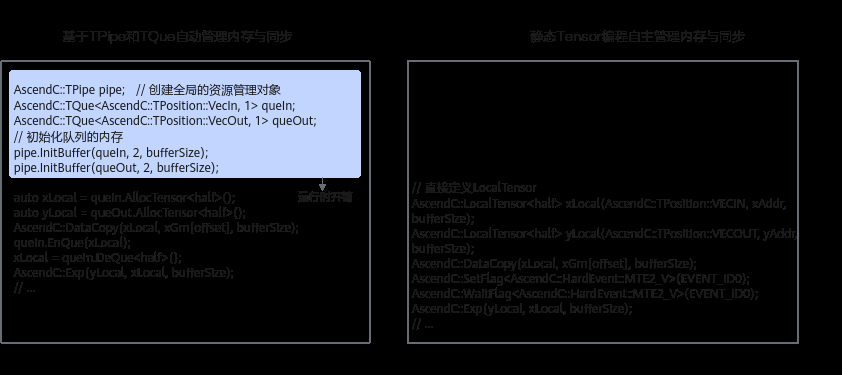
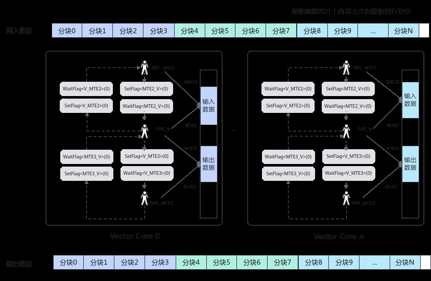
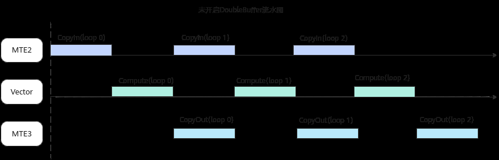
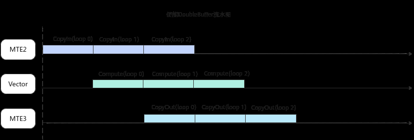

# 静态Tensor编程

> **Section**: 2.2.3.3.2  
> **PDF Pages**: 89–103  

---

<!-- page 89 -->

1.初始化一个MatMul对象，将输入数据从Global Memory搬运到Cube核上。

2.进行MatMul内部的计算。

3.将MatMul的计算结果搬运到Vector核上。

4.进行Vector矢量计算。

5.将输出结果搬运到Global Memory上。

整个过程的示例代码如下（伪代码）：

template<typename aType, typename bType, typename cType, typename biasType>__aicore__ inline void MatmulLeakyKernel<aType, bType, cType, biasType>::Process(){    // 步骤1：初始化一个MatMul对象，将输入数据从Global Memory搬运到Cube核上。    uint32_t computeRound = 0;    REGIST_MATMUL_OBJ(&pipe, GetSysWorkSpacePtr(), matmulObj);    matmulObj.Init(&tiling);    matmulObj.SetTensorA(aGlobal);    matmulObj.SetTensorB(bGlobal);    matmulObj.SetBias(biasGlobal);    while (matmulObj.template Iterate<true>()) { // 步骤2：进行MatMul内部的计算。        // 步骤3：将MatMul的计算结果搬运到Vector核上。        reluOutLocal = reluOutQueue_.AllocTensor<cType>();        matmulObj.template GetTensorC<true>(reluOutLocal, false, true);       // 步骤4：进行Vector矢量计算。        AscendC::LeakyRelu(reluOutLocal, reluOutLocal, (cType)alpha, tiling.baseM * tiling.baseN);        reluOutQueue_.EnQue(reluOutLocal);        // 步骤5：将输出结果搬运到Global Memory上        reluOutQueue_.DeQue<cType>();        ...        AscendC::DataCopy(cGlobal[startOffset], reluOutLocal, copyParam);        reluOutQueue_.FreeTensor(reluOutLocal);

```cpp
computeRound++;    }    matmulObj.End();}
```

## 2.2.3.3.2 静态Tensor 编程

在基于Pipe进行算子开发的方式中，由Pipe（TPipe类）统一管理Device端内存等资源，开发者无需感知内存管理、DoubleBuffer流水、同步等处理，只需要按照计算流编写算子即可，但由此也带来了一些运行时开销（如TPipe创建、InitBuffer等）。

基于以上原因，Ascend C提供了静态Tensor编程方式，相比基于Pipe的编程方式，这种方式避免了TPipe内存管理初始化过程（约数百纳秒），从而减少了运行时开销，更有助于开发者实现极致性能。通过直接构造指定地址和存储位置的LocalTensor，并将其传递给计算、搬运等API进行编程，提供了更高的灵活性。然而，这种编程方式也带来了更高的开发复杂性，需要开发者自行管理DoubleBuffer和同步流水，并且只能使用Ascend C的基础API，而非全部功能。

两种编程方式的对比如下：

<!-- page 90 -->



说明

●静态Tensor编程的使用约束和限制请参考使用约束和限制。

●本节涉及的完整样例请参考静态Tensor编程样例。

编程范式

●AI Core包括多种内存单元，比如用于矢量计算的Unified Buffer和用于矩阵计算的L1 Buffer、L0A Buffer、L0B Buffer、L0C Buffer等内存资源。开发者完全自主管理AI Core上的所有内存资源，创建Tensor分配地址时管理内存大小、内存复用关系并确保分配的地址有效性。

●AI Core包括多种指令流水类型，比如Vector/Cube/Scalar计算流水，MTE1、MTE2、MTE3搬运流水等，每条流水并行执行，它们之间的依赖关系通过同步事件来协调。开发者调用Ascend C提供的搬运或者计算类API编写算子并根据数据依赖关系插入对应的同步事件，以达成最优性能。

下图是一个典型矢量算子的示意图，开发者首先根据业务计算量进行数据分块处理，之后根据核内的数据依赖关系完成同步事件的插入：

<!-- page 91 -->



内存管理

静态Tensor编程方式下，开发者可以使用两种方式创建Tensor：

●通过 LocalMemAllocator指定硬件位置进行Tensor分配。

LocalMemAllocator是一种线性内存分配器，开发者可以调用Alloc方法进行内存分配，地址分配从0开始，根据调用次序依次向后进行线性分配，LocalMemAllocator只是一个简单的线性分配器，并不提供内存释放以及其它内存管理的能力。在不关注Bank冲突场景或者算子初始功能开发时，可以使用LocalMemAllocator简化算子编写，在后续性能优化时切换到使用LocalTensor进行地址分配的方式。

●通过LocalTensor构造函数创建Tensor，极致性能场景推荐使用此方式。

开发者可以使用LocalTensor构造函数直接指定内存地址，实现内存的完全自主管理（本质上无需申请和释放内存）。使用时，需根据需求合理指定地址（不超过物理存储上限），并在保证功能正确的前提下进行内存复用。如果需要通过规避Bank冲突或者复用内存来获得极致性能时，推荐使用该方式。

// 方式1：使用LocalMemAllocator进行内存分配    AscendC::LocalMemAllocator<AscendC::Hardware::UB> ubAllocator;    AscendC::LocalTensor<float> xLocalPing = ubAllocator.Alloc<float, TILE_LENGTH>();    AscendC::LocalTensor<float> yLocalPing = ubAllocator.Alloc<float, TILE_LENGTH>();    AscendC::LocalTensor<float> zLocalPing = ubAllocator.Alloc<float, TILE_LENGTH>();

// 方式2：直接使用LocalTensor构造函数构造Tensor    AscendC::LocalTensor<float> xLocalPing(AscendC::TPosition::VECCALC, xAddrPing, TILE_LENGTH);    AscendC::LocalTensor<float> yLocalPing(AscendC::TPosition::VECCALC, yAddrPing, TILE_LENGTH);    AscendC::LocalTensor<float> zLocalPing(AscendC::TPosition::VECCALC, zAddrPing, TILE_LENGTH);

同步管理

根据前文介绍的硬件架构，AI Core内部异步并行计算存在多条流水（包括矢量计算、矩阵计算、数据搬入、数据搬出等），多条流水之间存在数据依赖时，需要插入对应的同步事件。静态Tensor编程方式下，开发者使用 SetFlag/WaitFlag(ISASI)和PipeBarrier(ISASI)手动插入同步，事件的类型和事件ID由开发者自行管理，但需要注

<!-- page 92 -->

意事件ID不能使用6和7（可能与内部使用的事件ID出现冲突，进而出现未定义行为）。另外由于需要使用SetFlag/WaitFlag/PipeBarrier底层同步接口（属于ISASI硬件体系结构相关的接口），无法保证跨硬件版本兼容。

在同步依赖中，根据数据依赖和指令执行关系，存在两种依赖关系，即正向同步（循环内依赖）与反向同步（循环间依赖）：

●正向同步

在本次数据搬入和计算之间，插入MTE2_V（矢量计算流水等待MT2搬运流水）同步事件，确保数据搬入之后再进行计算；在本次数据计算和搬出之间，插入V_MTE3（MTE3搬运流水等待矢量计算流水）同步事件，确保数据计算完成后再进行搬出。

●反向同步

在上一次的数据计算和本次数据搬入之间，插入V_MTE2（MT2搬运流水等待矢量计算流水）同步事件，确保上一次的数据计算完成后，本次的数据再进行搬入。防止本次的数据会覆盖掉上一次未计算完成的数据；在上一次的数据搬出和本次数据计算之间，插入MTE3_V（矢量计算流水等待MT3搬运流水）同步事件，确保上一次的数据搬出后，再进行本次数据的计算。防止本次的数据会覆盖掉上一次未搬出的数据。

上述的同步逻辑在使用Pipe编程框架时，框架会使用EnQue/DeQue/AllocTensor/FreeTensor进行封装。您可以通过2.9.3 编程模型设计原理来了解应该如何在使用静态Tensor编程方式时手动进行同步控制。    AscendC::LocalTensor<float> xLocal(AscendC::TPosition::VECCALC, xAddr, TILE_LENGTH);    AscendC::LocalTensor<float> yLocal(AscendC::TPosition::VECCALC, yAddr, TILE_LENGTH);    AscendC::LocalTensor<float> zLocal(AscendC::TPosition::VECCALC, zAddr, TILE_LENGTH);    for (int i = 0; i < loopCount; i++) {        // dependency of PIPE_V & PIPE_MTE2 caused by xLocal/yLocal between 2 sequential loops        if (i != 0) {            AscendC::WaitFlag<AscendC::HardEvent::V_MTE2>(EVENT_ID0);        }        AscendC::DataCopy(xLocal, xGm[i * TILE_LENGTH], TILE_LENGTH);        AscendC::DataCopy(yLocal, yGm[i * TILE_LENGTH], TILE_LENGTH);        // dependency of PIPE_MTE2 & PIPE_V caused by xLocal/yLocal in one single loop        AscendC::SetFlag<AscendC::HardEvent::MTE2_V>(EVENT_ID0);        AscendC::WaitFlag<AscendC::HardEvent::MTE2_V>(EVENT_ID0);        if (i != 0) {            // dependency of PIPE_MTE3 & PIPE_V caused by zLocal between 2 sequential loops            AscendC::WaitFlag<AscendC::HardEvent::MTE3_V>(EVENT_ID0);        }        AscendC::Add(zLocal, xLocal, yLocal, TILE_LENGTH);        if (i != (loopCount - 1)) {            // dependency of PIPE_V & PIPE_MTE2 caused by xLocal/yLocal between 2 sequential loops            AscendC::SetFlag<AscendC::HardEvent::V_MTE2>(EVENT_ID0);        }        // dependency of PIPE_V & PIPE_MTE3 caused by zLocal in one single loop        AscendC::SetFlag<AscendC::HardEvent::V_MTE3>(EVENT_ID0);        AscendC::WaitFlag<AscendC::HardEvent::V_MTE3>(EVENT_ID0);        AscendC::DataCopy(zGm[i * TILE_LENGTH], zLocal, TILE_LENGTH);        if (i != (loopCount - 1)) {            // dependency of PIPE_MTE3 & PIPE_V caused by zLocal between 2 sequential loops            AscendC::SetFlag<AscendC::HardEvent::MTE3_V>(EVENT_ID0);        }    }

流水优化

在基于TPipe的编程范式中，开发者只需要在InitBuffer时指定buffer数量为2，即可自动开启Double Buffer。但是静态Tensor编程方式下，开发者需要手动开启DoubleBuffer，具体示例如下，完整样例请参考静态Tensor编程样例中的Double Buffer示例。

<!-- page 93 -->

```cpp
// ping    AscendC::LocalTensor<float> xLocalPing(AscendC::TPosition::VECCALC, xAddrPing, TILE_LENGTH);
    AscendC::LocalTensor<float> yLocalPing(AscendC::TPosition::VECCALC, yAddrPing, TILE_LENGTH);
    AscendC::LocalTensor<float> zLocalPing(AscendC::TPosition::VECCALC, zAddrPing, TILE_LENGTH);    // pong    AscendC::LocalTensor<float> xLocalPong(AscendC::TPosition::VECCALC, xAddrPong, TILE_LENGTH);
    AscendC::LocalTensor<float> yLocalPong(AscendC::TPosition::VECCALC, yAddrPong, TILE_LENGTH);
    AscendC::LocalTensor<float> zLocalPong(AscendC::TPosition::VECCALC, zAddrPong, TILE_LENGTH);
// double buffer    AscendC::SetFlag<AscendC::HardEvent::MTE3_MTE2>(EVENT_ID0);
    AscendC::SetFlag<AscendC::HardEvent::MTE3_MTE2>(EVENT_ID1);
    for (int i = 0;
 i < loopCount;
 i++) {        int32_t eventID = (i % 2 == 0 ? EVENT_ID0 : EVENT_ID1);
        AscendC::LocalTensor<float> &xLocal = (i % 2 == 0 ? xLocalPing : xLocalPong);
        AscendC::LocalTensor<float> &yLocal = (i % 2 == 0 ? yLocalPing : yLocalPong);
        AscendC::LocalTensor<float> &zLocal = (i % 2 == 0 ? zLocalPing : zLocalPong);        // dependency of PIPE_MTE3 & PIPE_MTE2 caused by xLocal/yLocal between 2 sequential loops        AscendC::WaitFlag<AscendC::HardEvent::MTE3_MTE2>(eventID);
        AscendC::DataCopy(xLocal, xGm[i * TILE_LENGTH], TILE_LENGTH);
        AscendC::DataCopy(yLocal, yGm[i * TILE_LENGTH], TILE_LENGTH);
// dependency of PIPE_MTE2 & PIPE_V caused by xLocal/yLocal in one single loop        AscendC::SetFlag<AscendC::HardEvent::MTE2_V>(eventID);
        AscendC::WaitFlag<AscendC::HardEvent::MTE2_V>(eventID);
        AscendC::Add(zLocal, xLocal, yLocal, TILE_LENGTH);        // dependency of PIPE_V & PIPE_MTE3 caused by zLocal in one single loop        AscendC::SetFlag<AscendC::HardEvent::V_MTE3>(eventID);
        AscendC::WaitFlag<AscendC::HardEvent::V_MTE3>(eventID);
        AscendC::DataCopy(zGm[i * TILE_LENGTH], zLocal, TILE_LENGTH);        // dependency of PIPE_MTE3 & PIPE_MTE2 caused by zLocal between 2 sequential loops        AscendC::SetFlag<AscendC::HardEvent::MTE3_MTE2>(eventID);    }    AscendC::WaitFlag<AscendC::HardEvent::MTE3_MTE2>(EVENT_ID0);
    AscendC::WaitFlag<AscendC::HardEvent::MTE3_MTE2>(EVENT_ID1);
```

以下为不使能DoubleBuffer和使能DoubleBuffer的流水示意图。多数情况下，采用DoubleBuffer能有效提升Vector的时间利用率，缩减算子执行时间，详细内容可参考2.9.5.1 DoubleBuffer。





<!-- page 94 -->

使用约束和限制

静态Tensor编程方式需要遵循以下约束和限制：

●开发者不能使用TPipe/TQue/TQueBind/TBufPool等框架接口，和上述框架接口混用可能会出现未定义行为。

●只能使用部分API。具体支持的API列表见支持的API范围。因为不在列表范围内的API内部依赖TPipe分配事件ID，可能会和开发者定义的事件ID产生冲突。

●同步事件需要由开发者使用 SetFlag/WaitFlag(ISASI)和 PipeBarrier(ISASI)手动插入，事件的类型和事件ID由开发者自行管理，但需要注意事件ID不能使用6和7（可能与内部使用的事件ID出现冲突，进而出现未定义行为）。

●由于需要使用SetFlag/WaitFlag/PipeBarrier底层同步接口（属于ISASI硬件体系结构相关的接口），无法保证算子跨硬件版本兼容。

●Kernel入口处需要开发者手动调用InitSocState接口用来初始化全局状态寄存器。因为全局状态寄存器处于不确定状态，如果不调用该接口，可能导致算子执行过程中出现未定义行为。在TPipe框架编程中，初始化过程由TPipe完成，无需开发者关注。

支持的API 范围

表2-3针对Atlas 推理系列产品AI Core，支持的API 范围

接口分类接口名称

基础API > 标量计算ScalarGetCountOfValue、ScalarCountLeadingZero、ScalarCast、CountBitsCntSameAsSignBit、ScalarGetSFFValue

基础API > 矢量计算 >基础算术

Exp、Ln、Abs、Reciprocal、Sqrt、Rsqrt、Relu、VectorPadding、Add、Sub、Mul、Div、Max、Min、BilinearInterpolation、Adds、Muls、Maxs、Mins、LeakyRelu

基础API > 矢量计算 >逻辑计算

Not、And、Or

基础API > 矢量计算 >复合计算

Axpy、CastDeq、AddRelu、AddReluCast、AddDeqRelu、SubRelu、SubReluCast、MulAddDst、MulCast、FusedMulAdd、FusedMulAddRelu

基础API > 矢量计算 >比较与选择

Compare、Compare（结果存入寄存器）、CompareScalar、GetCmpMask、SetCmpMask、

Select、GatherMask

基础API > 矢量计算 >类型转换

Cast

基础API > 矢量计算 >归约计算

WholeReduceMax、WholeReduceMin、WholeReduceSum、BlockReduceMax、BlockReduceMin、BlockReduceSum、PairReduceSum、RepeatReduceSum、GetReduceMaxMinCount

<!-- page 95 -->

接口分类接口名称

基础API > 矢量计算 >数据转换

Transpose、TransDataTo5HD

基础API > 矢量计算 >数据填充

Duplicate

基础API > 矢量计算 >排序组合

ProposalConcat、ProposalExtract、RpSort16、MrgSort4、GetMrgSortResult

基础API > 矢量计算 >离散与聚合

Gather、Scatter

基础API > 矢量计算 >掩码操作

SetMaskCount、SetMaskNorm、SetVectorMask、ResetMask

基础API > 矢量计算 >量化设置

SetDeqScale

基础API > 数据搬运 >DataCopy

基础数据搬运

基础API > 同步控制 >核内同步

SetFlag/WaitFlag、PipeBarrier

基础API > 缓存控制DataCachePreload、DataCacheCleanAndInvalid、ICachePreLoad

基础API > 系统变量访问

GetBlockNum、GetBlockIdx、GetDataBlockSizeInBytes、GetArchVersion、GetTaskRatio、InitSocState、GetProgramCounter、CheckLocalMemoryIA

基础API > 原子操作SetAtomicAdd、SetAtomicNone

基础API > 矩阵计算InitConstValue、LoadData、SetAippFunctions、LoadImageToLocal、LoadUnzipIndex、LoadDataUnzip、SetLoadDataBoundary、SetLoadDataPaddingValue、Mmad

表2-4针对Atlas A2 训练系列产品/Atlas A2 推理系列产品，支持的API 范围

接口分类接口名称备注

基础API > 标量计算ScalarGetCountOfValue、ScalarCountLeadingZero、ScalarCast、CountBitsCntSameAsSignBit、ScalarGetSFFValue、ToBfloat16、ToFloat

-

<!-- page 96 -->

接口分类接口名称备注

-

基础API > 矢量计算 >基础算术

Exp、Ln、Abs、Reciprocal、Sqrt、Rsqrt、Relu、Add、Sub、Mul、Div、Max、Min、BilinearInterpolation、Adds、Muls、Maxs、Mins、LeakyRelu

基础API > 矢量计算 >逻辑计算

Not、And、Or、ShiftLeft、ShiftRight

-

-

基础API > 矢量计算 >复合计算

Axpy、CastDeq、AddRelu、AddReluCast、AddDeqRelu、SubRelu、SubReluCast、MulAddDst、MulCast、FusedMulAdd、FusedMulAddRelu

-

基础API > 矢量计算 >比较与选择

Compare、Compare（结果存入寄存器）、CompareScalar、GetCmpMask、SetCmpMask、Select、GatherMask

基础API > 矢量计算 >类型转换

Cast-

基础API > 矢量计算 >归约计算

WholeReduceMax、WholeReduceMin、WholeReduceSum、BlockReduceMax、BlockReduceMin、BlockReduceSum、PairReduceSum、RepeatReduceSum、GetAccVal、GetReduceMaxMinCount

-

基础API > 矢量计算 >数据转换

Transpose、TransDataTo5HD-

基础API > 矢量计算 >数据填充

Duplicate、Brcb-

基础API > 矢量计算 >排序组合

Sort32、MrgSort、GetMrgSortResult

-

基础API > 矢量计算 >离散与聚合

Gather、Gatherb-

基础API > 矢量计算 >掩码操作

SetMaskCount、SetMaskNorm、SetVectorMask、ResetMask

-

基础API > 矢量计算 >量化设置

SetDeqScale-

<!-- page 97 -->

接口分类接口名称备注

基础API > 数据搬运 >DataCopy

基础数据搬运不支持VECIN/VECCALC/VECOUT-> TSCM通路的数据搬运。

增强数据搬运不支持VECIN/VECCALC/VECOUT-> TSCM通路的数据搬运。

切片数据搬运-

不支持VECIN/VECCALC/VECOUT-> TSCM通路的数据搬运。

随路转换ND2NZ搬运

随路转换NZ2ND搬运

随路量化激活搬运

基础API > 数据搬运Copy、DataCopyPad、SetPadValue

-

基础API > 同步控制 >核内同步

SetFlag/WaitFlag、PipeBarrier、DataSyncBarrier

-

基础API > 同步控制 >核间同步

CrossCoreSetFlag、CrossCoreWaitFlag

-

-

基础API > 缓存控制DataCachePreload、DataCacheCleanAndInvalid、ICachePreLoad、GetICachePreloadStatus

基础API > 系统变量访问

GetBlockNum、GetBlockIdx、GetDataBlockSizeInBytes、GetArchVersion、GetTaskRatio、InitSocState、GetProgramCounter、GetSubBlockNum、GetSubBlockIdx、GetSystemCycle、

-

CheckLocalMemoryIA

基础API > 原子操作SetAtomicAdd、SetAtomicType、SetAtomicNone、SetAtomicMax、SetAtomicMin、SetStoreAtomicConfig、GetStoreAtomicConfig

-

<!-- page 98 -->

接口分类接口名称备注

基础API > 矩阵计算Mmad、MmadWithSparse、SetHF32Mode、SetHF32TransMode、SetMMLayoutTransform、SetFixPipeConfig、SetFixpipeNz2ndFlag、SetFixpipePreQuantFlag、InitConstValue、LoadData、LoadDataWithTranspose、SetAippFunctions、LoadImageToLocal、LoadDataWithSparse、SetFmatrix、SetLoadDataBoundary、SetLoadDataRepeat、SetLoadDataPaddingValue、Fixpipe

-

Utils API > C++标准库> 算法

max、min、index_sequence-

Utils API > C++标准库> 容器函数

tuple、get、make_tuple-

Utils API > C++标准库> 类型特性

is_convertible、is_base_of、is_same、enable_if、conditional

-

表2-5针对Atlas A3 训练系列产品/Atlas A3 推理系列产品，支持的API 范围

接口分类接口名称备注

基础API > 标量计算ScalarGetCountOfValue、ScalarCountLeadingZero、ScalarCast、CountBitsCntSameAsSignBit、ScalarGetSFFValue、ToBfloat16、ToFloat

-

基础API > 矢量计算 >基础算术

Exp、Ln、Abs、Reciprocal、Sqrt、Rsqrt、Relu、Add、Sub、Mul、Div、Max、Min、BilinearInterpolation、Adds、Muls、Maxs、Mins、LeakyRelu

-

基础API > 矢量计算 >逻辑计算

Not、And、Or、ShiftLeft、ShiftRight

-

<!-- page 99 -->

接口分类接口名称备注

-

基础API > 矢量计算 >复合计算

Axpy、CastDeq、AddRelu、AddReluCast、AddDeqRelu、SubRelu、SubReluCast、MulAddDst、MulCast、FusedMulAdd、FusedMulAddRelu

-

基础API > 矢量计算 >比较与选择

Compare、Compare（结果存入寄存器）、CompareScalar、GetCmpMask、SetCmpMask、Select、GatherMask

基础API > 矢量计算 >类型转换

Cast-

基础API > 矢量计算 >归约计算

WholeReduceMax、WholeReduceMin、WholeReduceSum、BlockReduceMax、BlockReduceMin、BlockReduceSum、PairReduceSum、RepeatReduceSum、GetAccVal、GetReduceMaxMinCount

-

基础API > 矢量计算 >数据转换

Transpose、TransDataTo5HD-

基础API > 矢量计算 >数据填充

Duplicate、Brcb-

基础API > 矢量计算 >排序组合

Sort32、MrgSort、GetMrgSortResult

-

基础API > 矢量计算 >离散与聚合

Gather、Gatherb-

基础API > 矢量计算 >掩码操作

SetMaskCount、SetMaskNorm、SetVectorMask、ResetMask

-

基础API > 矢量计算 >量化设置

SetDeqScale-

基础API > 数据搬运 >DataCopy

基础数据搬运不支持VECIN/VECCALC/VECOUT-> TSCM通路的数据搬运。

基础API > 数据搬运增强数据搬运不支持VECIN/VECCALC/VECOUT-> TSCM通路的数据搬运。

切片数据搬运-

<!-- page 100 -->

接口分类接口名称备注

不支持VECIN/VECCALC/VECOUT-> TSCM通路的数据搬运。

随路转换ND2NZ搬运

随路转换NZ2ND搬运

随路量化激活搬运

Copy、DataCopyPad、SetPadValue

-

基础API > 同步控制 >核内同步

SetFlag/WaitFlag、PipeBarrier、DataSyncBarrier

-

基础API > 同步控制 >核间同步

CrossCoreSetFlag、CrossCoreWaitFlag

-

-

基础API > 缓存控制DataCachePreload、DataCacheCleanAndInvalid、ICachePreLoad、GetICachePreloadStatus

基础API > 系统变量访问

GetBlockNum、GetBlockIdx、GetDataBlockSizeInBytes、GetArchVersion、GetTaskRatio、InitSocState、GetProgramCounter、GetSubBlockNum、GetSubBlockIdx、GetSystemCycle、

-

CheckLocalMemoryIA

-

基础API > 原子操作SetAtomicAdd、SetAtomicType、SetAtomicNone、SetAtomicMax、SetAtomicMin、SetStoreAtomicConfig、GetStoreAtomicConfig

基础API > 矩阵计算Mmad、MmadWithSparse、SetHF32Mode、SetHF32TransMode、SetMMLayoutTransform、SetFixPipeConfig、SetFixpipeNz2ndFlag、SetFixpipePreQuantFlag、InitConstValue、LoadData、LoadDataWithTranspose、SetAippFunctions、LoadImageToLocal、LoadDataWithSparse、SetFmatrix、SetLoadDataBoundary、SetLoadDataRepeat、SetLoadDataPaddingValue、Fixpipe

-

<!-- page 101 -->

接口分类接口名称备注

Utils API > C++标准库> 算法

max、min、index_sequence-

Utils API > C++标准库> 容器函数

tuple、get、make_tuple-

Utils API > C++标准库> 类型特性

is_convertible、is_base_of、is_same、enable_if、conditional

-

高阶API > C++标准库> 类型特性

is_convertible、is_base_of、is_same、enable_if、conditional

-

高阶API > 模板库函数> type_traits

is_convertible、is_base_of、is_same、enable_if、conditional

-

表2-6针对Atlas 350 加速卡，支持的API 范围

接口分类接口名称备注

基础API > 标量计算GetBitCount、CountLeadingZero、CountBitsCntSameAsSignBit、GetSFFValue、Cast（float转half、int32_t）、Cast（float转bfloat16_t）、Cast（多类型转float）、Nop、GetUintDivMagicAndShift、WriteGmByPassDCache、ReadGmByPassDCache

-

基础API > 矢量计算 >基础算术

Exp、Ln、Abs、Reciprocal、Sqrt、Rsqrt、Relu、Neg、Add、Sub、Mul、Div、Max、Min、BilinearInterpolation、Prelu、Mull、Adds、Adds（灵活标量位置）、Muls、Muls（灵活标量位置）、Maxs、Maxs（灵活标量位置）、Mins、Mins（灵活标量位置）、Subs、Divs、LeakyRelu

-

基础API > 矢量计算 >逻辑计算

Not、And、Or、ShiftLeft（左移位数为Tensor）、ShiftRight（右移位数为Tensor）、Ands、Ors、ShiftLeft、ShiftRight

-

基础API > 矢量计算 >复合计算

Axpy、AddRelu、AddReluCast、AddDeqRelu、SubRelu、SubReluCast、MulAddDst、MulCast、FusedMulAdd、MulAddRelu、AbsSub、FusedExpSub、MulsCast

-

<!-- page 102 -->

接口分类接口名称备注

-

基础API > 矢量计算 >比较与选择

Compare、Compares、Compares（灵活标量位置）、GetCmpMask、SetCmpMask、GatherMask、Select（灵活标量位置）

基础API > 矢量计算 >类型转换

Truncate-

基础API > 矢量计算 >归约计算

ReduceMax、ReduceMin、WholeReduceSum、BlockReduceMax、BlockReduceMin、BlockReduceSum、PairReduceSum、RepeatReduceSum、

-

基础API > 矢量计算 >数据转换

Transpose-

基础API > 矢量计算 >数据填充

Duplicate、Brcb、CreateVecIndex

基础API > 矢量计算 >排序组合

Sort32、MrgSort、GetMrgSortResult

-

基础API > 矢量计算 >离散与聚合

Gather、Gatherb、Scatter-

基础API > 矢量计算 >掩码操作

SetMaskCount、SetMaskNorm、SetVectorMask、ResetMask

-

基础API > 数据搬运 >DataCopy

基础数据搬运不支持VECIN/VECCALC/VECOUT-> TSCM通路的数据搬运。

增强数据搬运不支持VECIN/VECCALC/VECOUT-> TSCM通路的数据搬运。

切片数据搬运-

随路转换ND2NZ搬运不支持VECIN/VECCALC/VECOUT-> TSCM通路的数据搬运。

随路转换NZ2ND搬运-

随路量化激活搬运-

<!-- page 103 -->

接口分类接口名称备注

基础API > 数据搬运Copy、DataCopyPad、SetPadValue

DataCopyPad 不支持VECIN/VECCALC/VECOUT -> TSCM通路的数据搬运。

基础API > 同步控制 >核内同步

SetFlag/WaitFlag、PipeBarrier、DataSyncBarrier

-

基础API > 同步控制 >核间同步

CrossCoreSetFlag、CrossCoreWaitFlag、SyncAll

-

-

基础API > 缓存控制DataCachePreload、DataCacheCleanAndInvalid、ICachePreLoad、GetICachePreloadStatus

基础API > 系统变量访问

GetBlockNum、GetBlockIdx、GetDataBlockSizeInBytes、GetArchVersion、InitSocState、GetSpr、ClearSpr、GetProgramCounter、GetSubBlockNum、GetSubBlockIdx、GetSystemCycle、SetCtrlSpr、GetCtrlSpr、ResetCtrlSpr

-

基础API > 原子操作SetAtomicAdd、SetAtomicType、DisableDmaAtomic、SetAtomicMax、SetAtomicMin、SetStoreAtomicConfig、GetStoreAtomicConfig、AtomicAdd、AtomicMin、AtomicMax、AtomicCas、AtomicExch

-

基础API > 矩阵计算Fill、LoadData、LoadDataWithTranspose、LoadDataWithSparse、SetFmatrix、SetLoadDataBoundary、SetLoadDataRepeat、SetLoadDataPaddingValue、Fixpipe、SetFixPipeConfig、SetFixpipeNz2ndFlag、SetFixpipePreQuantFlag、SetAippFunctions、LoadImageToLocal、Mmad、SetHF32Mode、SetHF32TransMode

-

Utils API > C++标准库> 算法

max、min、index_sequence-
