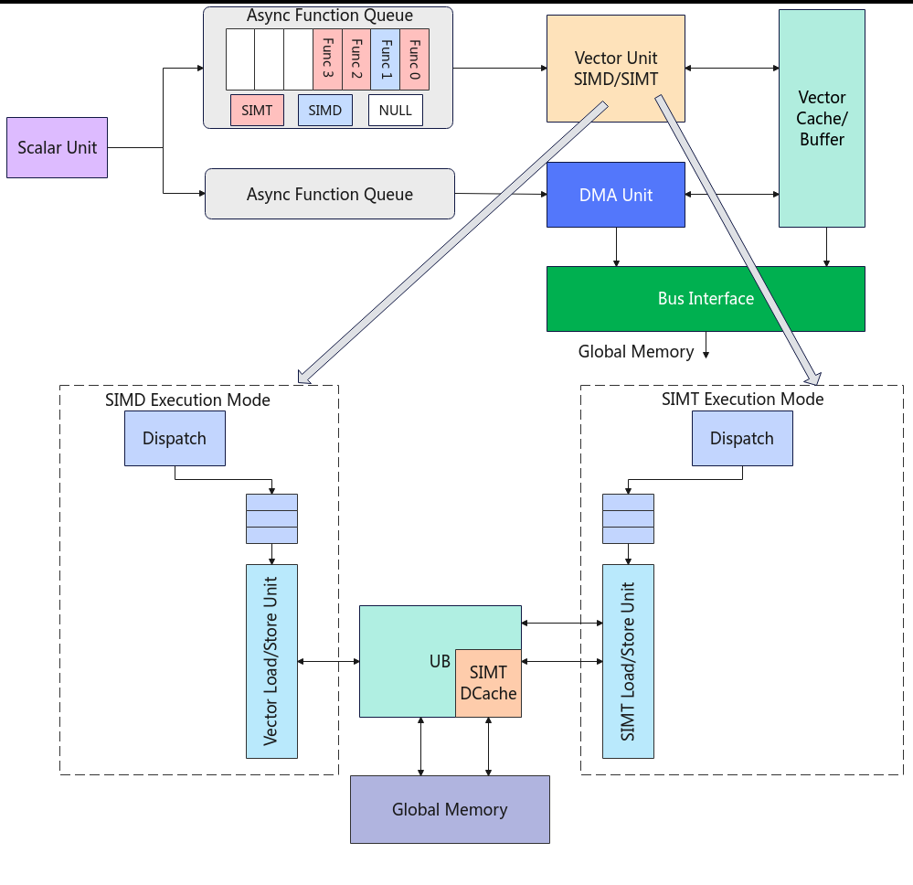
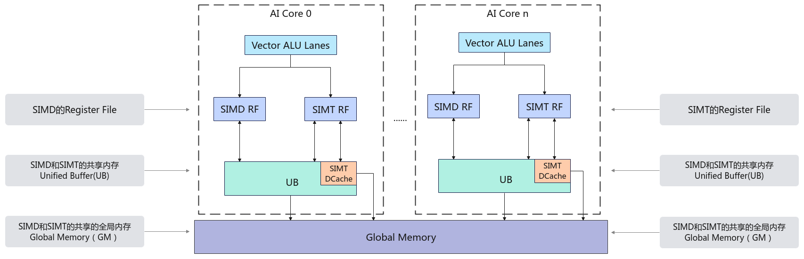
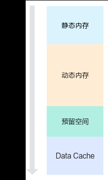
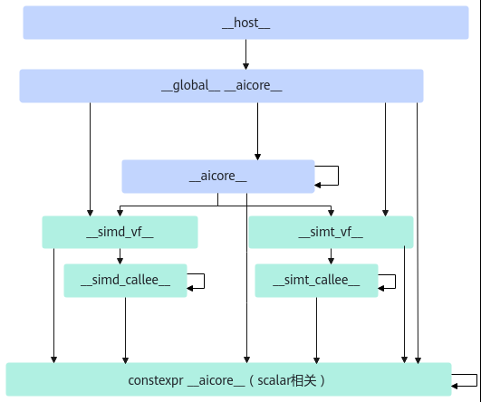

# SIMD与SIMT混合编程

> **Section**: 2.2.3.4  
> **PDF Pages**: 115–121  

---

<!-- page 115 -->

```cpp
asc_copy_ub2gm_align(zGm, (__ubuf__ float*)zLocal, BLK_NUM, burstLength, cacheMode2, srcStride, dstStride);}
```

## 2.2.3.4 SIMD 与SIMT 混合编程

抽象硬件架构

AI Core上SIMD（Single Instruction Multiple Data，单指令多数据）与SIMT（SingleInstruction Multiple Thread，单指令多线程）混合编程，结合了SIMD多数据并行计算能力与SIMT离散访存的优势，实现了向量级并行与线程级并行的高效协同。目前，该技术仅支持Atlas 350 加速卡。

整个执行过程以Vector Function（VF）为基本调度单位，VF为一个基本函数块。SIMD与SIMT混合编程支持在同一算子中灵活切换SIMD与SIMT执行方式，两种不同类型的VF可以快速切换，每个VF代表一个独立的计算任务片段，通常对应算子中的一段可并行处理的逻辑，从而在性能、能效与开发效率之间取得更优平衡。在SIMD与SIMT混合编程中：

●一个核函数中可包含多个VF。

●每个VF可以选择使用SIMD或SIMT方式进行编程。

●不同类型VF之间可以快速切换，切换粒度为单个VF。

●在同一时刻，一个AIV核只能执行SIMT或SIMD任务。

在SIMD与SIMT混合编程中，SIMT能够简化复杂算子与不规则控制流的开发；而SIMD基于向量寄存器与指令，实现高效的数据并行处理，即单指令处理多数据，提升每周期的吞吐量。SIMD与SIMT混合编程支持开发者根据算子特征进行精细化映射：规则的逐元素elementwise操作通过SIMD获得高带宽和高算力利用率，不规则或包含分支的计算通过SIMT来缓解发散和控制复杂度。在系统层面，这有利于提高硬件利用率和能效；同时，也更便于进行算子融合和数据复用等优化。同一个算子中既包含SIMD擅长的连续规整计算，也包含SIMT擅长的离散访问等任务，从而在同一算子中同时利用SIMD和SIMT的优势。

如图2-11所示，SIMD和SIMT的内部执行流程为：

●Scalar计算单元将VF发射到Vector Function Queue中。

●SIMD与SIMT混合编程的工作模式以VF为粒度进行切换，SIMT工作模式下的DataCache（DCache）数据在VF切换时会被保留。

●SIMD和SIMT之间的VF串序执行，同一时刻，一个AIV核仅能执行SIMD或SIMT任务。

●VF执行完成后，结果数据被写回Unified Buffer或Global Memory。

<!-- page 116 -->

图2-11 SIMD 与SIMT 混合编程硬件架构图



SIMD与SIMT编程存在以下差异：

表2-9 SIMD 与SIMT 核心差异点

维度SIMDSIMT

编程模型单指令多数据（SIMD），基于向量寄存器与向量指令。

单指令多线程（SIMT），以线程为单位并行执行。

通过显式Load/Store将数据从Unified Buffer搬运到向量寄存器。

支持直接读写Global Memory或Unified Buffer中的数据。

数据搬运方式

不支持直接从Global Memory搬运数据到SIMD的向量寄存器。

适用场景规则、连续的逐元素操作（elementwise），如卷积、矩阵乘法、向量操作等。

不规则、含分支、动态访问等复杂逻辑，如注意力机制、稀疏操作等。

<!-- page 117 -->

尽管SIMD与SIMT在编程模型和执行机制上有显著差异，但在硬件层面上共享以下关键资源：

●SIMT VF与SIMD VF共享ICache（Instruction Cache），提升指令预取效率。

●SIMT与SIMD共享Vector ALU单元，基于该单元执行的功能和性能基本相同。

●Unified Buffer内存空间中一部分为SIMT与SIMD共享空间，另一部分作为SIMT的Data Cache。

内存层级

在SIMD与SIMT混合编程场景下，可以访问多种内存空间，下表汇总了常见内存类型的作用域及其生命周期。

内存类型

作用域生命周期物理位置特点

所有核函数应用程序Device大容量，低带宽

全局内存

单核核函数核函数VectorCore

共享内存

小容量，高带宽

SIMT寄存器

ThreadSIMT VF函数Device极小容量，极高带宽

SIMD寄存器

Register FileSIMD VF函数VectorCore

极小容量，极高带宽

●全局内存即Global Memory，存储空间大，带宽低，生命周期与整个应用程序一致，通常用于存储输入输出数据；

●共享内存是每个AIV核拥有独立的Unified Buffer（UB），生命周期和AIV核函数一致，常作为全局内存的缓存；

●最靠近Vector计算单元的是寄存器，SIMT和SIMD模式各自拥有一块私有寄存器内存。

整体内存架构如下图所示：

图2-12 SIMD 与SIMT 混合编程内存模型示意图



在SIMT工作模式下，各个内存的工作流程如下：

<!-- page 118 -->

●每个线程独立的寄存器和栈，用于存储局部变量。可用寄存器数量与线程块中线程数有关，具体支持情况请见表2-23。

●线程块内所有线程共享本地内存Unified Buffer（UB），该内存区域由线程块内所有线程共同访问，且其生命周期和线程块一致。

●所有线程均可通过Data Cache（DCache）访问全局内存Global Memory（GM）。Data Cache是从UB中划分出来的一个缓存空间，内存大小可配置范围为32KB到128KB，具体配置方法详见下文UB内存分配。

在SIMD工作模式下，各个内存的工作流程如下：

●SIMD的Register File（简称RF），包含多种类型的Reg矢量计算寄存器，用于SIMD VF函数内部存储计算数据，Reg的类型请参见Reg数据类型定义。

●单核内所有VF Reg寄存器共享内存资源UB。

●在SIMD模式下，不支持直接从全局内存加载数据到Reg矢量计算寄存器，需先将数据从全局内存GM搬运至UB，再通过显式的Load/Store指令，从UB加载到Reg矢量计算寄存器中执行计算操作。

## UB 内存分配

UB（即Unified Buffer）内存空间总大小为256KB，参考图2-13，按功能划分为四个主要区域，从低地址向高地址依次为静态内存、动态内存、预留空间、Data Cache，具体结构如下：

1.静态内存：从内存的起始地址分配一段指定大小的内存空间，其大小在编译时确定，不可动态修改。// 静态内存通过数组分配，例如：__ubuf__ char staticBuf[1024];

2.动态内存（该方式将在后续版本中支持）：位于静态内存之后，通过<<<>>>中参数dynUBufSize指定的动态内存大小空间，可通过以下方式申请使用：

–通过TPipe的相关接口申请。

–通过LocalMemAllocator的Alloc接口申请。

–使用动态数组分配。// 动态内存通过动态数组分配，例如：extern __ubuf__ char dynamicBuf[];

由于上述三种方法申请动态内存时均从静态内存结束位置之后开始分配，如果同时使用可能会导致地址空间重叠，从而引发未定义行为，因此只能选择其中一种方法进行申请。

3.预留空间：编译器和Ascend C预留空间，大小固定为8KB。

4.Data Cache：SIMT专有的Data Cache空间，内存大小必须大于或等于32KB。

说明

动态内存的动态数组分配方式目前开发中，将在后续版本中支持，请关注后续版本。

●DataCache = UB总大小（256KB） – 静态内存 – 动态内存 – 预留空间(8KB）

●若DataCache小于32KB，会出现校验报错。

●在SIMD与SIMT混合编程的场景下，算子内部不能使用全部的Unified Buffer空间，除了预留8KB空间外，还需至少为SIMT预留32KB的Data Cache空间。

<!-- page 119 -->

图2-13 UB 内存分配图



核函数的定义

●核函数定义方式

–SIMT VF函数定义：

定义SIMT VF核函数时，__launch_bounds__(thread_num)是可选配置，用于在编译期指定核函数启动的最大线程数，如果不配置thread_num，thread_num默认为1024。

SIMD与SIMT混合编程中SIMT VF核函数定义的__simt_vf__、__gm__修饰符需要单独进行标识。关于SIMT VF函数编程的相关约束请参考附录。__simt__vf__ __launch_bounds__(thread_num) inline void simt_vector_function(__ubuf__ float* input, …)

–SIMD VF函数定义：

SIMD VF核函数使用__simd_vf__修饰符进行标识。__simd_vf__ inline void my_kernel(__gm__ uint8_t* x, __gm__ uint8_t* y, __gm__ uint8_t* z);

须知

**SIMD_VF和SIMT_VF的入参只支持PoD（Plain Old Data）数据类型。**

●PoD数据类型：包括基础数据类型（int32_t、float等）以及这些基本数据类型组成的数组和结构体；不包括构造函数、析构函数、复制构造函数、复制赋值操作符、非静态成员函数或虚函数的类或结构体。

–SIMD与SIMT混合编程核函数的定义：

i.核函数使用__global__、__aicore__修饰符进行标识。

ii.核函数的入参和SIMD函数的用法一致。

<!-- page 120 -->

iii.在SIMD与SIMT混合编程核函数中调用SIMT VF函数和SIMD VF函数。

__global__ __aicore__ void my_kernel(__gm__ float*,…)

●SIMD与SIMT混合核函数调用方式：

a.核函数的调用请参见核函数。执行配置由3个参数决定：▪numBlocks：设置核函数启用的核数，通过<<<...>>>的方式传入。▪dynUBufSize：用于指定动态内存大小。动态内存的申请方式请参见UB内存分配中的动态内存。▪stream：类型为aclrtStream，用于维护异步操作的执行顺序，确保在device上按照程序中的代码调用顺序执行。

b.开发者需要保证核函数内使用的动态内存大小不超过dynUBufSize，超出会越界访问预留空间或者Data Cache，引发未定义行为。

c.可配置的最大动态内存大小 = 256KB - 保留空间（8KB）- 32KB（最小DCache）- 静态内存。

```cpp
kernel_name<<<numBlocks, dynUBufSize, stream>>>(args...)
```

调用层级

●核函数：使用__global__ __aicore__标识，是Device侧的入口函数，在Host侧可以通过<<<...>>>语法进行调用。

●__aicore__函数：使用__aicore__标识该函数在Device侧执行。核函数内可以调用__aicore__函数。

●simd vf函数：使用__simd_vf__标记，能被核函数通过asc_vf_call接口调用。simdvf函数内只能调用__simd_callee__函数和constexpr函数。

●simt vf函数：使用__simt_vf__标记，能被核函数通过asc_vf_call接口调用。simtvf函数内只能调用__simt_callee__函数和constexpr函数。

●__simd_callee__子函数：被simd vf函数调用的子函数，子函数可能有返回值或者通过引用传参，这类子函数通过__simd_callee__标识。__simd_callee__函数内只能调用__simd_callee__函数和constexpr函数。

●__simt_callee__子函数：被simt vf函数调用的子函数，子函数可能有返回值或者通过引用传参，这类子函数通过__simt_callee__标识。__simt_callee__函数内只能调用__simt_callee__函数和constexpr函数。

具体支持的调用关系图如下所示。

<!-- page 121 -->

图2-14函数调用关系图



编程示例

样例中介绍的算子完整代码请参见SIMD与SIMT混合编程实现gather&adds算子样例。更多SIMT函数声明的相关约束请参考语法限制。__simt_vf__ __launch_bounds__(THREAD_COUNT) inline void simt_gather(    __gm__ float* input,    __gm__ uint32_t* index,    __ubuf__ float* gather_output,    uint32_t input_total_length,    uint32_t index_total_length,    uint32_t output_total_length){    if (threadIdx.x >= output_total_length) {        return;    }    // blockIdx will be supported later.    int idx = blockIdx.x * blockDim.x + threadIdx.x;    if (idx >= index_total_length) {        return;    }

```cpp
uint32_t gather_idx = index[idx];
    if (gather_idx >= input_total_length) {        return;    }
gather_output[threadIdx.x] = input[gather_idx];}
__simd_vf__ inline void simd_adds(__ubuf__ float* output, __ubuf__ float* input,    uint32_t count, uint32_t one_repeat_size, uint16_t repeat_times)
```
