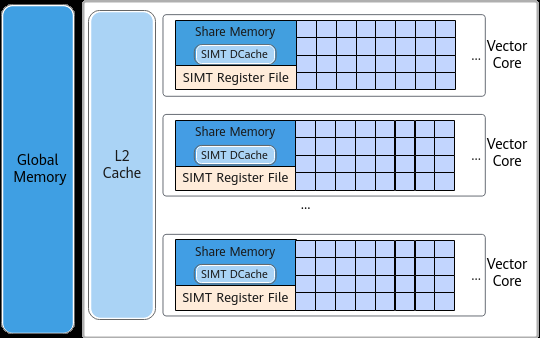

# 线程架构

> **Section**: 2.2.4.2  
> **PDF Pages**: 123–123  

---

<!-- page 123 -->

元、Share Memory即Unified Buffer、寄存器和堆栈空间，核外的Global Memory是全局内存空间，被所有Vector Core共享。

图2-15 SIMT 抽象硬件架构图

以下是SIMT多线程计算涉及到的硬件资源的说明：

●每个线程拥有独立的寄存器和栈空间，用于存储局部数据，寄存器的数量受线程块内线程数量影响，线程数量越多，每个线程拥有的寄存器数量越少。

●Unified Buffer的一部分内存空间作为线程块内所有线程的共享内存（ShareMemory），支持线程块内的线程进行数据交互，一部分作为读取GlobalMemory的Data Cache。

●SIMT模式中，读取Global Memory上的数据时，通过Data Cache单元完成数据中转，数据流经由Global Memory到Data Cache，再从Data Cache到寄存器。DataCache是Unified Buffer中预留的一部分空间，其最大容量为128KB，最小容量为32KB，实际大小由用户自主分配。

若您对上述内容中的线程、线程块等概念不熟悉，建议查阅2.2.4.2 线程架构了解更多SIMT线程架构知识；同时，您也可以通过阅读2.2.4.3 内存层级，了解如何配置DataCache、Unified Buffer的划分方式。

## 2.2.4.2 线程架构

SIMT编程模型的线程层次结构分为两层：

●线程块网格（Grid）：由多个线程块（Thread Block）组成，使用内置变量gridDim来表示启用的线程块的个数，同一时刻一个AIV核只执行一个线程块任务。

●线程块（Thread Block）：由若干线程（thread）组成，使用内置变量blockDim表示一个线程块启用的的线程个数，一个线程块最多可以启用2048个线程。
