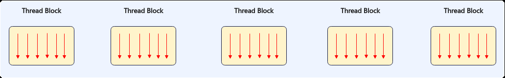
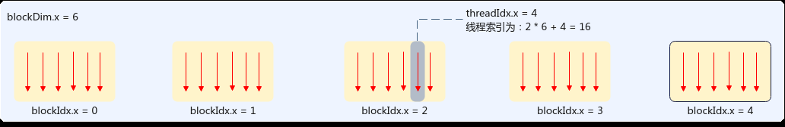
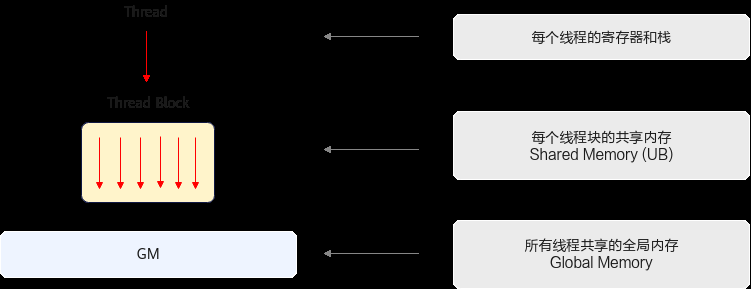
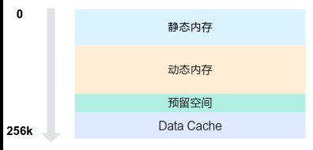

# 内存层级

> **Section**: 2.2.4.3  
> **PDF Pages**: 124–126  

---

<!-- page 124 -->

基于SIMT编程模型的程序，在AIV核上执行多个结构相同的线程块，执行的总线程数等于gridDim*blockDim。



gridDim由三维结构dim3来表示，{dimx，dimy，dimz}用于指定3个不同维度的线程块的大小，三维乘积的总数不超过65535，各线程块可通过线程块索引blockIdx进行标识。blockDim也由dim3三维结构表示，三维乘积的总数不超过2048，各线程可通过线程块内线程索引threadIdx进行标识。线程索引的计算示例如下图所示：



底层调度过程中，同一时刻一个AIV只能执行一个线程块任务，每个线程块会被切分成多个Warp。Warp是执行相同指令的线程的集合，每个Warp包含32个线程。每个AIV核包含4个Warp调度器（Warp Scheduler），调度器编号scheduler id为warp id %4。在每个调度周期内，每个Warp调度器从其需要调度处理的Warp集合中选取一个就绪状态的Warp发射指令。

## 2.2.4.3 内存层级

SIMT线程可访问多种内存空间。下表汇总了SIMT编程中常见内存类型的作用域及其生命周期。

内存类型线程作用域生命周期物理位置

全局内存Grid应用程序Device

共享内存Block核函数Vector Core

栈Thread核函数Device

寄存器Thread核函数Vector Core

●全局内存是所有线程均可直接访问的内存资源，即Global Memory；

●共享内存是线程块内所有线程共享的内存，即Unified Buffer，生命周期和线程块一致。

●每个线程独立的寄存器和栈，用于存储局部变量。

内存层级如下图所示。

<!-- page 125 -->



全局内存（Global Memory）

Device侧的全局内存是整个Grid中所有线程均可访问的内存空间，其作用与CPU系统中的随机存取存储器（RAM）相似，运行在Device侧的核函数可直接访问全局内存，这种方式与CPU上代码访问系统内存的方式相同。

全局内存具有持久性：通过全局内存分配的空间、其中存储的数据将持续保留，直到该内存空间被释放或应用程序终止。用户通过Runtime API完成Device侧全局内存的管理。Host使用aclrtMalloc分配Device侧的全局内存，并通过aclrtMemcpy将数据从Host拷贝到Device侧的全局内存，或将数据从Device的全局内存拷贝回Host内存；通过aclrtMalloc分配的Device全局内存需使用aclrtFree接口释放。有关Runtime API的更多信息与细节，可以参考《应用开发 (C&C++)》中的《Runtime运行时 API》章节。

在实际开发过程中，用户需在核函数启动前，通过Runtime API完成全局内存的分配与初始化；在核函数执行期间，SIMT每个线程均可读取和写入数据到全局内存；核函数执行完毕后，其写入全局内存的结果可拷贝回Host。由于全局内存对Grid内所有线程均开放访问，因此必须严格规避线程间的数据竞争。

下述代码为全局内存的使用提供了简易示例。数组 x、y、z 均存储于全局内存中，通过以下核函数实现每个线程对全局内存的访问和存储。

```cpp
__global__ void add_custom(float* x, float* y, float* z, uint64_t total_length){    // Calculate global thread ID    int32_t idx = blockIdx.x * blockDim.x + threadIdx.x;    // Maps to the row index of output tensor    if (idx >= total_length) {        return;    }    z[idx] = x[idx] + y[idx];}
```

共享内存（Unified Buffer）

共享内存是同一线程块内所有线程均可访问的内存空间，位于每个Vector Core（AIV）内部。与全局内存相比，共享内存的容量较小，但具有更高的带宽和更低的访问延迟，可视为内核执行期间由用户管理的高速缓存资源。由于共享内存可被线程块内的全部线程访问，因此需要注意避免同一线程块内线程间的数据竞争。通过使用6.3.3.1 asc_syncthreads接口，可以实现同一线程块内的线程同步，该函数会阻塞线程块内的所有线程，直至所有线程均执行到接口调用位置。

用户可通过动态或者静态方式申请共享内存。

1.静态申请：分配一段指定大小的内存空间，其大小在编译时确定，不可动态修改，开发者通过数组分配申请使用。该方式将在后续版本中支持。

<!-- page 126 -->

```cpp
__ubuf__ half staticBuf[1024];
```

2.动态申请：用户需要通过<<<>>>中参数dynUBufSize指定动态内存的空间大小，其大小在运行期确定，SIMT编程中可通过以下方式申请使用动态内存。该方式将在后续版本中支持。extern __ubuf__ char dynamicBuf[];

由于Unified Buffer不仅作为共享内存，还有部分内存空间预留作内部使用，因此用户在申请共享内存时，应注意不能将所有共享内存用尽。如下图，Unified Buffer内存空间总大小为256KB，按功能划分为四个主要区域，从低地址到高地址依次为静态内存、动态内存、预留空间和Data Cache。



具体结构如下：

1.静态内存和动态内存对应用户静态、动态申请方式分配的内存。

2.预留空间：编译器和Ascend C预留空间，大小固定为8KB。

3.Data Cache：SIMT专有的Data Cache空间，用于SIMT线程访问全局内存时的数据缓存，Data Cache的空间可配置范围在32KB到128KB，实际内存大小受用户配置的静态和动态内存大小影响，简单计算公式为DataCache空间大小 = UB大小（256KB） - 静态内存 - 动态内存 - 预留空间（8KB）。用户需要合理配置静态和动态内存大小，以确保Data Cache大于或等于32KB。

说明

静态内存分配、动态内存的动态数组分配方式目前开发中，将在后续版本中支持，请关注后续版本。

●若DataCache小于32KB，会出现校验报错。

●SIMT场景，算子开发不能使用全部的Unified Buffer空间，除了预留8KB空间外，还需至少为SIMT预留32KB的Data Cache空间。

寄存器

SIMT编程中，每个线程拥有独立的寄存器，其生命周期与核函数一致。寄存器的使用由编译器管理，并在核函数执行期间用于线程的局部存储。线程执行时可用寄存器数量与用户配置的blockDim有关，详见下表。

表2-10 LAUNCH_BOUND 的Thread 数量与每个Thread 可用寄存器数

**blockDim大小每个Thread可用寄存器个数(个)**

1025~204816

513~102432
