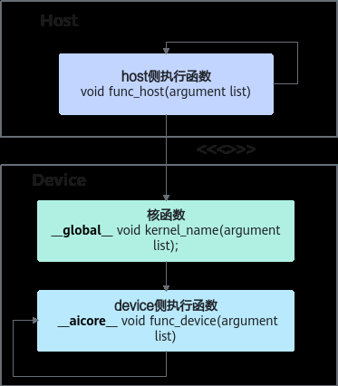

# 同步机制

> **Section**: 2.2.4.5  
> **PDF Pages**: 128–128  

---

<!-- page 128 -->

图2-16算子程序中三种函数间的调用关系



Host侧通过内核调用符<<<...>>>的语法形式调用核函数，如下所示：

```cpp
kernel_name<<<numBlocks, threadsPerBlock, dynUBufSize, stream>>>(args...)
```

执行配置由4个参数决定：

●numBlocks：为核函数配置的线程块的个数，即启用的核数, 支持int32_t和dim3类型；

●threadsPerBlock：每个线程块内并发执行的线程数量，支持int32_t和dim3类型；

●dynUBufSize：动态申请内存空间总大小，一般情况设置为0；

●stream：用于host侧和device侧的流同步。

## 2.2.4.5 同步机制

SIMT是一种单指令多线程的编程模式，其异步编程模型旨在通过多线程并发执行达到内存操作加速的目的。在这一编程模型中，线程作为执行计算或操作内存的最小抽象单位，其操作是相互独立的。然而，在某些应用场景中，需要支持线程间的同步，或防止不同线程对同一内存区域的读写操作引发的数据竞争。为此，Ascend C提供了相应的同步接口，这些接口允许开发者根据需求选择合适的同步机制，以确保异步操作的正确性和性能。

接口名功能说明

**asc_syncthreads**

等待当前线程块内所有线程代码都执行到该函数位置。
