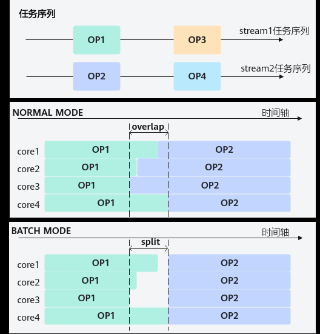

# SIMD BuiltIn关键字

> **Section**: 2.4.1  
> **PDF Pages**: 154–161  

---

<!-- page 154 -->

## 2.4 语言扩展层

## 2.4.1 SIMD BuiltIn 关键字

预定义宏

如其他语言一样，会提供一些内置的宏方便用户编写程序。预定义宏一节着重介绍一些用户在做异构编程时会经常用到的宏，以及宏的解释。

●__NPU_ARCH__

__NPU_ARCH__是Device侧AI Core代码中的预处理宏，用于标识AI处理器的架构版本。该宏由四位数字组成，其中前三位数字用于标识AI Core的IP核(IntellectualProperty Core)类型，第四位数字标识该AI Core同一个IP核的配置版本。通过该宏，开发者可以针对不同AI处理器，差异化进行代码适配和优化。AI处理器型号和__NPU_ARCH__对应关系如下表所示：

表2-17 AI 处理器型号和__NPU_ARCH__的对应关系

**AI处理器型号__NPU_ARCH__**

Atlas 350 加速卡3510

Atlas A3 训练系列产品/Atlas A3 推理系列产品

2201

Atlas A2 训练系列产品/Atlas A2 推理系列产品

2201

Atlas 200I/500 A2 推理产品3002

Atlas 推理系列产品2002

Atlas 训练系列产品1001

以下为通过__NPU_ARCH__控制在不同AI处理器上算子输出值舍入模式的示例。__aicore__ static inline void CopyOut(uint64_t mulLen){#if __NPU_ARCH__ == 2002    Cast(dstLocal, srcLocal, RoundMode::CAST_NONE, mulLen); // CAST_NONE表示舍入模式在转换有精度损失时使用CAST_RINT模式，在不涉及精度损失时不进行舍入#elif __NPU_ARCH__ == 2201    Cast(dstLocal, srcLocal, RoundMode::CAST_RINT, mulLen); // CAST_RINT表示舍入模式为四舍六入五成双舍入#endif    event_t eventVToMTE3 = static_cast<event_t>(GetTPipePtr()->FetchEventID(HardEvent::V_MTE3));    SetFlag<HardEvent::V_MTE3>(eventVToMTE3);    WaitFlag<HardEvent::V_MTE3>(eventVToMTE3);    CommonCopyOut<float>(dstLocal, mulLen);  // 拷贝LocalTensor至GlobalTensor}

●ASCEND_IS_AIV、ASCEND_IS_AIC

ASCEND_IS_AIV和ASCEND_IS_AIC是通过C++宏实现的条件判断语句，用于在__aicore__修饰的函数中实现代码的条件编译。基于分离模式（AIC核和AIV核分离）开发融合算子时，算子逻辑中同时涉及AIV核和AIC核的处理逻辑，并需要进

<!-- page 155 -->

行核间同步，此时需要通过ASCEND_IS_AIV/ ASCEND_IS_AIC进行AIV和AIC核代码的隔离。

说明

当使用高阶API Matmul时，其内部已通过REGIST_MATMUL_OBJ宏方式实现了AIV与AIC核代码的隔离，用户无需再使用该宏进行处理。以MatmulNzCustom算子为例，该算子在分离模式下需要分别在AIV核和AIC核上实现不同的逻辑。具体而言，AIV核负责将矩阵数据搬入Unified Buffer，完成数据的重排（将矩阵数据转换为NZ格式），并将其写入Global Memory。而AIC核则直接从Global Memory读取已经重排好的NZ格式数据，并执行矩阵乘法（Matmul）计算。由于AIV核和AIC核的代码逻辑不同，需要通过ASCEND_IS_AIV和ASCEND_IS_AIC宏进行代码隔离，确保在编译时分别生成适用于AIV核和AIC核的代码。示例伪码如下：template <typename AType, typename BType, typename CType, typename BiasType>__aicore__ inline void MatmulKernel<AType, BType, CType, BiasType>::Process(AscendC::TPipe *pipe){    // 利用AIV核的Vector计算单元实现ND2NZ格式转换。如下代码中MatrixBtoNZ为将B矩阵进行ND2NZ格式转换的函数。    if ASCEND_IS_AIV {        pipe->InitBuffer(ubBuf, TOTAL_UB_SIZE);        MatrixBtoNZ<typename B_TYPE::T>(tempGM,            bGMNZ,            tiling,            isTransB,            ubBuf,            tiling.baseK,            tiling.baseN);  // Vector侧实现的ND2NZ函数        SyncAll();        // AIC核和AIV核同步        AscendC::CrossCoreSetFlag<0x2, PIPE_MTE3>(0x4);        return;    }    if ASCEND_IS_AIC {        AscendC::CrossCoreWaitFlag(0x4);   // 等待AIV核完成ND2NZ格式转换    }    ... ...    // 设置左矩阵A、右矩阵B、Bias。    matmulObj.SetTail(tailM, tailN);    matmulObj.SetTensorA(aGlobal, false);    matmulObj.SetTensorB(bGlobal, false);    if (tiling.isBias) {        matmulObj.SetBias(biasGlobal);    }    // 完成矩阵乘操作    matmulObj.IterateAll(cGlobal);    // 结束矩阵乘操作    matmulObj.End();}●ASCENDC_CUBE_ONLYASCENDC_CUBE_ONLY是通过C++宏实现的条件判断语句，用于在__aicore__修饰的函数中实现代码的条件编译。基于分离模式开发非融合算子时，在只有矩阵计算的算子场景下，可以通过设置ASCENDC_CUBE_ONLY，使能纯Cube模式完成Matmul计算，减少消息通信的性能开销，提升算子性能。

注意

ASCENDC_CUBE_ONLY宏必须在#include "lib/matmul_intf.h"之前设置。

<!-- page 156 -->

以matmul_custom算子为例，高阶API Matmul默认使用MIX模式，即用户从AIV侧发起消息，通过消息通信框架中转消息后，在AIC侧执行Matmul计算。这套消息处理机制会带来额外的Scalar性能开销。相较于MIX模式，纯Cube模式可以直接跳过消息通信框架，完成Matmul计算，提升算子性能。

示例伪码如下：

```cpp
#define ASCENDC_CUBE_ONLY#include "lib/matmul_intf.h"
using A_TYPE = AscendC::MatmulType<AscendC::TPosition::GM, CubeFormat::ND, AType>;using B_TYPE = AscendC::MatmulType<AscendC::TPosition::GM, CubeFormat::ND, BType>;using C_TYPE = AscendC::MatmulType<AscendC::TPosition::GM, CubeFormat::ND, CType>;using BIAS_TYPE =  AscendC::MatmulType<AscendC::TPosition::GM, CubeFormat::ND, BiasType>;AscendC::Matmul<A_TYPE, B_TYPE, C_TYPE, BIAS_TYPE, CFG_NORM> matmulObj;
```

函数执行空间限定符

函数执行空间限定符（Function Execution Space Qualifier）指示函数是在Host侧执行还是在Device侧执行，以及它是否可从Host侧或Device侧调用。

●__global__

__global__执行空间限定符声明一个Kernel函数。Kernel函数有如下性质：在Device上执行；只能被Host侧函数调用；__global__只是表示这是Device侧函数的入口，并不表示具体的设备类型，具体的设备类型由__aicore__标记。具有如下使用约束：

–一个__global__函数必须返回void类型，并且不能是class的成员函数。

–主机侧调用__global__函数必须使用<<<>>>异构调用语法。

–__global__的调用是异步的，意味着函数返回，并不表示kernel函数在device侧已经执行完成，如果需要同步，需要使用Runtime同步接口显式同步，如aclrtSynchronizeStream接口。

●__aicore__

__aicore__执行空间限定符声明一个函数，它具有如下属性：

–在Device侧执行

–只能被__global__函数，或者其他__aicore__函数调用

```cpp
// Only callable from device functions with same kind// of execution space__aicore__ void bar() {}
// Define a kernel function execute on AI Core device__global__ __aicore__ void foo() {  bar(); // OK.}
```

●__host__

__host__执行空间限定符声明一个函数，它具有如下属性：

–只能在Host侧执行

–只能被Host侧函数调用

–__global__ 和__host__不能一起使用

__host__限定符是可选项，无函数执行空间限定符定义的函数，默认是host函数。

```cpp
__aicore__ int f() {}
// defines a host side functionint foo() {}
// defines a host side function
```

<!-- page 157 -->

```cpp
__host__ int bar() {  f();     // Error.  foo();   // OK.}
// Error.__global__ __host__ void kfunc() {}
```

●__aicpu__

AI CPU函数执行空间限定符__aicpu__用于指示函数是否为AI CPU Kernel函数，它具有如下属性：

–在Device侧执行且只能被Host侧函数调用，因此必须与__global__同时声明。

–一个__global__ __aicpu__函数不能是void返回类型，并且入参只能是一个指针。

–一个__global__ __aicpu__函数不能在.asc文件中进行定义，只能声明，且需要使用extern。

–Host侧调用__global__ __aicpu__函数时必须使用<<<>>>异构调用语法，输入的函数入参在入参指针的基础上需要输入从指针中读取的数据大小。

–__global__的调用是异步的，意味着函数返回，并不表示kernel函数在Device侧已经执行完成，如果需要同步，需要使用Runtime同步接口显式同步，如aclrtSynchronizeStream接口

```cpp
// Define a AI CPU kernel function in AI CPU device file__aicpu__ void foo() {} // Error, single __aicpu__ identifier without _global____global__ void foo() {} // Error, single __global__ identifier without __aicpu__ __global__ __aicpu__  void foo() {} // Error, return type is void__global__ __aicpu__  int foo(void *a) {} // OK __global__ __aicpu__  int foo(int a) {} // Error, input param is not pointer__global__ __aicpu__  int foo(void *a, void *b) {} // Error, input param num is not one// Declare a AI CPU kernel function in .asc fileextern __global__ __aicpu__ uint32_t hello_world(void *args);// OK}
```

●__inline__

__inline__限定符声明一个函数，它具有如下属性：

–标识Device侧函数强制内联，可以减少函数频繁调用产生的指令压栈、出栈的开销，但可能会导致算子二进制增加。

–和C++函数修饰符inline的主要区别是Device侧__inline__是强制内联，C++的inline则是根据编译器优化选择性内联。

–AI Core对函数嵌套深度有限制，一般推荐嵌套深度不超过4层。使用强制内联可以减少调用层次。

●__cube__

标识该核函数仅在Cube核执行。针对耦合模式的硬件架构，该修饰符不生效。

```cpp
extern "C" __global__ __cube__ void mmad_custom(GM_ADDR a, GM_ADDR b, GM_ADDR c){    KernelMmad op;
    op.Init(a, b, c);
    op.Process();}
```

●__vector__

标识该核函数仅在Vector核执行。针对耦合模式的硬件架构，该修饰符不生效。

```cpp
__vector__ __global__ __aicore__ void add_custom(){}
```

●__mix__(cube, vec)

<!-- page 158 -->

标识该核函数同时在Cube核和Vector核上执行。(cube, vec)分别表示核函数启动的Cube核和Vector核的配比，支持的配比为(1, 0)，(0, 1)，(1, 1)， (1, 2)。针对耦合模式的硬件架构，该修饰符不生效。

●__schedmode__(mode)

标识该核函数的执行调度模式。如下图所示：

–mode = 0 : normal mode，尽可能选择空闲物理核下发执行核函数，若空闲物理核数无法满足当前核函数的需要，没有下发的部分等待核心空闲后执行。此时OP1和OP2算子会存在交叠执行（overlap）的情况。

–mode = 1 : batch mode，在下发核函数时先进行判断，若空闲物理核数无法满足当前核函数的需要，则等待至空闲物理核数满足该核函数所需要的所有物理核时，同时下发执行，OP1和OP2的执行被切分（split）开，不会出现交叠执行的情况。



在多流并发场景，多算子并行执行时，若执行总核数超过最大物理核数，且多个算子逻辑使用SyncALL等核间同步接口时，建议设置mode为1，防止多个算子之间互相等待空闲核调度，导致死锁。默认值mode为0。

__schedmode__(1) __global__ __mix__(1, 2) void OP1() // OP1使用了SyncAll接口，且存在多流并发的可能，需要设置batch mode（mode 1）{    AscendC::SyncAll();    ....    }

<!-- page 159 -->

__schedmode__(1) __global__ __mix__(1, 2) void OP2() // OP2使用了SyncAll接口，且存在多流并发的可能，需要设置batch mode（mode 1）{    AscendC::SyncAll();    ....    } __schedmode__(0) __global__ __vector__ void OP3() {...} // OP3没有使用SyncAll接口，可以设置为normal mode(mode 0)，按照正常规则执行算子。or__global__ __vector__ void OP3() {...} // 不设置__schedmode__，默认为normal mode。

函数标记宏

●__simd_vf__

函数标记宏，用于标记SIMD VF入口函数，函数无返回值。使用asc_vf_call调用SIMD VF入口函数，启动VF子任务。__simd_vf__ inline void KernelAdd(__ubuf__ float* x, __ubuf__ float* y, __ubuf__ float* z)

__simd_vf__标记的SIMD VF有以下入参约束：

–支持指针传参（Pass-by-Pointer），指针变量必须用__ubuf__地址空间限定符修饰。

–不支持引用传参（Pass-by-Reference）。

–不支持函数指针传参，函数对象。

__simd_vf__使用的示例如下：

```cpp
__simd_vf__ inline void simd_adds(__ubuf__ float *output, __ubuf__ float *input,    uint32_t count, uint16_t one_repeat_size, uint16_t repeat_times){    AscendC::Reg::RegTensor<float> src_reg0;
    AscendC::Reg::RegTensor<float> dst_reg0;    // asc_update_mask() will be supported later.    // init MaskReg with the count of all numbers.    AscendC::Reg::MaskReg mask_reg = AscendC::Reg::UpdateMask<float>(count);
    for (uint16_t i = 0;
 i < repeat_times;
 i++) {        // asc_load, asc_adds and asc_store will be supported later.        // load data from UB to RegTensor.        AscendC::Reg::LoadAlign(src_reg0, input + i * one_repeat_size);
        AscendC::Reg::Adds(dst_reg0, src_reg0, 1.0f, mask_reg);        // store data from RegTensor to UB.        AscendC::Reg::StoreAlign(output + i * one_repeat_size, dst_reg0, mask_reg);    }}
```

●__simd_callee__

函数标记宏，函数可以有返回值，允许被SIMD VF入口函数或其他非入口函数调用。

```cpp
__simd_callee__ inline float add(float x, float y)
```

地址空间限定符

AI Core具备多级独立片上存储，各个地址空间独立编址，具备各自的访存指令，根据架构差异，有些存储空间具备统一地址空间（Generic Address Space），有些则没有。设备侧编程基于语法扩展允许地址空间作为合法的类型限定符，以提供针对不同地址空间的访问能力和地址空间合法性检查。

<!-- page 160 -->

表2-18地址空间映射关系

地址空间限定符AI Core物理存储空间

__gm__设备侧内存GM

__ubuf__Vector Unified Buffer

__ca__Cube L0A Buffer

__cb__Cube L0B Buffer

__cc__Cube L0C Buffer

__cbuf__Cube L1 Buffer

__fbuf__Fixpipe Buffer

__ssbuf__SSBuffer

地址空间限定符可以在变量声明中使用，用于指定对象分配的区域。如果对象的类型被地址空间名称限定，那么该对象将被分配在指定的地址空间中。同样地，对于指针，指向的类型可以通过地址空间进行限定，以指示所指向的对象所在的地址空间。

```cpp
// declares a pointer p in the __gm__ address space that// points to an object(has int type) in the __gm__ address space__gm__ int *p;
__global__ __aicore__ void foo(...){  // declares an array of 4 floats in the private address space.  float x[4];}
```

地址空间限定符不能用于非指针返回类型，非指针函数参数，函数类型，同一个类型上不允许使用多个地址空间限定符。

```cpp
// OK.__aicore__ int f() {...}
// Error. Address space qualifier cannot be used with a non-pointer return type.__ubuf__ int f() { ... }
// OK. Address space qualifier can be used with a pointer return type.__ubuf__ int *f() { ... }
// Error. Multiple address spaces specified for a type.__ubuf__ __gm__ int i;
// OK. The first address space qualifies the object pointed to and the second// qualifies the pointer.__ubuf__ int * __gm__ ptr;
```

说明

重要：不同地址空间指针的大小可能不同。例如，不能认为 sizeof(__gm__ int *)总是等于sizeof(__ubuf__ int *)，譬如编译器或许可能在某些系统上以32bit存储__ubuf__指针。

●private地址空间

private地址空间是大多数变量的默认地址空间，特别是局部变量。

```cpp
// m is in a specific kernel parameter address space, // it's physical location is implementation determined.
```

<!-- page 161 -->

```cpp
__global__ __aicore__ void foo(int m) {  // OK. i is an int variable allocated in private address space  int i;}
__aicore__ void bar(int k) { //OK. k is in private address space  // OK. i is an int variable allocated in private address space  int i; }
```

●__gm__地址空间

__gm__地址空间限定符用来表示分配于设备侧全局内存的对象，全局内存对象可以声明为标量、用户自定义结构体的指针。

```cpp
__gm__ int *var; // var point to an array of int elements
typedef struct {    float a[3];
    int b[2];} foo_t;
__gm__ foo_t *info; // info point to an array of foo_t elements
```

●__ubuf__地址空间

__ubuf__地址空间用来描述存储于AI Core核内UB存储空间的变量。

```cpp
__global__ __aicore__ void foo() {  // ptr is in private address space, point to __ubuf__  __ubuf__ int *ptr;}
```

●__ca__, __cb__, __cc__, __cbuf__地址空间

上述几个地址空间主要用于特定的DMA指令访问，不具备标量直接访问能力。

```cpp
class ObjTy{  ObjTy(){...}  void print(){...}
private:  int a;
  int b;};
__global__ __aicore__ void foo(__ca__ int * ptr) { // Error. Cannot have __ca__                             // qualifier in kernel arguments  // OK  __ca__ int *ptr; }
```

内置常量

常量名取值功能

constexprint32_tg_coreType

常量值由框架自动设置，AIC核下，配置为AscendC::AIC，AIV核下，配置为AscendC::AIV。

●AscendC::AIC

●AscendC::AIV

可以通过对该常量值的判断，来实现了AIV与AIC核代码的区分和隔离。功能等同于直接使用ASCEND_IS_AIV、ASCEND_IS_AIC。
