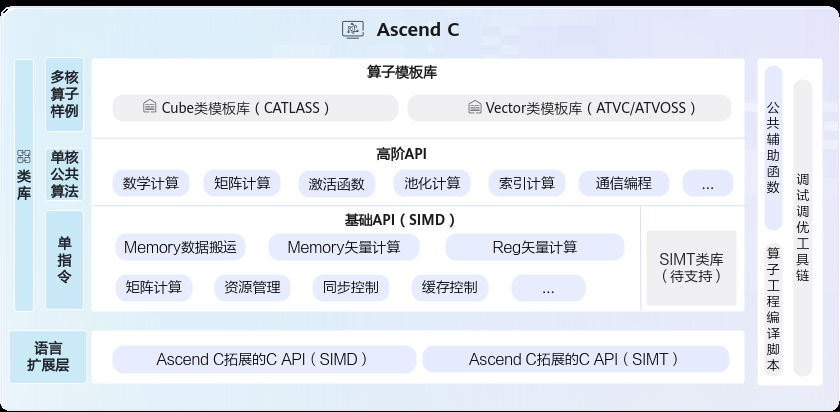

# 概述

> **Section**: 2.5.2.1  
> **PDF Pages**: 171–171  

---

<!-- page 171 -->

●基础API：实现对硬件能力的抽象，开放芯片的能力，保证完备性和兼容性。标注为ISASI（Instruction Set Architecture Special Interface，硬件体系结构相关的接口）类别的API，不能保证跨硬件版本兼容。

●高阶API：实现一些常用的计算算法，用于提高编程开发效率，通常会调用多种基础API实现。高阶API包括数学库、Matmul、Softmax等API。高阶API可以保证兼容性。

●Utils API（公共辅助函数）：丰富的通用工具类，涵盖标准库、平台信息获取、运行时编译及日志输出等功能，支持开发者高效实现算子开发与性能优化。

说明

Ascend C API所在头文件目录为：

●基础API：${INSTALL_DIR}/include/ascendc/basic_api/interface

●高阶API：（注意，如下目录头文件中包含的接口如果未在资料中声明，属于间接调用接口，开发者无需关注）

●${INSTALL_DIR}/include/ascendc/highlevel_api/lib

●${INSTALL_DIR}/include/tiling

${INSTALL_DIR}请替换为CANN软件安装后文件存储路径。以root用户安装为例，安装后文件默认存储路径为：/usr/local/Ascend/cann。

使用Ascend C API依赖的库文件说明如下：

●基础API：不涉及

●高阶API：因高阶API配套Host Tiling接口，需要链接libtiling_api.a。

## 2.5.2 基础API

## 2.5.2.1 概述

基础API实现对硬件能力的抽象，开放芯片的能力，保证完备性和兼容性。标注为ISASI（Instruction Set Architecture Special Interface，硬件体系结构相关的接口）类别的API，不能保证跨硬件版本兼容。

根据功能的不同，主要分为以下几类：

●标量计算API，实现调用Scalar计算单元执行计算的功能。
