# 连续计算API

> **Section**: 2.5.2.2.1  
> **PDF Pages**: 173–177  

---

<!-- page 173 -->

## 2.5.2.2.1 连续计算API

连续计算API，支持Tensor前n个数据计算。针对源操作数的连续n个数据进行计算并连续写入目的操作数，解决一维tensor的连续计算问题。Add(dst, src1, src2, n);

下图以矢量加法为例，展示了连续计算API的特点。

图2-19连续计算API

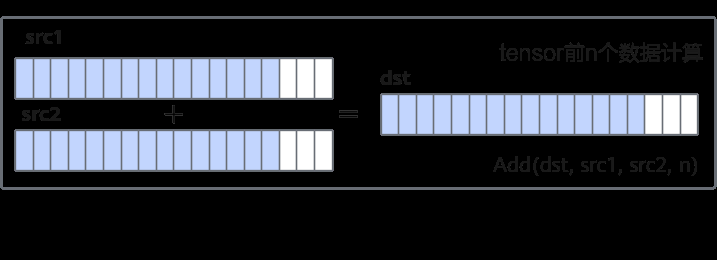

## 2.5.2.2.2 高维切分API

说明

●本章节对矢量计算基础API中的tensor高维切分计算接口做解释说明。如果您不需要使用此类接口，可略过该章节。

●下文中的repeatTime、dataBlockStride、repeatStride、mask为通用描述，其命名不一定与具体指令中的参数命名完全对应。

比如，单次迭代内不同datablock间地址步长dataBlockStride参数，在单目API中，对应为dstBlkStride、srcBlkStride参数；在双目API中，对应为dstBlkStride、src0BlkStride、src1BlkStride参数。

您可以在具体接口的参数说明中，找到参数含义的描述。

使用tensor高维切分计算API可充分发挥硬件优势，支持开发者控制指令的迭代执行和操作数的地址间隔，功能更加灵活。

矢量计算通过Vector计算单元完成，矢量计算的源操作数和目的操作数均通过UnifiedBuffer（UB）来进行存储。Vector计算单元每个迭代会从UB中取出8个datablock（每个datablock数据块内部地址连续，长度32Byte），进行计算，并写入对应的8个datablock中。下图为单次迭代内的8个datablock进行Exp计算的示意图。

图2-20单次迭代内的8 个datablock 进行Exp 计算示意图

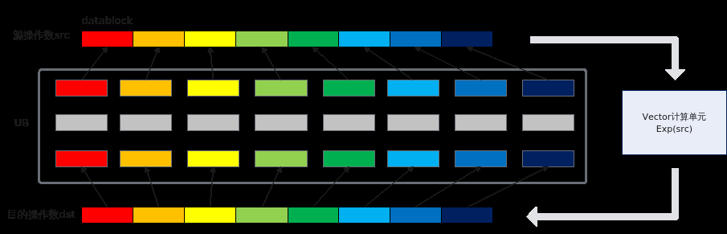

<!-- page 174 -->

●矢量计算API支持开发者通过repeatTime来配置迭代次数，从而控制指令的多次迭代执行。假设repeatTime设置为2，矢量计算单元会进行2个迭代的计算，可计算出2 * 8（每个迭代8个datablock） * 32Byte（每个datablock32Byte） =512Byte的结果。如果数据类型为half，则计算了256个元素。下图展示了2次迭代Exp计算的示意图。由于硬件限制，repeatTime不能超过255。

图2-21 2 次迭代Exp 计算

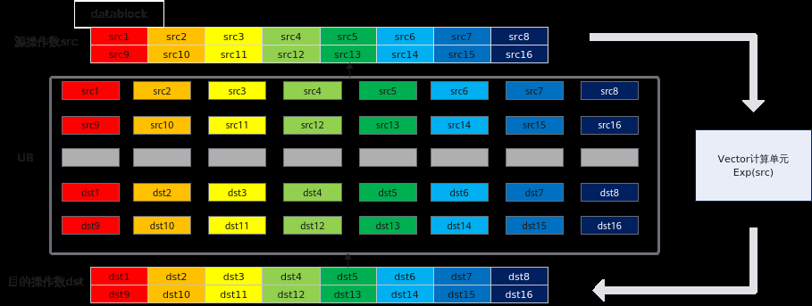

●针对同一个迭代中的数据，可以通过mask参数进行掩码操作来控制实际参与计算的个数。下图为进行Abs计算时通过mask逐比特模式按位控制哪些元素参与计算的示意图，1表示参与计算，0表示不参与计算。

图2-22通过mask 参数进行掩码操作示意图（以float 数据类型为例）

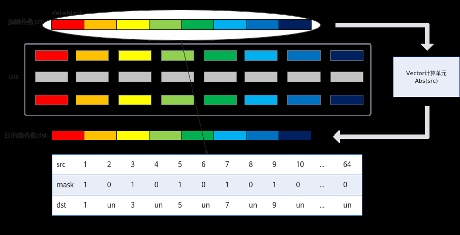

●矢量计算单元还支持带间隔的向量计算，通过dataBlockStride（单次迭代内不同datablock间地址步长）和repeatStride（相邻迭代间相同datablock的地址步长）来进行配置。

–dataBlockStride

如果需要控制单次迭代内，数据处理的步长，可以通过设置同一迭代内不同datablock的地址步长dataBlockStride来实现。下图给出了单次迭代内非连续场景的示意图，示例中源操作数的dataBlockStride配置为2，表示单次迭代内不同datablock间地址步长（起始地址之间的间隔）为2个datablock。

<!-- page 175 -->

图2-23单次迭代内非连续场景的示意图

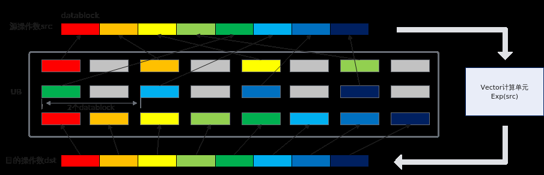

–repeatStride

当repeatTime大于1，需要多次迭代完成矢量计算时，您可以根据不同的使用场景合理设置相邻迭代间相同datablock的地址步长repeatStride的值。

下图给出了多次迭代间非连续场景的示意图，示例中源操作数和目的操作数的repeatStride均配置为9，表示相邻迭代间相同datablock起始地址之间的间隔为9个datablock。相同datablock是指datablock在迭代内的位置相同，比如下图中的src1和src9处于相邻迭代，在迭代内都是第一个datablock的位置，其间隔即为repeatStride的数值。

图2-24多次迭代间非连续场景的示意图

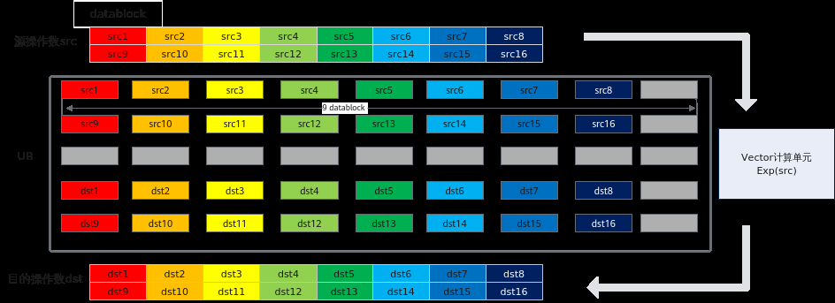

下文中给出了dataBlockStride、repeatStride、mask的详细配置说明和示例。

## dataBlockStride

dataBlockStride是指同一迭代内不同datablock的地址步长。

●连续计算，dataBlockStride设置为1，对同一迭代内的8个datablock数据连续进行处理。

●非连续计算，dataBlockStride值大于1（如取2），同一迭代内不同datablock之间在读取数据时出现一个datablock的间隔，如下图所示。

<!-- page 176 -->

图2-25 dataBlockStride 不同取值举例

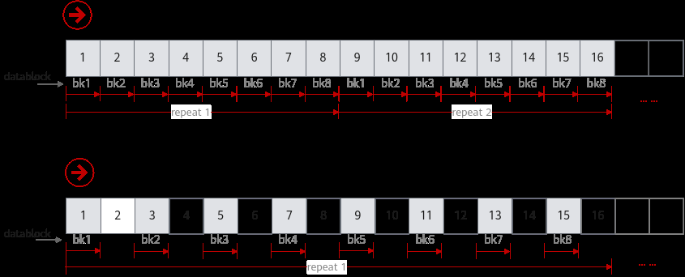

## repeatStride

repeatStride是指相邻迭代间相同datablock的地址步长。

●连续计算场景：假设定义一个Tensor供目的操作数和源操作数同时使用（即地址重叠），repeatStride取值为8。此时，矢量计算单元第一次迭代读取连续8个datablock，第二轮迭代读取下一个连续的8个datablock，通过多次迭代即可完成所有输入数据的计算。

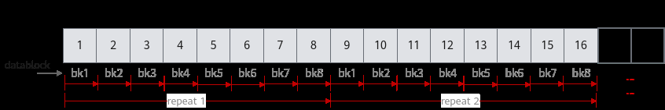

●非连续计算场景：repeatStride取值大于8（如取10）时，则相邻迭代间矢量计算单元读取的数据在地址上不连续，出现2个datablock的间隔。

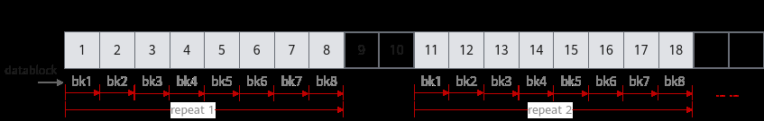

●反复计算场景：repeatStride取值为0时，矢量计算单元会对首个连续的8个datablock进行反复读取和计算。

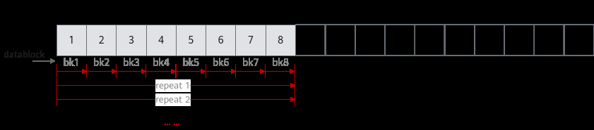

●部分重复计算：repeatStride取值大于0且小于8时，相邻迭代间部分数据会被矢量计算单元重复读取和计算，此种情形一般场景不涉及。

<!-- page 177 -->

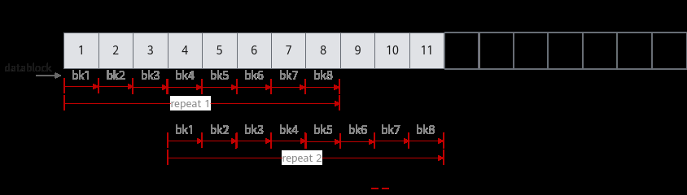

## mask 参数

mask用于控制每次迭代内参与计算的元素。可通过连续模式和逐bit模式两种方式进行设置。

●连续模式：表示前面连续的多少个元素参与计算。数据类型为uint64_t。取值范围和源操作数的数据类型有关，数据类型不同，每次迭代内能够处理的元素个数最大值不同（当前数据类型单次迭代时能处理的元素个数最大值为：256 / sizeof(数据类型)）。当操作数的数据类型占bit位16位时（如half/uint16_t），mask∈[1,128]；当操作数为32位时（如float/int32_t），mask∈[1, 64]。

具体样例如下：// int16_t数据类型单次迭代能处理的元素个数最大值为256/sizeof(int16_t) = 128，mask = 64，mask∈[1, 128]，所以是合法输入// repeatTime = 1, 共128个元素，单次迭代能处理128个元素，故repeatTime = 1// dstBlkStride, src0BlkStride, src1BlkStride = 1, 单次迭代内连续读取和写入数据// dstRepStride, src0RepStride, src1RepStride = 8, 迭代间的数据连续读取和写入uint64_t mask = 64;AscendC::Add(dstLocal, src0Local, src1Local, mask, 1, { 1, 1, 1, 8, 8, 8 });

结果示例如下：

输入数据(src0Local): [1 2 3 ... 64 ...128]输入数据(src1Local): [1 2 3 ... 64 ...128]输出数据(dstLocal): [2 4 6 ... 128 undefined...undefined]

// int32_t数据类型单次迭代能处理的元素个数最大值为256/sizeof(int32_t) = 64，mask = 64，mask∈[1, 64]，所以是合法输入// repeatTime = 1, 共64个元素，单次迭代能处理64个元素，故repeatTime = 1// dstBlkStride, src0BlkStride, src1BlkStride = 1, 单次迭代内连续读取和写入数据// dstRepStride, src0RepStride, src1RepStride = 8, 迭代间的数据连续读取和写入uint64_t mask = 64;AscendC::Add(dstLocal, src0Local, src1Local, mask, 1, { 1, 1, 1, 8, 8, 8 });

结果示例如下：

输入数据(src0Local): [1 2 3 ... 64]输入数据(src1Local): [1 2 3 ... 64]输出数据(dstLocal): [2 4 6 ... 128]

●逐bit模式：可以按位控制哪些元素参与计算，bit位的值为1表示参与计算，0表示不参与。

mask为数组形式，数组长度和数组元素的取值范围和操作数的数据类型有关。当操作数为16位时，数组长度为2，mask[0]、mask[1]∈[0, 264-1]并且不同时为0；当操作数为32位时，数组长度为1，mask[0]∈(0, 264-1]；当操作数为64位时，数组长度为1，mask[0]∈(0, 232-1]。

具体样例如下:

// 数据类型为int16_tuint64_t mask[2] = {6148914691236517205, 6148914691236517205};// repeatTime = 1, 共128个元素，单次迭代能处理128个元素，故repeatTime = 1。// dstBlkStride, src0BlkStride, src1BlkStride = 1, 单次迭代内连续读取和写入数据。// dstRepStride, src0RepStride, src1RepStride = 8, 迭代间的数据连续读取和写入。AscendC::Add(dstLocal, src0Local, src1Local, mask, 1, { 1, 1, 1, 8, 8, 8 });
