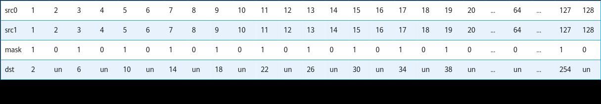
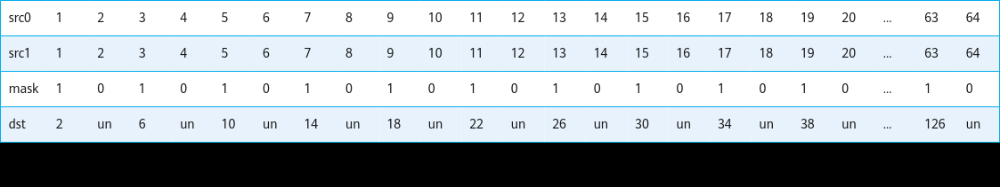

# 如何使用掩码操作API

> **Section**: 2.5.2.3.1  
> **PDF Pages**: 178–180  

---

<!-- page 178 -->

结果示例如下：

输入数据(src0Local): [1 2 3 ... 64 ...127 128]输入数据(src1Local): [1 2 3 ... 64 ...127 128]输出数据(dstLocal): [2 undefined 6 ... undefined ...254 undefined]

mask过程如下：

mask={6148914691236517205, 6148914691236517205}（注：6148914691236517205表示64位二进制数0b010101....01，mask按照低位到高位的顺序排布）

// 数据类型为int32_tuint64_t mask[1] = {6148914691236517205};// repeatTime = 1, 共64个元素，单次迭代能处理64个元素，故repeatTime = 1。// dstBlkStride, src0BlkStride, src1BlkStride = 1, 单次迭代内连续读取和写入数据。// dstRepStride, src0RepStride, src1RepStride = 8, 迭代间的数据连续读取和写入。AscendC::Add(dstLocal, src0Local, src1Local, mask, 1, { 1, 1, 1, 8, 8, 8 });

结果示例如下：

输入数据(src0Local): [1 2 3 ... 63 64]输入数据(src1Local): [1 2 3 ... 63 64]输出数据(dstLocal): [2 undefined 6 ... 126 undefined]

mask过程如下：

mask={6148914691236517205, 0}（注：6148914691236517205表示64位二进制数0b010101....01）

## 2.5.2.3 常用操作速查指导

## 2.5.2.3.1 如何使用掩码操作API

Mask用于控制矢量计算中参与计算的元素个数，支持以下工作模式及配置方式：

表2-24 Mask 工作模式

工作模式说明

Normal模式

默认模式，支持单次迭代内的Mask能力，需要开发者配置迭代次数，额外进行尾块的计算。

**Normal模式下，Mask用来控制单次迭代内参与计算的元素个数。**

通过调用 SetMaskNorm设置Normal模式。

<!-- page 179 -->

工作模式说明

Counter模式

简化模式，直接传入计算数据量，自动推断迭代次数，不需要开发者去感知迭代次数、处理非对齐尾块的操作；但是不具备单次迭代内的Mask能力。

**Counter模式下，Mask表示整个矢量计算参与计算的元素个数。**

通过调用 SetMaskCount设置Counter模式。

表2-25 Mask 配置方式

配置方式说明

通过矢量计算API的入参直接传递Mask值。矢量计算API的模板参数isSetMask（仅部分API支持）用于控制接口传参还是外部API配置，默认值为true，表示接口传参。Mask对应于高维切分计算API中的mask/mask[]参数或者tensor前n个数据计算API中的calCount参数。

接口传参（默认）

外部API配置

调用 SetVectorMask接口设置Mask值，矢量计算API的模板参数isSetMask设置为false，接口入参中的Mask参数（对应于高维切分计算API中的mask/mask[]参数或者tensor前n个数据计算API中的calCount参数）不生效。适用于Mask参数相同，多次重复使用的场景，无需在矢量计算API内部反复设置，会有一定的性能优势。

Mask操作的使用方式如下：

表2-26 Mask 操作的使用方式

前n个数据计算API高维切分计算API

配置方式

工作模式

Normal模式

不涉及。isSetMask模板参数设置为true，通过接口入参传入Mask，根据使用场景配置dataBlockStride、repeatStride、repeatTime参数。

接口传参

Counter模式

isSetMask模板参数设置为true，通过接口入参传入Mask。

●isSetMask模板参数设置为true，通过接口入参传入Mask。

●根据使用场景配置dataBlockStride、repeatStride参数。repeatTime传入固定值即可，建议统一设置为1，该值不生效。

<!-- page 180 -->

前n个数据计算API高维切分计算API

配置方式

工作模式

Normal模式

不涉及。调用 SetVectorMask设置Mask，之后调用高维切分计算API。

外部API配置

●isSetMask模板参数设置为false，接口入参中的mask值设置为占位符MASK_PLACEHOLDER，用于占位，无实际含义。

●根据使用场景配置repeatTime、dataBlockStride、repeatStride参数。

调用 SetVectorMask设置Mask，之后调用前n个数据计算API，isSetMask模板参数设置为false；接口入参中的calCount建议设置成1。

调用 SetVectorMask设置Mask，之后调用高维切分计算API。

Counter模式

●isSetMask模板参数设置为false；接口入参中的mask值设置为MASK_PLACEHOLDER，用于占位，无实际含义。

●根据使用场景配置dataBlockStride、repeatStride参数。repeatTime传入固定值即可，建议统一设置为1，该值不生效。

典型场景的使用示例如下：

●场景1：Normal模式 + 外部API配置 + 高维切分计算APIAscendC::LocalTensor<half> dstLocal;AscendC::LocalTensor<half> src0Local;AscendC::LocalTensor<half> src1Local;

// 1、设置Normal模式AscendC::SetMaskNorm();// 2、设置MaskAscendC::SetVectorMask<half, AscendC::MaskMode::NORMAL>(0xffffffffffffffff, 0xffffffffffffffff);  // 逐bit模式// SetVectorMask<half, MaskMode::NORMAL>(128);  // 连续模式

// 3、多次调用矢量计算API, isSetMask模板参数设置为false，接口入参中的mask值设置为占位符MASK_PLACEHOLDER，用于占位，无实际含义// 根据使用场景配置repeatTime、dataBlockStride、repeatStride参数// dstBlkStride, src0BlkStride, src1BlkStride = 1, 单次迭代内数据连续读取和写入// dstRepStride, src0RepStride, src1RepStride = 8, 相邻迭代间数据连续读取和写入AscendC::Add<half, false>(dstLocal, src0Local, src1Local, AscendC::MASK_PLACEHOLDER, 1, { 2, 2, 2, 8, 8, 8 });AscendC::Sub<half, false>(src0Local, dstLocal, src1Local, AscendC::MASK_PLACEHOLDER, 1, { 2, 2, 2, 8, 8, 8 });AscendC::Mul<half, false>(src1Local, dstLocal, src0Local, AscendC::MASK_PLACEHOLDER, 1, { 2, 2, 2, 8, 8, 8 });// 4、恢复Mask值为默认值AscendC::ResetMask();

●场景2：Counter模式 + 外部API配置 + 高维切分计算APIAscendC::LocalTensor<half> dstLocal;AscendC::LocalTensor<half> src0Local;AscendC::LocalTensor<half> src1Local;int32_t len = 128;  // 参与计算的元素个数// 1、设置Counter模式
