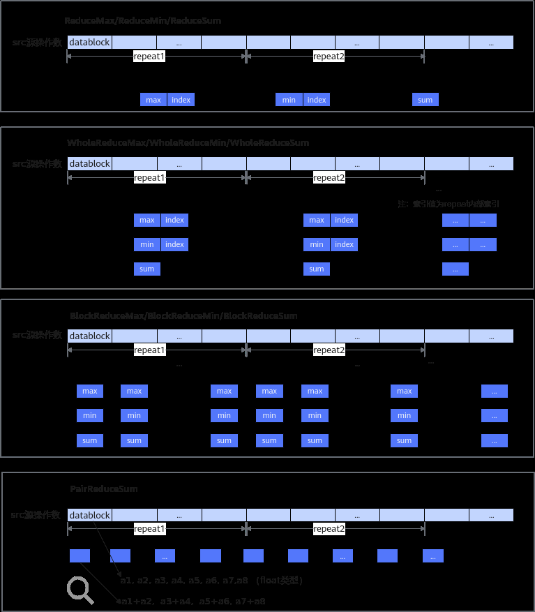

# 如何使用归约计算API

> **Section**: 2.5.2.3.2  
> **PDF Pages**: 181–182  

---

<!-- page 181 -->

AscendC::SetMaskCount();// 2、设置MaskAscendC::SetVectorMask<half, AscendC::MaskMode::COUNTER>(len);// 3、多次调用矢量计算API, isSetMask模板参数设置为false；接口入参中的mask值设置为MASK_PLACEHOLDER，用于占位，无实际含义// 根据使用场景正确配置dataBlockStride、repeatStride参数。repeatTime传入固定值即可，建议统一设置为1，该值不生效AscendC::Add<half, false>(dstLocal, src0Local, src1Local, AscendC::MASK_PLACEHOLDER, 1, { 1, 1, 1, 8, 8, 8 });AscendC::Sub<half, false>(src0Local, dstLocal, src1Local, AscendC::MASK_PLACEHOLDER, 1, { 1, 1, 1, 8, 8, 8 });AscendC::Mul<half, false>(src1Local, dstLocal, src0Local, AscendC::MASK_PLACEHOLDER, 1, { 1, 1, 1, 8, 8, 8 });// 4、恢复工作模式AscendC::SetMaskNorm();// 5、恢复Mask值为默认值AscendC::ResetMask();

●场景3：Counter模式 + 外部API配置 + 前n个数据计算接口配合使用AscendC::LocalTensor<half> dstLocal;AscendC::LocalTensor<half> src0Local;half num = 2; // 1、设置MaskAscendC::SetVectorMask<half, AscendC::MaskMode::COUNTER>(128); // 参与计算的元素个数为128// 2、调用前n个数据计算API，isSetMask模板参数设置为false；接口入参中的calCount建议设置成1。AscendC::Adds<half, false>(dstLocal, src0Local, num, 1);AscendC::Muls<half, false>(dstLocal, src0Local, num, 1);// 3、恢复工作模式AscendC::SetMaskNorm();// 4、恢复Mask值为默认值AscendC::ResetMask();

说明

●前n个数据计算API接口内部会设置工作模式为Counter模式，所以如果前n个数据计算API配合Counter模式使用时，无需手动调用 SetMaskCount设置Counter模式。

●所有手动使用Counter模式的场景，使用完毕后，需要调用 SetMaskNorm恢复工作模式。

●调用 SetVectorMask设置Mask，使用完毕后，需要调用 ResetMask恢复Mask值为默认值。

●使用高维切分计算API配套Counter模式使用时，比前n个数据计算API增加了可间隔的计算，支持dataBlockStride、repeatStride参数。

## 2.5.2.3.2 如何使用归约计算API

归约指令将数据集合简化为单一值或者更小的集合。按照归约操作的数据范围的不同，归约指令分为以下几种，可参考归约指令示意图：

●ReduceMax/ReduceMin/ReduceSum：对所有的输入数据做归约操作，得到最大值和最大值索引/最小值和最小值索引/数据总和。

●WholeReduceMax/WholeReduceMin/WholeReduceSum：对每个repeat内的输入数据做归约操作，得到每个repeat内的最大值和最大值索引/最小值和最小值索引/数据总和。返回索引时返回的是repeat内部索引。

●BlockReduceMax/BlockReduceMin/BlockReduceSum：对每个datablock内的输入数据做归约操作，得到每个datablock内的最大值/最小值/数据总和。

●PairReduce：相邻两个（奇偶）元素求和，例如（a1, a2, a3, a4, a5, a6...），归约后结果为（a1+a2, a3+a4, a5+a6, ......）。

<!-- page 182 -->

图2-26归约指令示意图

针对归约指令，和其他的基础API一样也提供了tensor高维切分计算接口，可充分发挥硬件优势，支持开发者控制指令的迭代执行和操作数的地址间隔，功能更加灵活。但具体参数的单位和约束与基础API略有不同，下文将对这些差异点进行介绍。

●repeatTime：迭代次数，开发者通过repeatTime来配置迭代次数，从而控制指令的多次迭代执行。

–ReduceMax/ReduceMin/ReduceSum对于repeatTime超过255的情况，在API内部进行了处理，所以repeatTime支持更大的取值范围，保证不超过int32_t最大值的范围即可。

–WholeReduceMax/WholeReduceMin/WholeReduceSum/BlockReduceMax/BlockReduceMin/BlockReduceSum/PairReduce和其他基础API一样，repeatTime要求不超过255。

●mask：用于控制每次迭代内参与计算的元素，mask参数的使用方法和基础API通用的使用方法一致。
