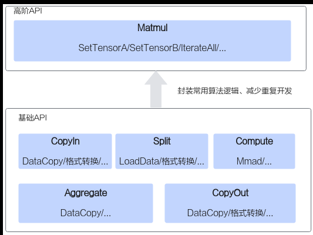

# 如何使用Tiling依赖的头文件

> **Section**: 2.5.3.2.1  
> **PDF Pages**: 184–185  

---

<!-- page 184 -->



## 2.5.3.2 常用操作速查指导

## 2.5.3.2.1 如何使用Tiling 依赖的头文件

由于AI处理器的Scalar计算单元执行能力有限，为减少算子Kernel侧的Scalar计算，将部分计算在Host端执行，这需要编写Host端Tiling代码。注意，在程序中调用高阶API的Tiling接口或者使用高阶API的Tiling结构体参数时，需要引入依赖的头文件。在不同的Tiling实现方式下，具体为：

●使用标准C++语法定义Tiling结构体

这种方式需要引入依赖的头文件如下。所有高阶API的Tiling结构体定义在AscendC::tiling命名空间下，因此需要通过AscendC::tiling访问具体API的Tiling结构体。#include "kernel_tiling/kernel_tiling.h"

```cpp
// ...AscendC::tiling::TCubeTiling cubeTilingData;
```

●使用TILING_DATA_DEF宏定义Tiling结构体

这种方式需要引入依赖的头文件如下。所有高阶API的Tiling结构体和Tiling函数定义在optiling命名空间下。#include "tiling/tiling_api.h"

```cpp
namespace optiling {// ...}
```

## 2.5.3.2.2 如何使用Kernel 侧临时空间

Kernel侧接口的内部实现一般涉及复杂的数学计算，需要额外的临时空间来存储计算过程中的中间变量。除矩阵计算、HCCL通信类、卷积计算等，对于多数高阶API中临

<!-- page 185 -->

时空间的处理，开发者可以通过Kernel侧接口的入参sharedTmpBuffer传入提前申请的临时空间、通过接口框架申请临时空间两种方式。

●通过sharedTmpBuffer入参传入，Kernel侧接口使用该传入的Tensor作为临时空间。该方式下，开发者可以自行管理sharedTmpBuffer内存空间，并在接口调用完成后，复用该部分内存，内存不会反复申请释放，灵活性较高，内存利用率也较高。

●接口框架申请临时空间，开发者无需在Kernel侧申请临时空间，但是需要预留临时空间的大小，即在分配内存空间时，应在可用空间大小中减去需预留的临时空间大小。

无论开发者采用上述哪种方式，在申请Tensor空间或预留临时空间时，都需要提前获取Kernel侧接口所需的临时空间大小BufferSize，为此相应类别API中提供了GetxxxMaxMinTmpSize接口，用于获取所需预留空间的大小范围，其中xxx为对应的Kernel侧接口。开发者在Host侧调用GetxxxMaxMinTmpSize接口，获取预留/申请的最大和最小临时空间大小，基于此范围选择合适的空间大小作为Tiling参数传递到Kernel侧使用。

●为保证功能正确，预留/申请的临时空间大小不能小于最小临时空间大小；

●在最小临时空间-最大临时空间范围内，随着临时空间增大，Kernel侧接口计算性能会有一定程度的优化提升。为了达到更好的性能，开发者可以根据实际的内存使用情况进行空间预留/申请。

以Asin接口为例：

// 算子输入的数据类型T为half，isReuseSource传入默认值falseauto shape_input = context->GetInputTensor(0)->GetOriginShape();    std::vector<int64_t> srcDims = {shape_input.GetDim(0), shape_input.GetDim(1)};uint32_t srcSize = 1;for (auto dim : srcDims) {    srcSize *= dim;}uint32_t typeSize = 2;ge::Shape shape(srcDims);uint32_t minValue = 0;uint32_t maxValue = 0;AscendC::GetAsinMaxMinTmpSize(shape, typeSize, false, maxValue, minValue);

auto platformInfo = context->GetPlatformInfo();auto ascendcPlatform = platform_ascendc::PlatformAscendC(platformInfo);uint64_t tailSize = 0; // UB剩余空间大小ascendcPlatform.GetCoreMemSize(platform_ascendc::CoreMemType::UB, tailSize); // 本样例中使用完整的ub空间，实际情况下tailSize需要减掉用户已使用的UB空间auto tmpSize = tailSize >= maxValue ? maxValue : tailSize;

AsinCustomTilingData tiling;tiling.set_tmpBufferSize(tmpSize); // 将临时空间大小设置为Tiling参数

另外，多数高阶API中提供了GetxxxTmpBufferFactorSize接口，该接口用于获取maxLiveNodeCnt和extraBuf，maxLiveNodeCnt表示临时空间是单次计算数据量所占空间的多少倍；extraBuf表示Kernel侧接口所需的临时空间大小。在固定空间大小的情况下，通过maxLiveNodeCnt和extraBuf可以推算算子单次最大计算元素数量。

推算示例如下：

●算子实现需要调用Mean接口，开发者为其预留currBuff大小的空间（即总可用空间），利用GetMeanTmpBufferFactorSize接口得到maxLiveNodeCnt、extraBuf输出值，可推导算子单次最大计算元素数量为：

currentShapeSize = (currBuff - extraBuf) / maxLiveNodeCnt / typeSize
