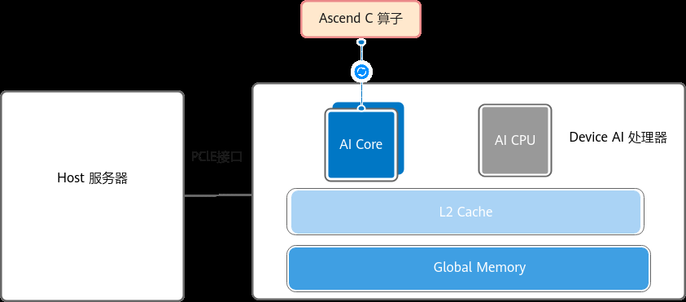
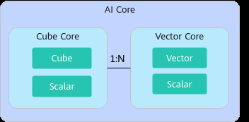
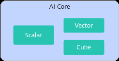
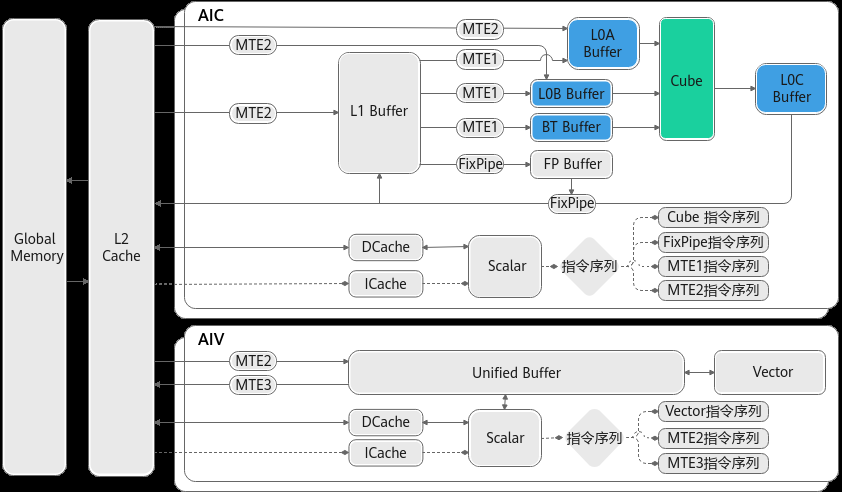
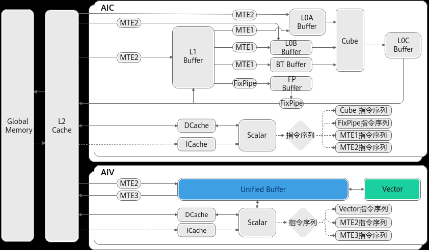
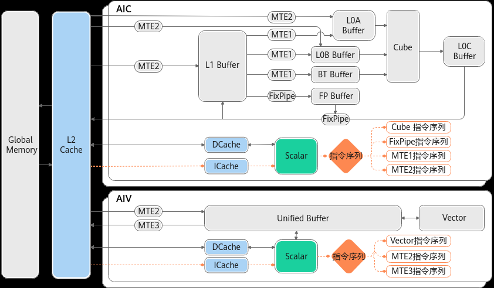
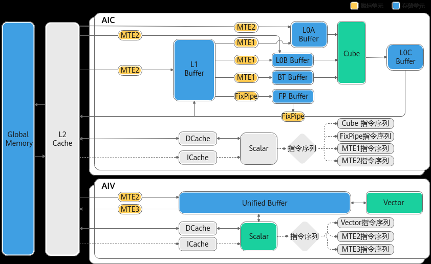
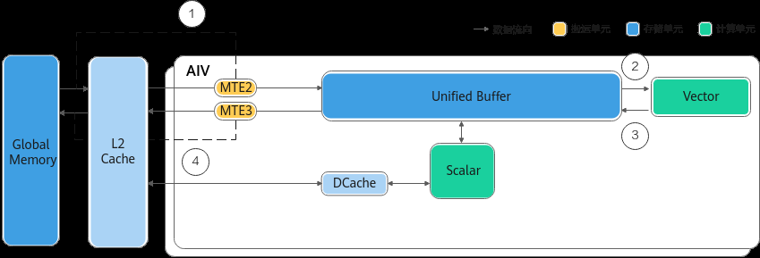
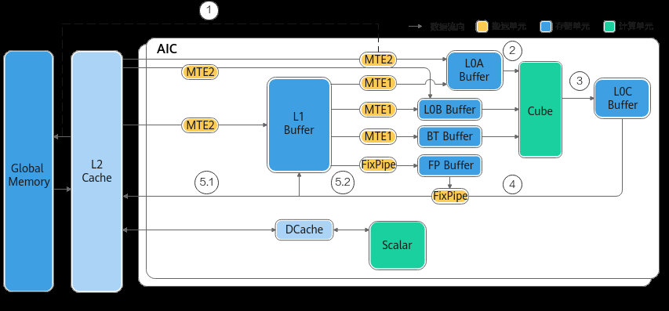
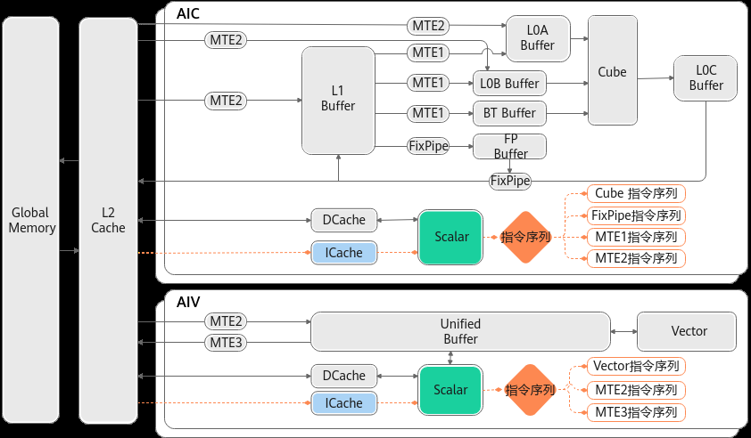

# 基本架构

> **Section**: 2.6.1  
> **PDF Pages**: 187–194  

---

<!-- page 187 -->

●C++标准库API：提供算法、数学函数、容器函数等C++标准库函数。

●平台信息获取API：提供获取平台信息的功能，比如获取硬件平台的核数等信息。

●RTC API：Ascend C运行时编译库，通过aclrtc接口，在程序运行时，将中间代码动态编译成目标机器码，提升程序运行性能。

●log API：提供Host侧打印Log的功能。开发者可以在算子的TilingFunc代码中使用ASC_CPU_LOG_XXX接口来输出相关内容。

●调测接口：SIMT VF调试场景下使用的相关接口。

## 2.6 硬件实现

## 2.6.1 基本架构

如下图所示，基于Ascend C开发的算子运行在AI Core上。Ascend C编程模型基于AICore硬件架构的抽象进行介绍，了解硬件架构能够帮助开发者更好的理解编程模型；对于需要完成高性能编程的深度开发者，更需要了解硬件架构相关知识，算子实践参考中很多内容都以本章为基础进行介绍。

AI Core负责执行矩阵、矢量计算密集的任务，其包括以下组成部分：

●计算单元：包括Cube（矩阵）计算单元、Vector（矢量）计算单元和Scalar（标量）计算单元。

●存储单元：包括L1 Buffer、L0A Buffer、L0B Buffer、L0C Buffer、UnifiedBuffer、BiasTable Buffer、Fixpipe Buffer等专为高效计算设计的存储单元。

●搬运单元：包括MTE1、MTE2、MTE3和FixPipe，用于数据在不同存储单元之间的高效传输。

以Atlas A2 训练系列产品/Atlas A2 推理系列产品为例，硬件架构图如下：

<!-- page 188 -->

本章节首先介绍硬件架构相关的关键概念和术语，以及AI Core的工作模式，为理解后续内容奠定基础。随后以Atlas A2 训练系列产品/Atlas A2 推理系列产品为例，提供AICore基本架构的介绍：首先介绍计算单元、存储单元和搬运单元的基本功能与结构，然后通过典型的数据流和控制流示例，帮助开发者深入理解硬件架构的工作原理。针对不同产品型号对应的具体架构规格和细节说明需要参考后续2.6.2 架构规格章节。

关键概念和术语

●Core

拥有独立Scalar计算单元的计算核。Scalar计算单元是核内的调度单元，承担了核内的指令发射等功能。

●AI Core

AI处理器的计算核，负责执行矩阵、矢量计算密集的任务。

●Cube Core

矩阵计算核，专注于矩阵计算。由Scalar调度单元、矩阵计算单元、搬运单元等组成，不包括矢量计算单元。

●Vector Core

矢量计算核，专注于矢量计算，由Scalar调度单元、矢量计算单元、搬运单元等组成，不包括矩阵计算单元。

●AIC

在AI Core分离模式下，一组Cube Core和Vector Core组合中的Cube Core。

●AIV

在AI Core分离模式下，一组Cube Core和Vector Core组合中的Vector Core。

## AI Core 的工作模式

●分离模式

AI Core的一种工作模式，矩阵计算单元、矢量计算单元各自对应独立的Scalar调度单元，分离部署在Cube Core和Vector Core上。将Cube Core和Vector Core按

<!-- page 189 -->

照一定比例（1：N）进行组合，这样的组合视为一个AI Core，AI Core的核数以Cube Core为准。

图2-27分离模式示意图（N 的取值以硬件平台信息获取接口获取的数值为准）

●耦合模式

AI Core的一种工作模式，矩阵计算单元、矢量计算单元对应同一个Scalar调度单元，部署在一个AI Core上。

图2-28耦合模式示意图

说明

Ascend C编程中，不同产品的工作模式如下：

●Atlas 推理系列产品：耦合模式

●Atlas 训练系列产品：耦合模式

●Atlas A2 训练系列产品/Atlas A2 推理系列产品：分离模式

●Atlas A3 训练系列产品/Atlas A3 推理系列产品：分离模式

●Atlas 350 加速卡：分离模式

●Atlas 200I/500 A2 推理产品：耦合模式

注意：针对Atlas 200I/500 A2 推理产品，硬件的工作模式既可以支持耦合模式，又可以支持分离模式。耦合模式下，开发者仅需关注AI Core数量，无需关注Vector Core和Cube Core数量；分离模式下，需要关注AI Core、Vector Core、Cube Core的数量。Ascend C编程场景下，仅支持耦合模式。

计算单元

计算单元是AI Core中提供强大算力的核心单元，包括三种基础计算单元：Cube（矩阵）计算单元、Vector（矢量）计算单元和Scalar（标量）计算单元，完成AI Core中不同类型的数据计算。

●Cube

Cube计算单元负责执行矩阵运算，以float16数据类型为例，Cube每次执行可完成两个float16类型的16x16矩阵的乘法操作。如下图所示，高亮部分为Cube计算

<!-- page 190 -->

单元及其访问的存储单元，其中L0A存储左矩阵，L0B存储右矩阵，L0C存储矩阵乘的结果和中间结果。

图2-29 Cube 计算单元数据访问

●Vector

Vector负责执行向量运算。向量计算单元执行向量指令，类似于传统的单指令多数据（Single Instruction Multiple Data，SIMD）指令，每个向量指令可以完成多个操作数的同一类型运算。向量计算单元可以快速完成两个float16类型的向量相加或者相乘。向量指令支持多次迭代执行，也支持对带有间隔的向量直接进行运算。

如下图所示，Vector所有计算的源数据以及目标数据都要求存储在Unified Buffer中，Vector指令的首地址和操作长度有对齐要求，通常要求32B对齐，具体对齐要求参考API的约束描述。

图2-30 Vector 计算单元数据访问

<!-- page 191 -->

●Scalar

Scalar负责各类型的标量数据运算和程序的流程控制。功能上可以看做一个小CPU，完成整个程序的循环控制、分支判断、Cube/Vector等指令的地址和参数计算以及基本的算术运算，并且可以通过在事件同步模块中插入同步符的方式来控制AI Core中其他执行单元的流水。相对于Host CPU，AI Core中的Scalar计算能力较弱，重点用于发射指令，所以在实际应用场景中应尽量减少Scalar计算，比如性能调优时尽量减少if/else等分支判断及变量运算。

如下图所示：Scalar执行标量运算指令时，执行标准的ALU(Arithmetic LogicUnit)语句，ALU需要的代码段和数据段（栈空间）都来自于GM，ICache(Instruction Cache)用于缓存代码段，缓存大小与硬件规格相关，比如为16K或32K，以2K为单位加载；DCache(Data Cache)用于缓存数据段，大小也与硬件规格相关，比如为16K，以Cache Line（64Byte）为单位加载。考虑到核内访问效率最高，应尽量保证代码段和数据段被缓存在ICache和DCache，避免核外访问；同时根据数据加载单位不同，编程时可以考虑单次加载数据大小，来提升加载效率。例如在DCache加载数据时，当数据内存首地址与Cache Line（64Byte）对齐时，加载效率最高。

图2-31 Scalar 对指令和数据的访问

说明

硬件提供L2Cache用于缓存访问GM的数据（包括代码段、数据段），以此加快访问速度，提高访问效率。核外L2Cache以Cache Line为单位加载数据，根据硬件规格不同，CacheLine大小不同（128/256/512Byte等）。

存储单元和搬运单元

AI处理器中的计算资源要想发挥强劲算力，必要条件是保证输入数据能够及时准确地出现在计算单元中，需要精心设计存储系统，保证计算单元所需的数据供应。

如下图所示：AI Core中包含多级内部存储，AI Core需要把外部存储中的数据加载到内部存储中，才能完成相应的计算。AI Core的主要内部存储包括：L1 Buffer（L1缓冲区），L0 Buffer（L0缓冲区），Unified Buffer（统一缓冲区）等。为了配合AI Core中的数据传输和搬运，AI Core中还包含MTE（Memory Transfer Engine，数据传递引擎）搬运单元，在搬运过程中可执行随路数据格式/类型转换。

<!-- page 192 -->

内部存储单元和搬运单元的具体介绍请参考表2-27和表2-28。

图2-32存储单元

表2-27存储单元介绍

存储单元描述

L1 BufferL1缓冲区，通用内部存储，是AI Core内比较大的一块数据中转区，可暂存Cube计算单元需要反复使用的一些数据从而减少从总线读写的次数。

L0A Buffer / L0BBuffer

Cube指令的输入。

L0C BufferCube指令的输出，但进行累加计算的时候，也是输入的一部分。

Unified Buffer统一缓冲区，向量和标量计算的输入和输出。

BT BufferBiasTable Buffer，存放矩阵计算中的Bias。

FP BufferFixpipe Buffer，存放量化参数、Relu参数等。

表2-28搬运单元介绍

搬运单元描述

MTE1负责如下通路的数据搬运：

●L1->L0A/L0B

●L1->BT Buffer

<!-- page 193 -->

搬运单元描述

MTE2负责如下通路的数据搬运：

●GM->{L1, L0A/B}，在该通路下，基于分形大小搬运，搬运时满足Cache Line大小对齐，性能更优。

●GM->UB，基于Cache Line大小搬运性能更优。

MTE3负责如下通路的数据搬运：

●UB -> GM

FixPipe负责如下通路的数据搬运，搬运过程中可以完成随路数据格式/类型转换：

●L0C->{GM/L1}

●L1->FP Buffer

说明

●不同类型的AI处理器，存储单元大小不同，开发者可通过6.4.2.1.11 GetCoreMemSize接口获取。

●所有通过搬运单元读写GM的数据都缺省被缓存在L2Cache，以此加快访问速度，提高访问效率。核外L2Cache以Cache Line为单位加载数据，根据硬件规格不同，Cache Line大小不同（128/256/512Byte等）。

典型的数据流

●Vector计算典型的数据流如下：

GM → UB → Vector → UB → GM

●Cube计算典型的数据流如下：

–GM →L1→L0A/L0B →Cube →L0C→FixPipe→GM

–GM →L1→L0A/L0B →Cube →L0C→FixPipe→L1

<!-- page 194 -->

典型的指令流

多条指令从系统内存通过总线接口进入到ICache(Instruction Cache)中，后续的指令执行过程，根据指令的类型，有两种可能：

●如果指令是Scalar指令，指令会被Scalar单元直接执行。

●其他指令会被Scalar单元调度到独立的分类序列（Vector指令序列、Cube指令序列、MTE1/MTE2/MTE3指令序列等），然后再被对应的执行单元执行。

图2-33指令分类处理机制

同一个指令序列中的指令是按照进入指令序列的顺序执行的，不同指令序列之间可以并行执行，通过多个指令序列的并行执行可以提升整体执行效率。对于并行执行过程中可能出现的数据依赖，通过事件同步模块插入同步指令来控制流水线的同步，提供PipeBarrier、SetFlag/WaitFlag两种API，保证序列内部以及序列之间按照逻辑关系执行。

●PipeBarrier本身是一条指令，用于在序列内部约束执行顺序（虽然指令是顺序执行，但并不意味着后一条指令开始执行时前一条指令执行结束）。PipeBarrier指令可以保证前序指令中所有数据读写全部完成，后序指令才开始执行。
