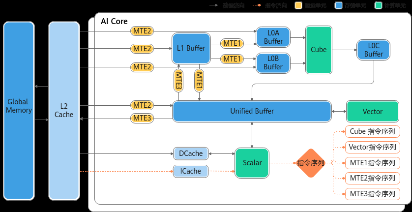

# NPU架构版本200x

> **Section**: 2.6.2.1  
> **PDF Pages**: 195–197  

---

<!-- page 195 -->

●SetFlag/WaitFlag为两条指令，在SetFlag/WaitFlag的指令中，可以指定一对指令序列的关系，表示两个序列之间完成一组“锁”机制，其作用方式为：

–SetFlag：当前序指令的所有读写操作都完成之后，当前指令开始执行，并将硬件中的对应标志位设置为1。

–WaitFlag：当执行到该指令时，如果发现对应标志位为0，该序列的后续指令将一直被阻塞；如果发现对应标志位为1，则将对应标志位设置为0，同时后续指令开始执行。

Ascend C提供同步控制API，开发者可以使用这类API来自行完成同步控制。需要注意的是，通常情况下，开发者基于2.2 编程模型中介绍的编程模型和范式进行编程时不需要关注同步，编程模型帮助开发者完成了同步控制；使用编程模型和范式是我们推荐的编程方式，自行同步控制可能会带来一定的编程复杂度。

但是我们仍然希望开发者可以理解同步的基本原理，便于后续更好的理解设计并行计算程序；同时少数情况需要开发者手动插入同步，您可以通过什么时候需要开发者手动插入同步来了解具体内容。

## 2.6.2 架构规格

## 2.6.2.1 NPU 架构版本200x

本节介绍__NPU_ARCH__版本号为200x的硬件架构和其功能说明，其中200代表IP核编号，x表示同一个IP核的配置版本号。对应的产品型号为Atlas 推理系列产品。

硬件架构图

计算单元

**Cube计算单元和Vector计算单元同核部署**

本架构中，Cube计算单元和Vector计算单元同核部署，共享同一个Scalar计算单元。

**Vector计算单元**

●Vector计算单元的数据来源来自于Unified Buffer，要求32字节对齐。

<!-- page 196 -->

●数据从L0C Buffer传输至Unified Buffer需要以Vector计算单元作为中转。

**Cube计算单元**

●Cube计算单元可以访问的存储单元有L0A Buffer、L0B Buffer、L0C Buffer，其中L0A Buffer存储左矩阵，L0B Buffer存储右矩阵，L0C Buffer存储矩阵乘的结果和中间结果。

存储单元

获取存储单元的内存空间大小

开发者可以通过平台信息获取接口查询各存储单元的内存空间大小。

各存储单元的最小访问粒度（对齐要求）

存储单元对齐要求

Unified Buffer32Byte对齐。

L1 Buffer32Byte对齐。

L0A Buffer512Byte对齐。

L0B Buffer512Byte对齐。

L0C Buffer64Byte对齐。

各存储单元推荐使用的数据排布格式

●L0A Buffer、L0B Buffer和L0C Buffer推荐分别采用以下分形格式：

–L0A Buffer：FRACTAL_ZZ

–L0B Buffer：FRACTAL_ZN

–L0C Buffer：FRACTAL_NZ

这些格式针对矩阵乘法等计算密集型任务进行优化，可显著提升计算效率。

●L1 Buffer缓存推荐使用FRACTAL_NZ格式。当L1采用NZ格式时，数据搬运到L0A/L0B Buffer（需分别转换为ZZ和ZN格式）时，可降低格式转换开销。

●Unified Buffer对数据格式没有要求。

解决存储单元的访问冲突，提升读写性能

当多个操作尝试同时访问Unified Buffer同一个bank或者bank group时，可能会发生bank冲突，包括读写冲突、写写冲突、读读冲突，这种冲突会导致访问排队，降低性能。可以通过优化bank分配的方式来提升读写性能，具体信息请参考3.8.5.11 避免Unified Buffer的bank冲突章节。

搬运单元

搬运时的对齐要求

由于搬运后的数据用于参与数据计算，因此对搬运数据大小有要求，搬运到UnifiedBuffer的数据大小需要按照DataBlock对齐，其余存储单元的数据搬运必须按分形要求进行搬运。例如，数据从L1 Buffer搬运到L0A Buffer时，数据格式需要从NZ转换为ZZ

<!-- page 197 -->

格式，搬运数据的大小要按分形大小对齐，如果L1 Buffer的剩余大小不足1个分形，则硬件执行中会出现异常。

同步控制

核内同步

由于AI Core内部的执行单元（如MTE2搬运单元、Vector计算单元等）以异步并行的方式运行，在读写Local Memory（如Unified Buffer）时可能存在数据依赖关系。为确保数据一致性及计算正确性，需通过同步控制协调操作时序。

以MTE2从GM搬运数据至UB，进行Vector计算单元的Abs计算，再搬运回GM的流程为例，需满足以下同步条件：

1.数据搬运与计算顺序

–GM→UB搬运完成后再启动Vector单元的Abs计算（避免计算时未完成搬运导致的数据缺失）；

–Vector计算完成后再执行UB→GM的数据搬运（确保结果数据已就绪）。

2.循环搬运计算场景的同步规则

–前序计算完成后再启动新搬运：上一次计算未完成时，不得触发新数据搬运（防止UB中旧数据被覆盖）；

–前序数据搬出完成后再启动新计算：上一次数据未完全从UB搬出时，不得触发新计算任务（避免目标内存区域的覆盖冲突）。

同步控制流程如下图所示：

上图中，ID1、ID2、ID3、ID4、ID5、ID6表示事件ID（EventID），每个EventID对应一块存储数据的搬运状态，确保数据操作的正确性和一致性。

需要注意以下几点：

●建议通过 AllocEventID或者 FetchEventID接口获取EventID，以确保其合法性和有效性。

●EventID的数量有限，使用后应立即调用ReleaseEventID释放资源，避免EventID耗尽，影响系统正常运行。

●SetFlag和WaitFlag必须成对使用，且SetFlag和WaitFlag的参数必须完全一致（包括模板参数和事件ID）。如果不匹配，可能导致当前核的计算异常，或影响下一个核的算子执行，引发timeout问题。

例如，SetFlag<HardEvent::S_MTE3>(1)和SetFlag<HardEvent::MTE3_MTE1>(1)设置的不是同一个EventID，因为其模板参数不同。只有当模板参数和事件ID完全一致时，才表示同一个EventID。
