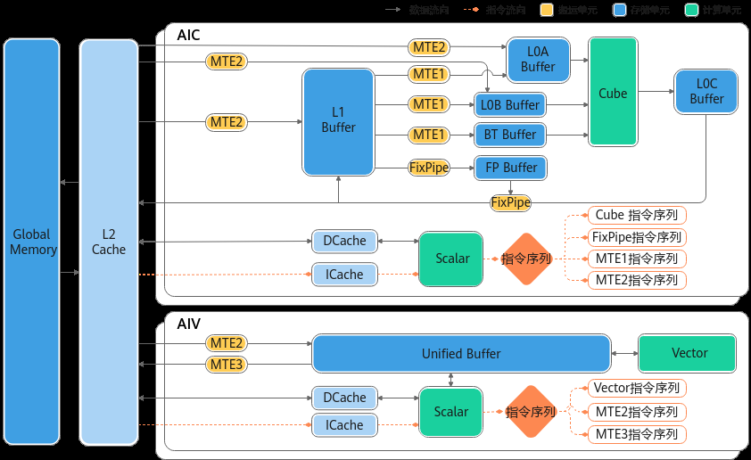
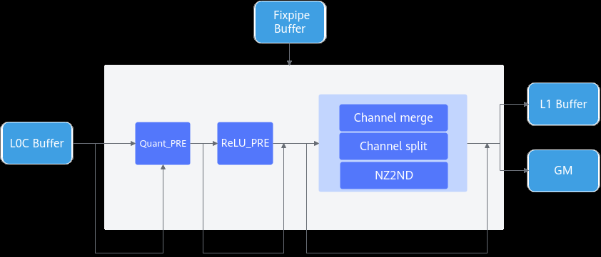
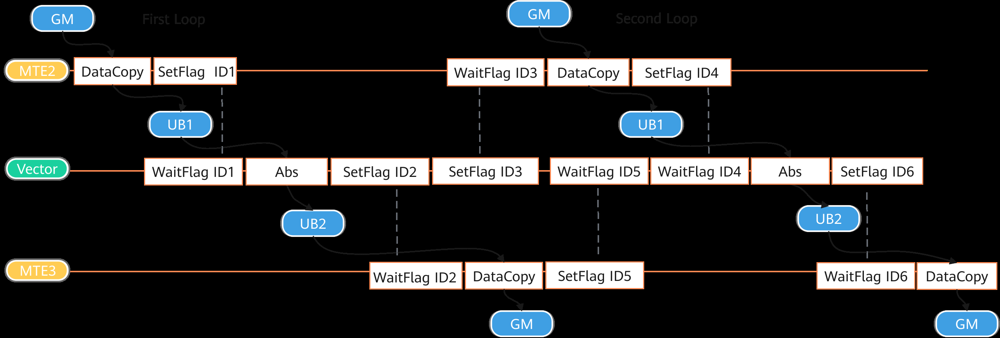
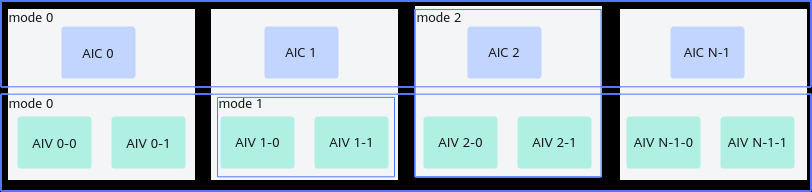

# NPU架构版本220x

> **Section**: 2.6.2.2  
> **PDF Pages**: 198–204  

---

<!-- page 198 -->

●不允许连续设置同一个EventID，因为这可能导致事件状态混乱或未被正确处理。

核间同步

该硬件架构不支持核间同步。

## 2.6.2.2 NPU 架构版本220x

本节介绍__NPU_ARCH__版本号为220x的硬件架构和其功能说明，其中220代表IP核编号，x表示同一个IP核的配置版本号。对应的产品型号为：

●Atlas A3 训练系列产品/Atlas A3 推理系列产品

●Atlas A2 训练系列产品/Atlas A2 推理系列产品

硬件架构图

如下图所示，本架构中AI Core分为AIC和AIV两个独立的核，分别用于矩阵计算和向量计算。每个核都有自己的Scalar单元，能独立加载自己的代码段。AIV与AIC之间通过Global Memory进行数据传递。

计算单元

**Cube计算单元和Vector计算单元分离部署**

本架构中，Cube计算单元和Vector计算单元分别部署在AIC核和AIV核上，每个核都有自己的Scalar单元，能独立加载自己的代码段。

**Vector计算单元**

●Vector计算单元的数据来自于Unified Buffer，要求32字节对齐。

**Cube计算单元**

<!-- page 199 -->

●Cube计算单元可以访问的存储单元有L0A Buffer、L0B Buffer、L0C Buffer，其中L0A Buffer存储左矩阵，L0B Buffer存储右矩阵，L0C Buffer存储矩阵乘的结果和中间结果。

存储单元

获取存储单元的内存空间大小

开发者可以通过平台信息获取接口查询各存储单元的内存空间大小。

各存储单元的最小访问粒度（对齐要求）

核存储单元对齐要求

AIVUnified Buffer32Byte对齐。

AICL1 Buffer32Byte对齐。

L0A Buffer512Byte对齐。

L0B Buffer512Byte对齐。

L0C Buffer64Byte对齐。

BiasTable Buffer64Byte对齐。

Fixpipe Buffer64Byte对齐。

各存储单元推荐使用的数据排布格式

●L0A Buffer、L0B Buffer和L0C Buffer推荐分别采用以下分形格式：

–L0A Buffer：FRACTAL_ZZ

–L0B Buffer：FRACTAL_ZN

–L0C Buffer：FRACTAL_NZ

这些格式针对矩阵乘法等计算密集型任务进行优化，可显著提升计算效率。

●L1 Buffer缓存推荐使用FRACTAL_NZ格式。当L1 Buffer采用NZ格式时，数据搬运到L0A/L0B Buffer（需分别转换为ZZ和ZN格式）时，可降低格式转换开销。

●Unified Buffer对数据格式没有要求。

解决存储单元的访问冲突，提升读写性能

当多个操作尝试同时访问Unified Buffer同一个bank或者bank group时，可能会发生bank冲突，包括读写冲突、写写冲突、读读冲突，这种冲突会导致访问排队，降低性能。可以通过优化bank分配的方式来提升读写性能，具体信息请参考3.8.5.11 避免Unified Buffer的bank冲突章节。

搬运单元

搬运时的对齐要求

由于搬运后的数据用于参与数据计算，因此对搬运数据大小有要求，搬运到UnifiedBuffer的数据大小需要按照DataBlock对齐，其余存储单元的数据搬运必须按分形要求进行搬运。例如，数据从L1 Buffer搬运到L0A Buffer时，数据格式需要从NZ转换为ZZ

<!-- page 200 -->

格式，搬运数据的大小要按分形大小对齐，如果L1 Buffer的剩余大小不足1个分形，则硬件执行中会出现异常。

支持跨卡数据搬运（Hccs物理链路）

在跨卡通信算子开发场景，DataCopy类接口支持跨卡数据搬运，在Atlas A2 训练系列产品/Atlas A2 推理系列产品设备上，仅支持Hccs物理链路，不支持其他通路；开发者开发过程中，请关注涉及卡间通信的物理通路；通过npu-smi info -t topo指令查询Hccs 物理通路。

支持Fixpipe硬件化加速

Fixpipe是NPU将典型操作进行硬化的加速模块，位于AIC内部，配合Cube计算单元完成随路计算，主要功能如下：

●量化反量化：包括S322FP16、S322S32、S322S4、S322S8、S322S16、FP322FP16、FP322BF16、FP322S8、FP322S4、FP322FP32。

●Relu功能，包括ReLu、PReLu和Leaky ReLu等典型的激活函数。

●数据格式转换，包括：

–通过Channel merge、Channel split可以实现分形大小的转换，保证输出到L1 Buffer/GM的分形满足诉求。

–NZ2ND数据格式转换。

上图中，Channel merge支持S8、U8、S4和U4数据类型，而Channel split支持FP32数据类型。

●Channel merge（S8和U8数据类型）

对于转换为S8或U8的目标数据类型，分形矩阵通过硬件从16x16转换为16x32，如果输出通道数N是16的偶数倍，则N方向上每2个相邻的16x16分形矩阵将合并为1个16x32分形矩阵。如果N是16的奇数倍，则将通道1到通道（N–16）合并，最后16个通道保持未合并。

如下所示，目标数据类型为S8，M为32，N为48，首先将前2列16x16分形矩阵合并为一个16x32矩阵，然后将剩余的16x16分形矩阵直接移入L1 Buffer。

<!-- page 201 -->

●Channel merge（S4和U4数据类型）

对于转换为S4或U4的目标数据类型，分形矩阵通过硬件从16x16转换为16x64，如果输出通道数N是64的倍数，则N方向上每4个相邻的16x16分形矩阵将合并为1个16x64分形矩阵。

例如，这里目标数据类型为S4，M为32，N为64，首先将第1行16x16分形矩阵合并为一个16x64矩阵，然后将第2行16x16分形矩阵也合并。

在这种情况下，N的配置必须是64的倍数。

<!-- page 202 -->

●FP32 Channel split：

对于目标类型为FP32，分形矩阵可以通过硬件从16x16转换为16x8，如果使能Channel split，则每个16x16分形矩阵将被分裂为2个16x8分形矩阵。

如下图所示，这里的目标数据类型是FP32，M是64，N是32，它将被拆分为16个16x8的分形。

同步控制

●核内同步

<!-- page 203 -->

由于AI Core内部的执行单元（如MTE2搬运单元、Vector计算单元等）以异步并行的方式运行，在读写Local Memory（如Unified Buffer）时可能存在数据依赖关系。为确保数据一致性及计算正确性，需通过同步控制协调操作时序。

以MTE2从GM搬运数据至UB，进行Vector计算单元的Abs计算，再搬运回GM的流程为例，需满足以下同步条件：

a.数据搬运与计算顺序▪GM→UB搬运完成后再启动Vector单元的Abs计算（避免计算时未完成搬运导致的数据缺失）；▪Vector计算完成后再执行UB→GM的数据搬运（确保结果数据已就绪）。

b.循环搬运计算场景的同步规则▪前序计算完成后再启动新搬运：上一次计算未完成时，不得触发新数据搬运（防止UB中旧数据被覆盖）；▪前序数据搬出完成后再启动新计算：上一次数据未完全从UB搬出时，不得触发新计算任务（避免目标内存区域的覆盖冲突）。

同步控制流程如下图所示：

上图中，ID1、ID2、ID3、ID4、ID5、ID6表示事件ID（EventID），每个EventID对应一块存储数据的搬运状态，确保数据操作的正确性和一致性。

需要注意以下几点：

–建议通过 AllocEventID或者 FetchEventID接口获取EventID，以确保其合法性和有效性。

–EventID的数量有限，使用后应立即调用ReleaseEventID释放资源，避免EventID耗尽，影响系统正常运行。

–SetFlag和WaitFlag必须成对使用，且SetFlag和WaitFlag的参数必须完全一致（包括模板参数和事件ID）。如果不匹配，可能导致当前核的计算异常，或影响下一个核的算子执行，引发timeout问题。

例如，SetFlag<HardEvent::S_MTE3>(1)和SetFlag<HardEvent::MTE3_MTE1>(1)设置的不是同一个EventID，因为其模板参数不同。只有当模板参数和事件ID完全一致时，才表示同一个EventID。

–不允许连续设置同一个EventID，因为这可能导致事件状态混乱或未被正确处理。

–不建议手动插入 TEventID，不能手动插入6和7的TEventID，因为它们可能被系统预留或用于特殊用途。

●核间同步

<!-- page 204 -->

当不同核之间操作同一块全局内存时，可能存在读后写、写后读以及写后写等数据依赖问题，需要进行核间同步控制。

核间同步控制分为以下几种模式，如下图所示：

–模式0：AI Core核间的同步控制。对于AIC场景，同步所有的AIC核，直到所有的AIC核都执行到CrossCoreSetFlag时，CrossCoreWaitFlag后续的指令才会执行；对于AIV场景，同步所有的AIV核，直到所有的AIV核都执行到CrossCoreSetFlag时，CrossCoreWaitFlag后续的指令才会执行。

–模式1：AI Core内部，AIV核之间的同步控制。如果两个AIV核都运行了CrossCoreSetFlag，CrossCoreWaitFlag后续的指令才会执行。

–模式2：AI Core内部，AIC与AIV之间的同步控制。在AIC核执行CrossCoreSetFlag之后，两个AIV上CrossCoreWaitFlag后续的指令才会继续执行；两个AIV都执行CrossCoreSetFlag后，AIC上CrossCoreWaitFlag后续的指令才能执行。

例如，在AIC中将L0C的计算结果搬运到GM后，AIV需要将GM的数据搬运到UB。此时，可以使用CrossCoreSetFlag和CrossCoreWaitFlag命令，确保数据从L0C成功搬运到GM后，再从GM搬运到UB，流程如下图所示。

**CrossCoreSetFlag和CrossCoreWaitFlag接口配合使用。使用时需传入核间同步的标记ID(flagId)，即上图中的ID1，每个ID对应一个初始值为0的计数器。执行CrossCoreSetFlag后ID对应的计数器增加1；执行CrossCoreWaitFlag时如果对应的计数器数值为0则阻塞不执行；如果对应的计数器大于0，则计数器减一，同时后续指令开始执行。flagId取值范围是0-10。**

需要注意以下几点：

–成对使用

CrossCoreSetFlag和CrossCoreWaitFlag必须成对使用，否则可能导致算子超时问题。

–一致性要求

CrossCoreSetFlag 的模板参数和flagId必须与CrossCoreWaitFlag完全一致，否则视为不同的flagId。例如，CrossCoreSetFlag<0x0, PIPE_MTE3>(0x8) 和CrossCoreSetFlag<0x2, PIPE_FIX>(0x8) 设置的不是同一个flagId。
