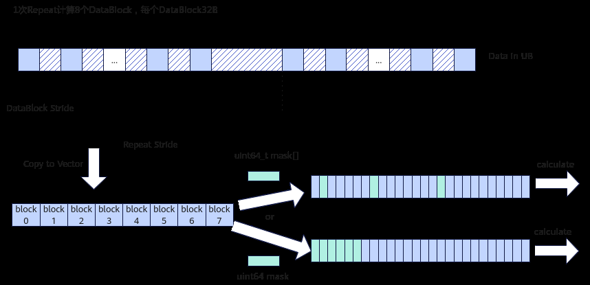
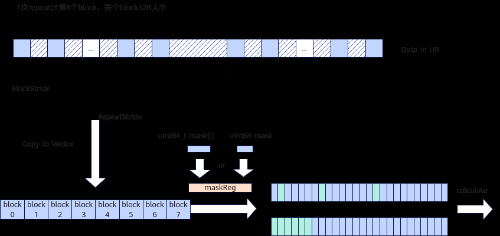
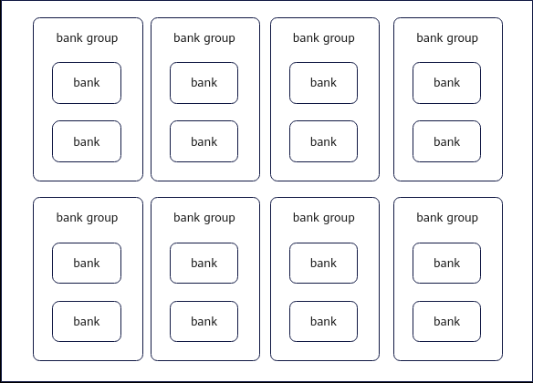
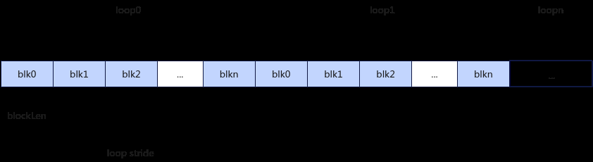
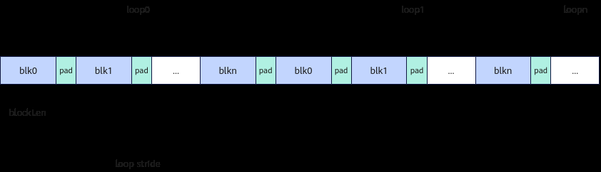
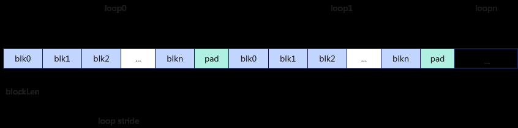
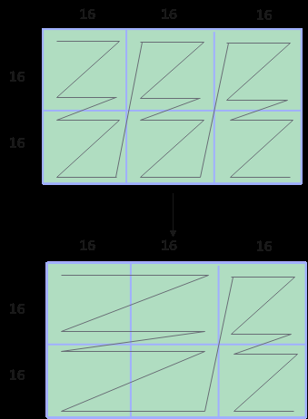
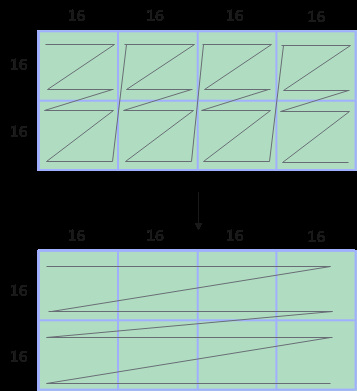
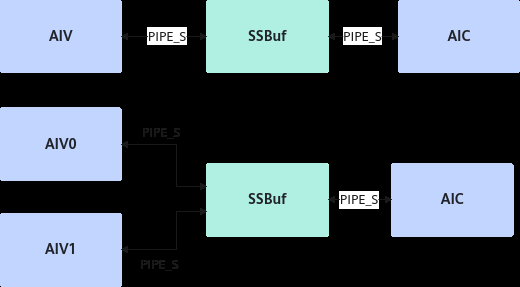
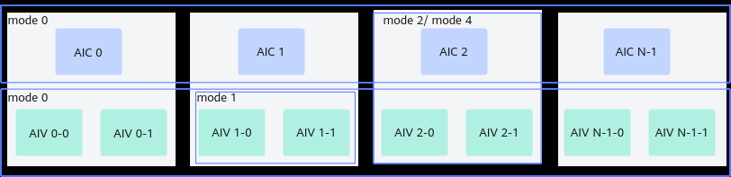

# NPU架构版本351x

> **Section**: 2.6.2.4  
> **PDF Pages**: 211–220  

---

<!-- page 211 -->

## 2.6.2.4 NPU 架构版本351x

本节介绍__NPU_ARCH__版本号为351x的硬件架构和其功能说明。

硬件架构图

如下图所示，本架构中AI Core分为AIC和AIV两个独立的核，分别用于矩阵计算和向量计算。AIC核与AIV核配比为1：2。每个核都有自己的Scalar单元，能独立加载自己的代码段。

该架构的关键特点有：

●增加L0C Buffer -> Unified Buffer、Unified Buffer <-> L1 Buffer的数据通路。

●删除Global Memory -> L0A Buffer、Global Memory -> L0B Buffer的数据通路。

●删除L1 Buffer-> Global Memory的数据通路。

●SSBuffer，用于AIC和AIV的核间通信。

●增加SIMD Register File存储层次，在SIMD程序中，数据从Unified Buffer搬运到Register进行计算，产生的中间结果可以不用传回Unified Buffer，直接在寄存器计算。

●新增SIMT相关硬件单元。SIMT相关硬件单元介绍如下：

<!-- page 212 -->

**SIMT硬件单元名称**

说明

SIMTDCache

SIMT访问GM需要经过SIMT DCache中转，SIMT支持最大128KB Data Cache，Data Cache直接复用UB作为cacheline，SIMT所有对外访存都是以128B为粒度。

WarpScheduler

实现硬件的多线程调度。

每个AIV有4个Warp Scheduler。

SIMTRegister File

为SIMT应用程序提供的总容量为128KB的超大容量寄存器。每个Thread可用的寄存器数和Thread数量有关，对应关系为：

●1025~2048条Thread：16个Register。

●513~1024条Thread：32个Register。

●257~512条Thread：64个Register。

●1~256条Thread：127个Register。

计算单元

**Cube计算单元和Vector计算单元分离部署**

本架构中，Cube计算单元和Vector计算单元分别部署在AIC核和AIV核上，每个核都有自己的Scalar单元，能独立加载自己的代码段。

**Vector计算单元**

●Vector计算单元支持U8、U16、U32、S8、S16、S32、BF16、FP16、FP32数据类型。

●Vector计算单元每拍可处理256字节的数据。

●Vector计算单元处理的数据来源来自于Register。

●在本架构版本中，高维切分接口中的传入的掩码值会被转化为MaskReg传入Vector计算单元，而在NPU架构版本220x中，掩码值从特殊的掩码寄存器中读取。

图2-34 NPU 架构版本220 高维切分

<!-- page 213 -->

图2-35本架构版本高维切分

**Cube计算单元**

●Cube计算单元支持FP32/FP16/BF16/HiF8/FP8_E4M3/U8/S8。一拍完成一个float16数据类型的16x16与16x16大小的矩阵乘；如果是int8_t数据类型，则一拍完成16*32与32*16大小的矩阵乘。

●Cube计算单元可以访问的存储单元有L0A Buffer、L0B Buffer、L0C Buffer，其中L0A Buffer存储左矩阵，L0B Buffer存储右矩阵，L0C Buffer存储矩阵乘的结果和中间结果。

**Scalar单元**

●Scalar单元支持U16/S16/U32/S32/U64/S64/FP64数据类型。

●在Regbase架构中，Aux Scalar计算单元单独处理SIMD_VF函数内的Scalar计算，Scalar计算单元处理SIMD_VF函数外的Scalar计算。

存储单元

获取存储单元的内存空间大小

开发者可以通过平台信息获取接口查询各存储单元的内存空间大小。

各存储单元的最小访问粒度（对齐要求）

核存储单元对齐要求

AIVUnified Buffer32Byte对齐。

AICL1 Buffer32Byte对齐。

L0A Buffer512Byte对齐。

L0B Buffer512Byte对齐。

L0C Buffer64Byte对齐。

BiasTable Buffer64Byte对齐。

Fixpipe Buffer64Byte对齐。

<!-- page 214 -->

各存储单元推荐使用的数据排布格式

●L0A Buffer、L0B Buffer和L0C Buffer推荐分别采用以下分形格式：

–L0A Buffer：FRACTAL_NZ（由于硬件结构变更，本架构下L0A Buffer的分形改为NZ）

–L0B Buffer：FRACTAL_ZN

–L0C Buffer：FRACTAL_NZ

这些格式针对矩阵乘法等计算密集型任务进行优化，可显著提升计算效率。

●L1 Buffer缓存推荐使用FRACTAL_NZ格式。当L1 Buffer采用NZ格式时，数据搬运到L0A/L0B Buffer（需分别转换为ZN格式）时，可降低格式转换开销。

●Unified Buffer对数据格式没有要求。

存储单元的访问冲突

本NPU架构版本UB结构如下图所示，当多个操作尝试同时访问Unified Buffer同一个bank或者bank group时，可能会发生bank冲突，包括读写冲突、写写冲突、读读冲突，这种冲突会导致访问排队，降低性能。在NPU架构版本220x中，同一个bankgroup只有一组读口和写口，最多一拍完成一读或者一写，在本NPU架构版本中每个bank group有两组读口和写口，最多同时允许2读0写或者1读1写。相关读写约束如下：

●读写冲突：读操作和写操作同时尝试访问同一个bank。

●写写冲突：多个写操作同时尝试访问同一个bank group。

●读读冲突：两个读操作同时尝试访问同一个bank，或者两个以上读操作同时尝试访问同一个bank group。

图2-36本架构版本UB bank 示意图

**Register寄存器**

<!-- page 215 -->

●RegTensor

RegTensor用于存放Reg矢量计算数据， RegTensor位宽为VL（Vector Length，256字节）。

●MaskReg

MaskReg用于指示在计算过程中哪些元素参与计算，宽度为RegTensor的八分之一（VL/8）。

●UnalignRegForLoad & UnalignRegForStore

UnalignRegForLoad、UnalignRegForStore用作缓冲区来优化UB和RegTensor之间连续不对齐地址访问的开销。在读不对齐地址前，UnalignRegForLoad、UnalignRegForStore应该通过LoadUnAlignPre API初始化，然后使用LoadUnAlign API。在写不对齐地址时，先使用StoreUnAlign API，再使用StoreUnAlignPost API后处理。

●AddrReg

AddrReg即为Address Register（地址寄存器），是用于存储地址偏移量的寄存器。AddrReg应该通过CreateAddrReg初始化，然后在循环之中使用AddrReg存储地址偏移量。AddrReg每层循环中根据所设置的stride进行自增。

搬运单元

搬运时的对齐要求

由于搬运后的数据用于参与数据计算，因此对搬运数据大小有要求，搬运到UnifiedBuffer的数据大小需要按照DataBlock对齐，其余存储单元的数据搬运必须按分形要求进行搬运。例如，数据从L1 Buffer搬运到L0A Buffer时，数据格式需要从NZ转换为ZN格式，搬运数据的大小要按分形大小对齐，如果L1 Buffer的剩余大小不足1个分形，则硬件执行中会出现异常。

**MTE硬通道**

●AIV新增Unified Buffer和L1 Buffer之间的硬通道。

●新增支持GM到Unified Buffer搬运和Unified Buffer到GM搬运的Loop模式。在Loop模式下，每次循环可以是Normal模式或Compact模式，Normal模式和Compact模式可参考6.2.3.1.2 DataCopyPad(ISASI)。

–单次Loop以Normal模式搬运

若单个数据块长度为32B对齐，则无需插入Padding，可通过多次Repeat搬运多组数据块。

若单个数据块长度不为32B对齐，则需在每个数据块后插入Padding，使其32B对齐后再进行搬运。

<!-- page 216 -->

–单次Loop以Compact模式搬运

Compact可以一次搬运一组数据块，当这些数据块的总长度为32B对齐的时候，则无需在最后插入Padding。

当一组数据块的长度不是32B对齐，需要在这组数据块后插入padding，使总长度32B对齐。

支持Fixpipe硬件化加速

Fixpipe是NPU将典型操作进行硬化的加速模块，位于AIC内部，配合Cube计算单元完成随路计算，主要功能如下：

●量化反量化：包括S4/S8/S32/FP16/FP32/FP8_E4M3/HiF8/BF16。

●Relu功能，包括ReLu、PReLu和Leaky ReLu等典型的激活函数。

●数据格式转换，包括：

–通过Channel merge、Channel split可以实现分形大小的转换，保证输出到L1 Buffer/GM的分形满足诉求。

–支持L0C Source的NZ2ND、NZ2DN随路转换。

Channel merge支持S8、U8、S4和U4数据类型，而Channel split支持FP32数据类型。

●Channel merge（S8和U8数据类型）

对于转换为S8或U8的目标数据类型，分形矩阵通过硬件从16x16转换为16x32，如果输出通道数N是16的偶数倍，则N方向上每2个相邻的16x16分形矩阵将合并为1个16x32分形矩阵。如果N是16的奇数倍，则将通道1到通道（N–16）合并，最后16个通道保持未合并。

如下所示，目标数据类型为S8，M为32，N为48，首先将前2列16x16分形矩阵合并为一个16x32矩阵，然后将剩余的16x16分形矩阵直接移入L1 Buffer。

<!-- page 217 -->

●Channel merge（S4和U4数据类型）：

对于转换为S4或U4的目标数据类型，分形矩阵通过硬件从16x16转换为16x64，如果输出通道数N是64的倍数，则N方向上每4个相邻的16x16分形矩阵将合并为1个单个的16x64分形矩阵。

例如，这里目标数据类型为S4，M为32，N为64，首先将第1行16x16分形矩阵合并为一个16x64矩阵，然后将第2行16x16分形矩阵也合并。

在这种情况下，N的配置必须是64的倍数。

<!-- page 218 -->

●FP32 Channel split：

对于目标类型为FP32，分形矩阵可以通过硬件从16x16转换为16x8，如果使能Channel split，则每个16x16分形矩阵将被分裂为2个16x8分形矩阵。

如下图所示，这里的目标数据类型是FP32，M是64，N是32，它将被拆分为16个16x8的分形。

## AIC AIV 核间通信

该架构支持AIC: AIV为1:1和1:2的核间通信，核间通信通过SSBuf进行，这一点和NPU220架构有所不同，NPU220架构中核间通信通过GM来完成。

<!-- page 219 -->

同步控制

●核内同步

由于AI Core内部的执行单元（如MTE2搬运单元、Vector计算单元等）以异步并行的方式运行，在读写Local Memory（如Unified Buffer）时可能存在数据依赖关系。为确保数据一致性及计算正确性，需通过同步控制协调操作时序。

以MTE2从GM搬运数据至UB，进行Vector计算单元的Abs计算，再搬运回GM的流程为例，需满足以下同步条件：

a.数据搬运与计算顺序▪GM→UB搬运完成后再启动Vector单元的Abs计算（避免计算时未完成搬运导致的数据缺失）；▪Vector计算完成后再执行UB→GM的数据搬运（确保结果数据已就绪）。

b.循环搬运计算场景的同步规则▪前序计算完成后再启动新搬运：上一次计算未完成时，不得触发新数据搬运（防止UB中旧数据被覆盖）；▪前序数据搬出完成后再启动新计算：上一次数据未完全从UB搬出时，不得触发新计算任务（避免目标内存区域的覆盖冲突）。

同步控制流程如下图所示：

<!-- page 220 -->

上图中，ID1、ID2、ID3、ID4、ID5、ID6表示事件ID（EventID），每个EventID对应一块存储数据的搬运状态，确保数据操作的正确性和一致性。

需要注意以下几点：

–建议通过 AllocEventID或者 FetchEventID接口获取EventID，以确保其合法性和有效性。

–EventID的数量有限，使用后应立即调用ReleaseEventID释放资源，避免EventID耗尽，影响系统正常运行。

–SetFlag和WaitFlag必须成对使用，且SetFlag和WaitFlag的参数必须完全一致（包括模板参数和事件ID）。如果不匹配，可能导致当前核的计算异常，或影响下一个核的算子执行，引发timeout问题。

例如，SetFlag<HardEvent::S_MTE3>(1)和SetFlag<HardEvent::MTE3_MTE1>(1)设置的不是同一个EventID，因为其模板参数不同。只有当模板参数和事件ID完全一致时，才表示同一个EventID。

–不允许连续设置同一个EventID，因为这可能导致事件状态混乱或未被正确处理。

–不建议手动插入TEventID，不能手动插入6和7的TEventID，因为它们可能被系统预留或用于特殊用途。

●核间同步

当不同核之间操作同一块全局内存时，可能存在读后写、写后读以及写后写等数据依赖问题，需要进行核间同步控制。

核间同步控制分为以下几种模式，如下图所示：

–模式0：AI Core核间的同步控制。对于AIC场景，同步所有的AIC核，直到所有的AIC核都执行到CrossCoreSetFlag时，CrossCoreWaitFlag后续的指令才会执行；对于AIV场景，同步所有的AIV核，直到所有的AIV核都执行到CrossCoreSetFlag时，CrossCoreWaitFlag后续的指令才会执行。

–模式1：AI Core内部，AIV核之间的同步控制。如果两个AIV核都运行了CrossCoreSetFlag，CrossCoreWaitFlag后续的指令才会执行。

–模式2：AI Core内部，AIC与AIV之间的同步控制（1:2）。在AIC核执行CrossCoreSetFlag之后，两个AIV上CrossCoreWaitFlag后续的指令才会继续执行；两个AIV都执行CrossCoreSetFlag后，AIC上CrossCoreWaitFlag后续的指令才能执行。

–模式4：AI Core内部，AIC与AIV之间的同步控制（1:1）。AIV0与AIV1可单独触发AIC等待。比如，在AIC核执行CrossCoreSetFlag之后， AIV0上CrossCoreWaitFlag后续的指令才会继续执行；AIV0执行CrossCoreSetFlag后，AIC上CrossCoreWaitFlag后续的指令才能执行。

例如，在AIC中将L0C的计算结果搬运到GM后，AIV需要将GM的数据搬运到UB。此时，可以使用CrossCoreSetFlag和CrossCoreWaitFlag命令，确保数据从L0C成功搬运到GM后，再从GM搬运到UB，流程如下图所示。
