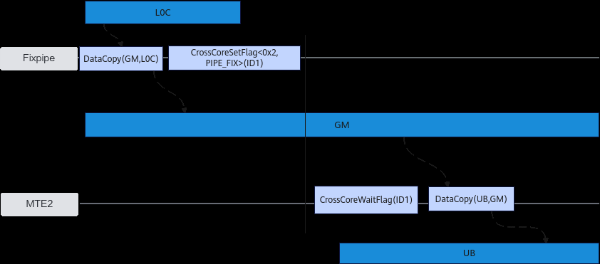

# NPU架构版本200x

> **Section**: 2.6.3.1  
> **PDF Pages**: 221–221  

---

<!-- page 221 -->

**CrossCoreSetFlag和CrossCoreWaitFlag接口配合使用。使用时需传入核间同步的标记ID(flagId)，即上图中的ID1，每个ID对应一个初始值为0的计数器。执行CrossCoreSetFlag后ID对应的计数器增加1；执行CrossCoreWaitFlag时如果对应的计数器数值为0则阻塞不执行；如果对应的计数器大于0，则计数器减一，同时后续指令开始执行。flagId取值范围是0-10。**

需要注意以下几点：

–成对使用

CrossCoreSetFlag和CrossCoreWaitFlag必须成对使用，否则可能导致算子超时问题。

–一致性要求

CrossCoreSetFlag 的模板参数和flagId必须与CrossCoreWaitFlag完全一致，否则视为不同的flagId。例如，CrossCoreSetFlag<0x0, PIPE_MTE3>(0x8) 和CrossCoreSetFlag<0x2, PIPE_FIX>(0x8) 设置的不是同一个flagId。

–避免连续设置

不允许连续设置同一个flagId，以防止计数器状态混乱。

–与高阶 API 的使用冲突

**Matmul高阶API内部实现中使用了本接口进行核间同步控制，所以不建议开发者同时使用该接口和Matmul高阶API，否则会有flagId冲突的风险。**

–计数器限制

同一flagId的计数器最多可以设置15次。

–默认流水类型

CrossCoreWaitFlag不需要显式设置指令所在的流水类型，默认使用PIPE_S。

## 2.6.3 硬件约束

## 2.6.3.1 NPU 架构版本200x

本节介绍硬件约束以及解决方案建议。对应的产品型号为：Atlas 推理系列产品。

●全局变量使用约束

NPU架构版本200x不支持Generic Addressing通用寻址（针对UB、stack、GM等地址空间），因此语言层面地址空间必须匹配。不同的地址空间信息不允许转换，不符合语法。全局变量位于GM上，传参位于stack上，函数内传参使用全局变量时会报错。目前编译器仅在优化级别为O0的场景下，对constexpr做了适配处
