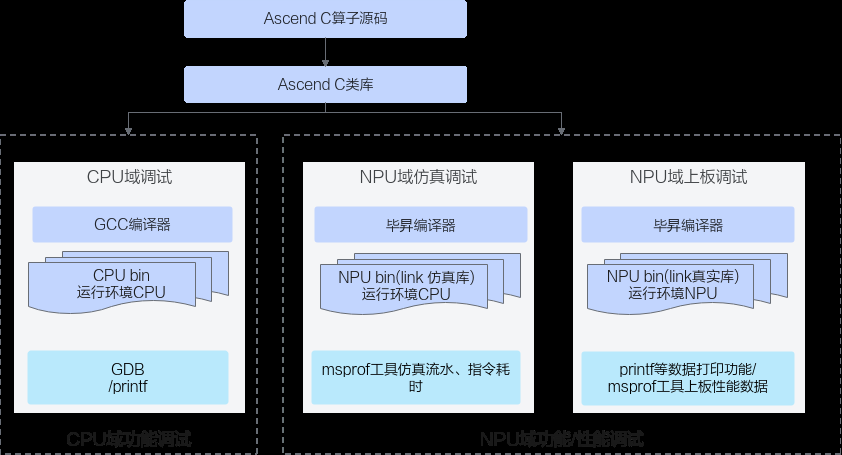

# 概述

> **Section**: 2.7.1  
> **PDF Pages**: 225–225  

---

<!-- page 225 -->

## 2.7 调试调优

## 2.7.1 概述

Ascend C算子调试的整体方案如下：开发者通过调用Ascend C类库编写Ascend C算子Kernel侧源码，Kernel侧源码通过通用的GCC编译器进行编译，编译生成通用的CPU域的二进制，可以通过gdb通用调试工具等调试手段进行调试；Kernel侧源码通过毕昇编译器进行编译，编译生成NPU域的二进制文件，可使用printf/assert等接口进行数据打印，也可通过仿真打点图或者Profiling工具进行上板数据采集等方式进行调试。

具体的调试调优方法和使用的工具列表如下：

表2-30调试调优方法和使用的工具列表

分类子分类方法

CPU域孪生调试

孪生调试：相同的算子代码可以在CPU域调试精度，NPU域调试性能。在CPU域可以进行gdb调试、使用printf命令打印。

功能调试

NPU域上板调试

**printf/assert：printf主要用于打印标量和字符串信息；assert主要用于在代码中设置检查点，当某个条件不满足时，程序会立即终止并报错。**

**DumpTensor：使用DumpTensor接口打印指定Tensor的数据，只支持SIMD编程场景。**

上板调试工具：使用msDebug工具调试NPU侧运行的算子程序，在真实的硬件环境中，对算子的输入输出进行测试，以验证算子的功能是否正确。具体功能包括断点设置、打印变量和内存、单步调试、中断运行等。当前SIMT编程场景不支持。
