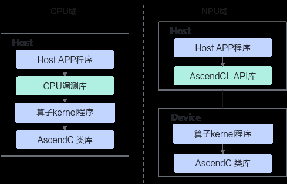

# CPU域孪生调试

> **Section**: 2.7.2.1  
> **PDF Pages**: 226–228  

---

<!-- page 226 -->

分类子分类方法

内存检测工具：使用msSanitizer工具进行内存检测，可以检测并报告算子运行中对外部存储（Global Memory）和内部存储（Local Memory）的越界及未对齐等内存访问异常。

-msprof工具：

性能调优

msProf工具用于采集和分析运行在AI处理器上算子的关键性能指标，用户可根据输出的性能数据，快速定位算子的软、硬件性能瓶颈，提升算子性能的分析效率。

当前支持基于不同运行模式（上板或仿真）和不同文件形式（可执行文件或算子二进制.o文件）进行性能数据的采集和自动解析。

## 2.7.2 功能调试

## 2.7.2.1 CPU 域孪生调试

本节介绍CPU域调试的方法：CPU侧验证核函数，gdb调试、使用printf命令打印。当前SIMT编程场景不支持。

说明

CPU调测过程中，配置日志相关环境变量，可以记录程序的运行过程及异常信息，有助于开发者进行功能调测。

关于环境变量的使用约束以及详细说明，可参见《环境变量参考》中“辅助功能 > 日志”章节。

## CPU 侧验证核函数

在非昇腾设备上，开发者可以利用CPU仿真环境先行进行算子开发和测试，并在准备就绪后，利用昇腾设备进行加速计算。在2.3 编译与运行章节，我们已经介绍了算子Kernel程序NPU域的编译运行。相比于NPU域的算子运行逻辑，CPU域调试将算子Kernel程序以Host程序的形式进行编译，此时算子Kernel程序链接CPU调测库，执行编译生成的可执行文件，可以完成算子CPU域的运行验证。CPU侧的运行程序，通过GDB通用调试工具进行单步调试，可以精准验证程序执行流程是否符合预期。

<!-- page 227 -->

图2-37 CPU 域和NPU 域的核函数运行逻辑对比



推荐使用CMake编译方式，可在最小化修改的情况下快速开启CPU域孪生调试功能。

步骤1启用CPU域调试需包含"cpu_debug_launch.h"头文件。

bisheng编译器在CPU调试模式下会对<<<>>>调用核函数的过程进行转义，实现核函数在CPU域下的调用，相关调用函数定义在"cpu_debug_launch.h"中，在使用<<<>>>语法调用核函数的源文件中，请通过以下方式包含必需的头文件：#ifdef ASCENDC_CPU_DEBUG#include "cpu_debug_launch.h"#endif

步骤2通过在CMake配置阶段传入变量CMAKE_ASC_RUN_MODE和CMAKE_ASC_ARCHITECTURES即可开启CPU域编译。命令示例如下：

```cpp
cmake -B build -DCMAKE_ASC_RUN_MODE=cpu -DCMAKE_ASC_ARCHITECTURES=dav-2201
```

cpu表示开启CPU域编译，dav-后为NPU架构版本号，请根据实际情况进行填写。

其他CMakeLists.txt项目配置2.3.1.4 通过CMake编译进行编写。

**----结束**

<!-- page 228 -->

说明

为了实现CPU域与NPU域代码归一，框架在CPU域中仅对部分acl接口进行适配，开发者在使用CPU域调测功能时，仅支持使用如下acl接口，并且不支持用户自行链接ascendcl库：

●有实际功能接口，支持CPU域调用

●aclDataTypeSize、aclFloat16ToFloat、aclFloatToFloat16。

●aclrtMalloc、aclrtFree、aclrtMallocHost、aclrtFreeHost、aclrtMemset、aclrtMemsetAsync、aclrtMemcpy、aclrtMemcpyAsync、aclrtMemcpy2d、aclrtMemcpy2dAsync、aclrtCreateContext、aclrtDestroyContext。

●无实际功能接口，打桩实现。

●Profiling数据采集

aclprofInit、aclprofSetConfig、aclprofStart、aclprofStop、aclprofFinalize。

●系统配置

aclInit、aclFinalize、aclrtGetVersion。

●运行时管理

aclrtSetDevice、aclrtResetDevice、aclrtCreateStream、aclrtCreateStreamWithConfig、aclrtDestroyStream、aclrtDestroyStreamForce、aclrtSynchronizeStream、aclrtCreateContext、aclrtDestroyContext。

## gdb 调试

可使用gdb单步调试算子计算精度。由于cpu调测已转为多进程调试，每个核都会拉起独立的子进程，故gdb需要转换成子进程调试的方式。针对耦合架构，每个AI Core会拉起1个子进程。针对分离架构，默认每个AI Core会拉起3个子进程，1个Cube，2个Vector。

●调试单独一个子进程

启动gdb，示例中的add_custom_cpu为CPU域的算子可执行文件，参考修改并执行一键式编译运行脚本，将一键式编译运行脚本中的run-mode设置成cpu，即可编译生成CPU域的算子可执行文件。

gdb启动后，首先设置跟踪子进程，之后再打断点，就会停留在子进程中，但是这种方式只会停留在遇到断点的第一个子进程中，其余子进程和主进程会继续执行直到退出。涉及到核间同步的算子无法使用这种方法进行调试。gdb --args add_custom_cpu  // 启动gdb，add_custom_cpu为算子可执行文件(gdb) set follow-fork-mode child

●调试多个子进程

如果涉及到核间同步，那么需要能同时调试多个子进程。

在gdb启动后，首先设置调试模式为只调试一个进程，挂起其他进程。设置的命令如下：

```cpp
(gdb) set detach-on-fork off
```

查看当前调试模式的命令为：

```cpp
(gdb) show detach-on-fork
```

中断gdb程序要使用捕捉事件的方式，即gdb程序捕捉fork这一事件并中断。这样在每一次起子进程时就可以中断gdb程序。设置的命令为：

```cpp
(gdb) catch fork
```

当执行r后，可以查看当前的进程信息：

```cpp
(gdb) info inferiors  Num  Description* 1    process 19613
```
