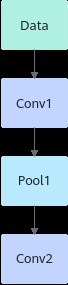
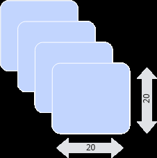

# 算子基本概念

> **Section**: 2.9.2.1  
> **PDF Pages**: 242–244  

---

<!-- page 242 -->

术语/缩略语含义

连续模式使用Mask控制矢量计算每次Repeat内参与计算的元素时，可选择的模式之一，表示前面连续的多少个元素参与计算。

耦合模式AI Core的一种工作模式，采用同一个Scalar调度单元同时调度矩阵计算单元、矢量计算单元，所有的单元部署在一个AI Core上。

融合算子融合算子由多个独立的小算子融合而成，其功能与多个小算子的功能等价，性能方面通常优于独立的小算子。用户可以根据实际业务场景诉求，按照具体算法自由融合矢量（Vector）、矩阵（Cube）算子以达到性能上的收益。

算子入图算子入图指通过GE图模式运行算子，在图模式下首先将所有算子构造成一张图，然后通过GE将图下发到AI处理器执行。

算子原型算子原型是算子的抽象描述，定义了算子的输入、输出、属性等信息。

通算融合算子通算融合算子是融合集合通信任务和计算任务的算子，在算子执行过程中，计算和通信任务可以实现部分流水并行，从而提升性能。

Reg矢量计算Reg矢量计算API是面向RegBase架构开发的API，用户可以通过该类API直接对芯片中涉及Vector计算的寄存器进行操作，实现更大的灵活性和更好的性能。

逐比特模式使用Mask控制矢量计算每次Repeat内参与计算的元素时，可选择的模式之一，可以按位控制哪些元素参与计算，bit位的值为1表示参与计算，0表示不参与。

自定义算子工程Ascend C提供的基于msOpGen工具生成的算子工程。

## 2.9.2 神经网络和算子

## 2.9.2.1 算子基本概念

算子（Operator，简称OP），是深度学习算法中执行特定数学运算或操作的基础单元，例如激活函数（如ReLU）、卷积（Conv）、池化（Pooling）以及归一化（如Softmax）。通过组合这些算子，可以构建神经网络模型。

本章节介绍算子中常用的基本概念。

算子名称（Op Name）

算子的名称，用于标识网络中的某个算子，同一网络中算子的名称需要保持唯一。如下图所示Conv1、Pool1、Conv2都是此网络中的算子名称，其中Conv1与Conv2算子的类型为Convolution，表示分别做一次卷积运算。

<!-- page 243 -->

图2-38网络拓扑示例



算子类型（Op Type）

网络中每一个算子根据算子类型进行算子实现的匹配，相同类型算子的实现逻辑相同。在一个网络中同一类型的算子可能存在多个，例如上图中的Conv1算子与Conv2算子的类型都为Convolution。

张量（Tensor）

Tensor是算子计算数据的容器，包含如下属性信息。

表2-34 Tensor 属性信息

属性定义

形状Tensor的形状，比如(10, )或者(1024, 1024)或者(2, 3, 4)等。如形状(3, 4)表示第一维有3个元素，第二维有4个元素，(3, 4)表示一个3行4列的矩阵数组。

形式：(i1, i2, …, in)，其中i1到in均为正整数。

数据类型指定Tensor对象的数据类型。

取值范围：float16, float32, int8, int16, int32, uint8,uint16, bfloat16, bool等。

数据排布格式数据的物理排布格式，详细请参见2.9.2.2 数据排布格式。

形状（Shape）

张量的形状，以(D0, D1, … ,Dn-1)的形式表示，D0到Dn是任意的正整数。

如形状(3,4)表示第一维有3个元素，第二维有4个元素，(3,4)表示一个3行4列的矩阵数组。

<!-- page 244 -->

形状的第一个元素对应张量最外层中括号中的元素个数，形状的第二个元素对应张量中从左边开始数第二个中括号中的元素个数，依此类推。例如：

表2-35张量的形状举例

张量形状描述

1(0,)0维张量，也是一个标量

[1,2,3](3,)1维张量

[[1,2],[3,4]](2, 2)2维张量

[[[1,2],[3,4]], [[5,6],[7,8]]]

(2, 2, 2)3维张量

物理含义我们应该怎么理解呢？假设我们有这样一个shape=(4, 20, 20, 3)。

假设有一些照片，每个像素点都由红/绿/蓝3色组成，即shape里面3的含义，照片的宽和高都是20，也就是20*20=400个像素，总共有4张的照片，这就是shape=(4, 20, 20,3)的物理含义。

图2-39示意图



如果体现在编程上，可以简单把shape理解为操作Tensor的各层循环，比如我们要对shape=(4, 20, 20, 3)的A tensor进行操作，循环语句如下：

```cpp
produce A {  for (i, 0, 4) {    for (j, 0, 20) {      for (p, 0, 20) {        for (q, 0, 3) {          A[((((((i*20) + j)*20) + p)*3) + q)] = a_tensor[((((((i*20) + j)*20) + p)*3) + q)]        }      }    }  }}
```
