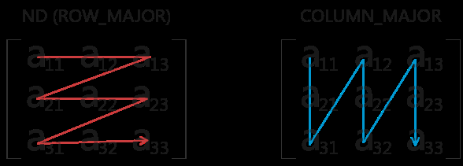
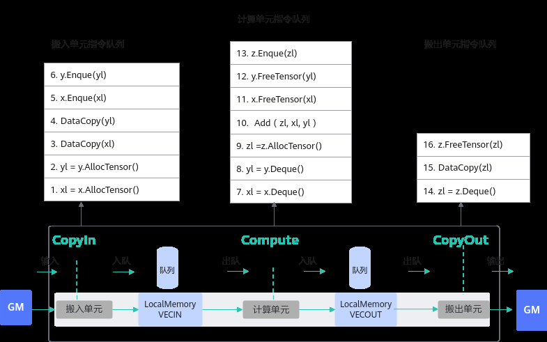
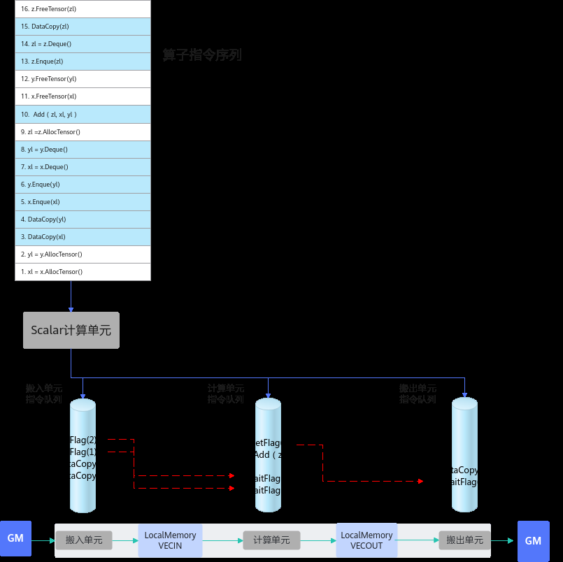
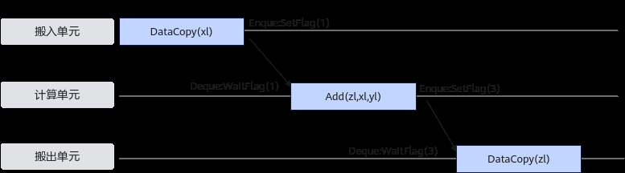
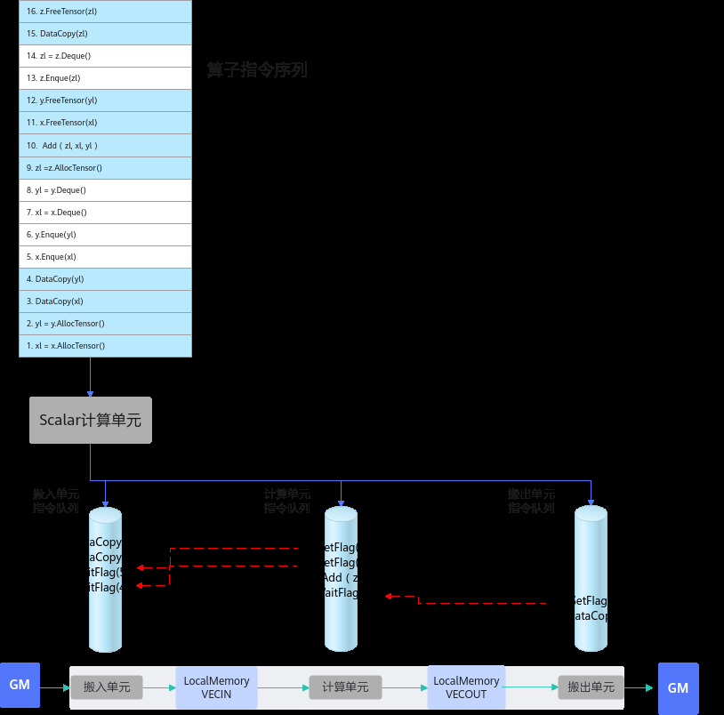
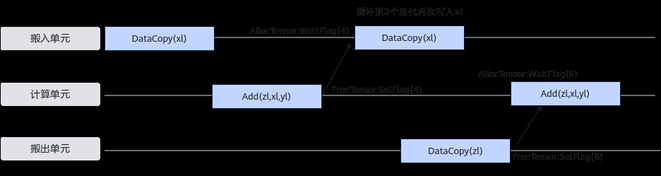

# 编程模型设计原理

> **Section**: 2.9.3  
> **PDF Pages**: 259–261  

---

<!-- page 259 -->

## 2.9.3 编程模型设计原理

Ascend C编程模型中，并行编程范式核心要素是：一组并行计算任务、通过队列实现任务之间的同步、开发者自主表达对并行计算任务和资源的调度。本节介绍编程模型的设计原理，作为扩展阅读，便于开发者更好的理解编程模型的设计思路和优势，对于后续的深度开发也会有所帮助。

每个并行任务Stage的编程范式如下：

1.获取Local Memory的内存：调用AllocTensor申请内存，或者从上游队列DeQue一块内存数据。

2.完成计算或者数据搬运。

3.把上一步处理好的数据调用EnQue入队。

4.调用FreeTensor释放不再需要的内存。

以最简单的矢量编程范式为例，在调用上述接口时，实际上会给各执行单元下发一些指令，如下图所示：

图2-43 Vector 编程范式指令队列示例

<!-- page 260 -->

●EnQue/DeQue的具体处理流程：

a.标量执行单元读取算子指令序列

b.把这些指令发射到对应的执行单元的指令队列

c.各个执行单元并行执行这些指令序列

d.EnQue/DeQue解决对内存的写后读问题▪EnQue调用会发射同步指令set，发送信号激活wait▪DeQue调用会发射同步指令wait，等待数据写入完成▪wait需要等到set指令执行完成后才能执行否则阻塞

由此可以看出，EnQue/DeQue主要解决了存在数据依赖时，并行执行单元的写后读同步控制问题。

<!-- page 261 -->

●AllocTensor/FreeTensor的具体处理流程

a.标量执行单元读取算子指令序列

b.把这些指令发射到对应的执行单元的指令队列

c.各个执行单元并行执行这些指令序列

d.AllocTensor/FreeTensor，解决对内存的读后写问题▪AllocTensor调用会发射同步指令wait等待内存被读完成▪FreeTensor调用会发射同步指令set，通知内存释放，可以重复写▪wait需要等到set指令执行完成后才能执行否则阻塞

由此可以看出，AllocTensor/FreeTensor主要解决了存在数据依赖时，并行执行单元的读后写同步控制问题。

