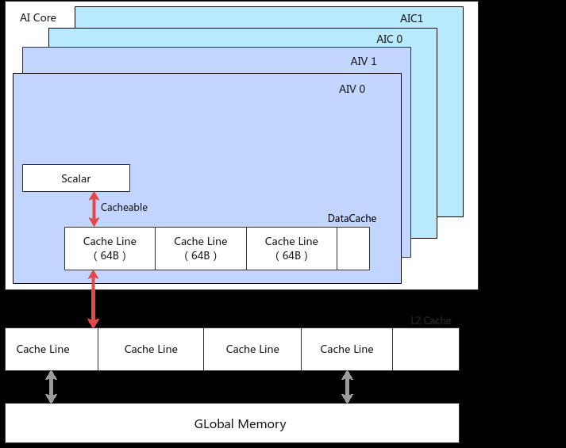
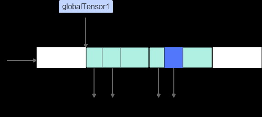

# Scalar读写数据

> **Section**: 2.9.4.1  
> **PDF Pages**: 262–263  

---

<!-- page 262 -->

通过上文的详细说明，可以看出异步并行程序需要考虑复杂的同步控制，而Ascend C编程模型将这些流程进行了封装，通过EnQue/DeQue/AllocTensor/FreeTensor这种开发者熟悉的资源控制方式来体现，达到简化编程和易于理解的目的。

## 2.9.4 内存访问原理

## 2.9.4.1 Scalar 读写数据

AI Core中Scalar计算单元负责各类型的标量数据运算和程序的流程控制。根据硬件架构设计，Scalar仅支持对Global Memory和Unified Buffer的读写操作，而不支持对L1Buffer、L0A Buffer、L0B Buffer和L0C Buffer等其他类型存储的访问。下文分别介绍了Scalar读写Global Memory和Unified Buffer的方式和Scalar读写数据时的同步机制。

## Scalar 读写Global Memory

如上图所示，Scalar读写GM数据时会经过DataCache，DataCache主要用于提高标量访存指令的执行效率，每一个AIC/AIV核内均有一个独立的DataCache。下面通过一个具体示例来讲解DataCache的具体工作机制。

globalTensor1是位于GM上的Tensor：

●执行完GetValue(0)后，globalTensor1的前8个元素会进入DataCache，后续GetValue(1)~GetValue(7)不需要再访问GM，而可以直接从DataCache的CacheLine中读取数据，提高了标量连续访问的效率。

<!-- page 263 -->

●执行完SetValue(8, val)后，globalTensor1的index为8~15的元素会进入DataCache，SetValue只会修改DataCache中的Cache Line数据，同时将CacheLine的状态设置为Dirty，表明Cache Line中的数据与GM中的数据不一致。

AscendC::GlobalTensor<int64_t> globalTensor1;globalTensor1.SetGlobalBuffer((__gm__ int64_t *)input);// 从0~7共计8个uint64_t类型，DataCache的Cache Line长度为64字节// 执行完GetValue(0)后，GetValue(1)~GetValue(7)可以直接从Cache Line中读取，不需要再访问GMglobalTensor1.GetValue(0);globalTensor1.GetValue(1);globalTensor1.GetValue(2);globalTensor1.GetValue(3);globalTensor1.GetValue(4);globalTensor1.GetValue(5);globalTensor1.GetValue(6);globalTensor1.GetValue(7);

// 执行完SetValue(8)后，不会修改GM上的数据，只会修改DataCache中Cache Line数据// 同时Cache Line的状态置为dirty，dirty表示DataCache中Cache Line数据与GM中的数据不一致int64_t val = 32;globalTensor1.SetValue(8, val);globalTensor1.GetValue(8);

根据上文的工作机制（如下图所示），多核间访问globalTensor1会出现数据不一致的情况，如果其余核需要获取GM数据的变化，则需要开发者手动调用DataCacheCleanAndInvalid来保证数据的一致性。

## Scalar 读写Unified Buffer

Scalar读写Unified Buffer时，可以使用LocalTensor的SetValue和GetValue接口。示例如下：

for (int32_t i = 0; i < 16; ++i) {    inputLocal.SetValue(i, i); // 对inputLocal中第i个位置进行赋值为i}

for (int32_t i = 0; i < srcLen; ++i) {    auto element = inputLocal.GetValue(i); // 获取inputLocal中第i个位置的数值}

## Scalar 读写数据时的同步

Scalar读写Global Memory和Unified Buffer时属于PIPE_S（Scalar流水）操作，当用户使用SetValue或者GetValue接口，且算子工程使能自动同步时，不需要手动插入同步事件。
