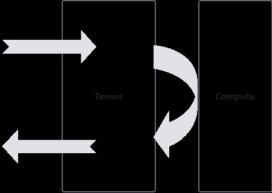

# DoubleBuffer

> **Section**: 2.9.5.1  
> **PDF Pages**: 264–264  

---

<!-- page 264 -->

如果用户关闭算子工程的自动同步功能时，则需要手动插入同步事件：

// GetValue为Scalar操作，与后续的Duplicate存在数据依赖// 因此Vector流水需要等待Scalar操作结束float inputVal = srcLocal.GetValue(0);SetFlag<HardEvent::S_V>(eventID1);WaitFlag<HardEvent::S_V>(eventID1);AscendC::Duplicate(dstLocal, inputVal, srcDataSize);

// SetValue为Scalar操作，与后续的数据搬运操作存在数据依赖// 因此MTE3流水需要等待Scalar操作结束srcLocal.SetValue(0, value);SetFlag<HardEvent::S_MTE3>(eventID2);WaitFlag<HardEvent::S_MTE3>(eventID2);AscendC::DataCopy(dstGlobal, srcLocal, srcDataSize);

## 2.9.5 性能优化技术原理

## 2.9.5.1 DoubleBuffer

执行于AI Core上的指令队列主要包括如下几类，即Vector指令队列、Cube指令队列和MTE指令队列。不同指令队列间的相互独立性和可并行执行性，是DoubleBuffer优化机制的基石。

矢量计算CopyIn、CopyOut过程使用MTE指令队列（MTE2、MTE3），Compute过程使用Vector指令队列（V），意味着CopyIn、CopyOut过程和Compute过程是可以并行的。

如图2-44所示，考虑一个完整的数据搬运和计算过程，CopyIn过程将数据从GlobalMemory搬运到Local Memory，Vector计算单元完成计算后，经过CopyOut过程将计算结果搬回Global Memory。

图2-44数据搬运与Vector 计算过程

在此过程中，数据搬运与Vector计算串行执行，Vector计算单元无可避免存在资源闲置问题。举例而言，若CopyIn、Compute、CopyOut三阶段分别耗时t，则Vector的时间利用率仅为1/3，等待时间过长，Vector利用率严重不足。
