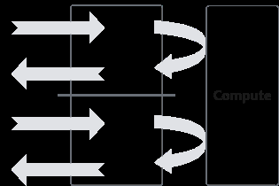

# 概述

> **Section**: 2.10.1.1  
> **PDF Pages**: 265–265  

---

<!-- page 265 -->

为减少Vector等待时间，DoubleBuffer机制将待处理的数据一分为二，比如Tensor1、Tensor2。如图2-45所示，当Vector对Tensor1中数据进行Compute时，Tensor2可以执行CopyIn的过程；而当Vector切换到计算Tensor2时，Tensor1可以执行CopyOut的过程。由此，数据的进出搬运和Vector计算实现并行执行，Vector闲置问题得以有效缓解。

总体来说，DoubleBuffer是基于MTE指令队列与Vector指令队列的独立性和可并行性，通过将数据搬运与Vector计算并行执行以隐藏数据搬运时间并降低Vector指令的等待时间，最终提高Vector单元的利用效率，您可以通过为队列申请内存时设置内存块的个数来实现数据并行，简单代码示例如下：

```cpp
pipe.InitBuffer(inQueueX, 2, 256);
```

图2-45 DoubleBuffer 机制



需要注意：

多数情况下，采用DoubleBuffer能有效提升Vector的时间利用率，缩减算子执行时间。然而，DoubleBuffer机制缓解Vector闲置问题并不代表它总能带来整体的性能提升。例如：

●当数据搬运时间较短，而Vector计算时间显著较长时，由于数据搬运在整个计算过程中的时间占比较低，DoubleBuffer机制带来的性能收益会偏小。

●又如，当原始数据较小且Vector可一次性完成所有计算时，强行使用DoubleBuffer会降低Vector计算资源的利用率，最终效果可能适得其反。

因此，DoubleBuffer的性能收益需综合考虑Vector算力、数据量大小、搬运与计算时间占比等多种因素。

## 2.10 附录

## 2.10.1 C++标准支持

## 2.10.1.1 概述

Host侧与clang15一致，支持完整的C/C++标准。

Device侧，默认支持C++11标准，支持指定C++14、C++17、C++20。由于硬件限制，部分C++运行时能力无法支持。
