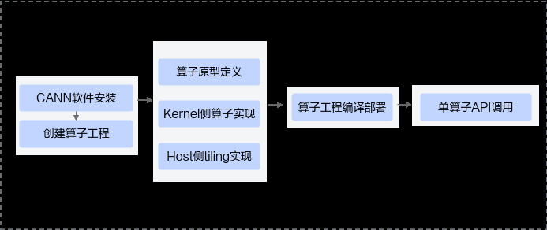

# 概述

> **Section**: 2.10.2.1  
> **PDF Pages**: 267–267  

---

<!-- page 267 -->

## SIMT 子函数

__simt_callee__标记的SIMT子函数需要遵循以下约束和限制：

●必须添加inline标识符。

## 2.10.2 工程化算子开发

## 2.10.2.1 概述

工程化算子开发是指基于自动生成的自定义算子工程完成算子实现、编译部署、单算子调用代码自动生成等一系列流程。

该开发流程是标准的开发流程，建议开发者按照该流程进行算子开发。该方式下，算子开发的代码会更规范、统一、易于维护；同时该方式考虑了单算子API调用、算子入图、AI框架调用等功能的集成，使得开发者易于借助CANN框架实现上述功能。

工程化算子开发流程如下图所示：

步骤1环境准备。

1.CANN软件安装请参考1.2 环境准备。

2.创建算子工程。使用msOpGen工具创建算子开发工程。

步骤2算子实现。

●算子原型定义。通过原型定义来描述算子输入输出、属性等信息以及算子在AI处理器上相关实现信息，并关联tiling实现等函数。

●Kernel侧算子实现和host侧tiling实现请参考3.3 SIMD算子实现；工程化算子开发，支持开发者调用Tiling API基于CANN提供的编程框架进行tiling开发，kernel侧也提供对应的接口方便开发者获取tiling参数，具体内容请参考2.10.2.4 Kernel侧算子实现和2.10.2.5 Host侧Tiling实现，由此而带来的额外约束也在上述章节说明。

步骤3编译部署。通过工程编译脚本完成算子的编译部署，分为算子包编译和算子动态库编

译两种方式。

步骤4单算子API调用：调用单算子API接口，基于C语言的API执行算子。

**----结束**
