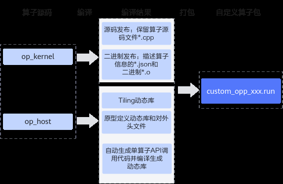

# 算子工程编译

> **Section**: 2.10.2.6.1  
> **PDF Pages**: 294–300  

---

<!-- page 294 -->

```cpp
TILE_NUM = 1;    }else{        IS_SPLIT = 1;
        TILE_NUM = DEFAULT_TILE_NUM;    }    context->SetBlockDim(NUM_BLOCKS);
    tiling.set_totalLength(totalLength);
    tiling.SaveToBuffer(context->GetRawTilingData()->GetData(), context->GetRawTilingData()->GetCapacity());
    context->GetRawTilingData()->SetDataSize(tiling.GetDataSize());
    ASCENDC_TPL_SEL_PARAM(context, D_T_X, D_T_Y, D_T_Z, TILE_NUM, IS_SPLIT);
    size_t *currentWorkspace = context->GetWorkspaceSizes(1);
    currentWorkspace[0] = 0;
    return ge::GRAPH_SUCCESS;}
```

步骤3kernel侧实现

●kernel实现文件中包含步骤1中定义模板参数和模板参数组合的头文件。

●核函数添加template模板，以便支持模板参数的传入，参数顺序需要与定义模板参数和模板参数组合的头文件中的模板参数顺序保持一致。

●通过对模板参数的分支判断，选择不同的kernel侧实现。

```cpp
#include "tiling_key_add_custom.h"......template<typename D_T_X, typename D_T_Y, typename D_T_Z, int TILE_NUM, int IS_SPLIT> __global__ __aicore__ void add_custom_template(GM_ADDR x, GM_ADDR y, GM_ADDR z, GM_ADDR workspace, GM_ADDR tiling){    GET_TILING_DATA(tiling_data, tiling);
    KernelAdd<D_T_X, D_T_Y, D_T_Z> op;
    op.Init(x, y, z, tiling_data.totalLength, TILE_NUM);
    if constexpr (std::is_same_v<D_T_X, float> && std::is_same_v<D_T_Y, float> && std::is_same_v<D_T_Z, float>) {        op.Process1();    } else if constexpr (std::is_same_v<D_T_X, half> && std::is_same_v<D_T_Y, half> && std::is_same_v<D_T_Z, half>){        if (IS_SPLIT == 0) {            op.Process1();        } else if(IS_SPLIT == 1) {            op.Process2();        }    }}
```

**----结束**

说明

Tiling模板编程场景下，编译时，可以通过--kernel-template-input编译选项配置仅编译指定的模板参数组合相关的Kernel代码，用于加速编译过程。

## 2.10.2.6 算子包编译

## 2.10.2.6.1 算子工程编译

算子kernel侧和host侧实现开发完成后，需要对算子工程进行编译，生成自定义算子安装包*.run，详细的编译操作包括：

●编译Ascend C算子kernel侧代码实现文件*.cpp，分为源码发布和二进制发布两种方式。

<!-- page 295 -->

–源码发布：不对算子kernel侧实现进行编译，保留算子kernel源码文件*.cpp。该方式可以支持算子的在线编译、通过ATC模型转换的方式编译算子的场景。

–二进制发布：对算子kernel侧实现进行编译，生成描述算子相关信息的json文件*.json和算子二进制文件*.o。算子调用时，如果需要直接调用算子二进制，则使用该编译方式，比如通过2.10.2.9 单算子API调用的方式完成单算子的调用，PyTorch框架中单算子调用的场景，动态网络中调用算子的场景。

●编译Ascend C算子host侧代码实现文件*.cpp、*.h。

–将原型定义和shape推导实现编译成算子原型定义动态库libcust_opsproto_*.so，并生成算子原型对外接口op_proto.h。

–将Tiling实现编译成Tiling动态库liboptiling.so等。

–基于算子原型定义，自动生成单算子API调用代码和头文件aclnn_*.h，并编译生成单算子API调用的动态库libcust_opapi.so。

上述编译过程示意图如下：

图2-48算子工程编译示意图



编译步骤

步骤1完成工程编译相关配置。

●修改工程目录下的CMakePresets.json cacheVariables的配置项。CMakePresets.json文件内容如下，需要配置的参数请参考表2-40，其他参数会在工程创建时自动生成。{    "version": 1,    "cmakeMinimumRequired": {        "major": 3,        "minor": 19,        "patch": 0    },    "configurePresets": [

<!-- page 296 -->

```cpp
{            "name": "default",            "displayName": "Default Config",            "description": "Default build using Unix Makefiles generator",            "generator": "Unix Makefiles",            "binaryDir": "${sourceDir}/build_out",            "cacheVariables": {                "CMAKE_BUILD_TYPE": {                    "type": "STRING",                    "value": "Release"                },                "ENABLE_SOURCE_PACKAGE": {                    "type": "BOOL",                    "value": "True"                },                "ENABLE_BINARY_PACKAGE": {                    "type": "BOOL",                    "value": "True"                },                "ASCEND_COMPUTE_UNIT": {                    "type": "STRING",                    "value": "ascendxxx"                },                "ENABLE_TEST": {                    "type": "BOOL",                    "value": "True"                },                "vendor_name": {                    "type": "STRING",                    "value": "customize"                },                "ASCEND_PYTHON_EXECUTABLE": {                    "type": "STRING",                    "value": "python3"                },                "CMAKE_INSTALL_PREFIX": {                    "type": "PATH",                    "value": "${sourceDir}/build_out"                },                "ENABLE_CROSS_COMPILE": {                    "type": "BOOL",                    "value": "False"                },                "CMAKE_CROSS_PLATFORM_COMPILER": {                    "type": "PATH",                    "value": "/usr/bin/aarch64-linux-gnu-g++"                },                "ASCEND_PACK_SHARED_LIBRARY": {                    "type": "BOOL",                    "value": "False"                }            }        }    ]}
```

<!-- page 297 -->

表2-40需要开发者配置的参数列表

参数名称参数描述默认值

CMAKE_BUILD_TYPE

“Release”

编译模式选项，可配置为：

–“Release”，Release版本，不包含调试信息，编译最终发布的版本。

–“Debug”，“Debug”版本，包含调试信息，便于开发者开发和调试。

ENABLE_SOURCE_PACKAGE

是否开启源码编译“True”

ENABLE_BINARY_PACKAGE

是否开启二进制编译“True”

“customize”

vendor_name标识自定义算子所属厂商的名称。建议开发者自行指定所属厂商名称，避免和其他厂商提供的算子包冲突。

ASCEND_PACK_SHARED_LIBRARY

是否开启动态库编译功能。“False”

●配置编译相关环境变量（可选）

表2-41环境变量说明

环境变量配置说明

CMAKE_CXX_COMPILER_LAUNCHER

用于配置C++语言编译器（如g++）、毕昇编译器的启动器程序为ccache，配置后即可开启cache缓存编译，加速重复编译并提高构建效率。使用该功能前需要安装ccache。

配置方法如下，在对应的CMakeLists.txt进行设置：set(CMAKE_CXX_COMPILER_LAUNCHER <launcher_program>)

其中<launcher_program>是ccache的安装路径，比如ccache的安装路径为/usr/bin/ccache，示例如下：set(CMAKE_CXX_COMPILER_LAUNCHER /usr/bin/ccache)

步骤2在算子工程目录下执行如下命令，进行算子工程编译。

**./build.sh**

编译成功后，会在当前目录下创建build_out目录，并在build_out目录下生成自定义算子安装包custom_opp_<target os>_<target architecture>.run。

用户如果需要编译过程日志存盘，可以使用环境变量ASCENDC_BUILD_LOG_DIR来控制存储路径。用户设置该选项之后，如果编译过程中无错误产生，则对应的log文件后缀会添加"_success"，若编译过程有错误产生，则会在屏幕打印对应的报错信息，以及指示用户log文件的具体路径与文件名，同时，对应log文件后缀会添加“_error”。

<!-- page 298 -->

# 如希望编译日志存储在/home/build_log/，则可以按照如下设置，默认不打开日志存储export ASCENDC_BUILD_LOG_DIR=/home/build_log/

**----结束**

算子包交叉编译

完成算子代码实现后，如果当前平台架构和运行环境一致则参考上一节的内容进行编译即可，如果需要实现算子包的交叉编译，您可以参考如下流程。

步骤1交叉编译工具下载，下表以Ubuntu系列操作系统为例，展示了编译工具下载命令的样例。其他操作系统，请替换为实际的下载命令。

表2-42 Ubuntu 系列操作系统交叉编译工具下载命令样例

当前平台架构运行环境平台架构编译工具下载命令

x86_64aarch64sudo apt-get install -y g++-aarch64-linux-gnu

aarch64x86_64sudo apt-get install g++-x86-64-linux-gnu

步骤2自定义算子工程交叉编译，构建生成自定义算子包。

1.修改CMakePresets.json中ENABLE_CROSS_COMPILE为True，使能交叉编译。"ENABLE_CROSS_COMPILE": {    "type": "BOOL","value": "True" }

2.修改CMakePresets.json中CMAKE_CROSS_PLATFORM_COMPILER为安装后的交叉编译工具路径。"CMAKE_CROSS_PLATFORM_COMPILER": {    "type": "PATH",    "value": "/usr/bin/aarch64-linux-gnu-g++"}

3.在算子工程目录下执行如下命令，进行算子工程交叉编译。

**./build.sh**

编译成功后，会在当前目录下创建build_out目录，并在build_out目录下生成自定义算子安装包custom_opp_<target os>_<target architecture>.run

**----结束**

支持自定义编译选项

在算子工程中，如果开发者想对算子kernel侧代码增加一些自定义的编译选项，可以参考如下内容进行编译选项的定制。

修改算子工程op_kernel目录下的CMakeLists.txt，使用add_ops_compile_options来增加编译选项，方法如下：

```cpp
add_ops_compile_options(OpType COMPUTE_UNIT soc_version1 soc_version2 ... OPTIONS option1 option2 ...)
```

具体参数的介绍如下：

<!-- page 299 -->

表2-43具体参数介绍

参数名称可选/必选

参数描述

OpType（算子类型）必选第一个参数应传入算子类型，如果需要对算子工程中的所有算子生效，需要配置为ALL。

COMPUTE_UNIT可选标识编译选项在哪些AI处理器型号上生效，多个型号之间通过空格间隔。不配置时表示对所有AI处理器型号生效。

说明

COMPUTE_UNIT具体配置如下：

●针对如下产品：在安装AI处理器的服务器执行npu-smi info命令进行查询，获取Name信息。实际配置值为AscendName，例如Name取值为xxxyy，实际配置值为Ascendxxxyy。Atlas A2 训练系列产品/Atlas A2 推理系列产品

Atlas 200I/500 A2 推理产品

Atlas 推理系列产品

Atlas 训练系列产品

●针对Atlas A3 训练系列产品/Atlas A3 推理系列产品，在安装AI处理器的服务器执行npu-smi info -t board -i id -c chip_id命令进行查询，获取Chip Name和NPU Name信息，实际配置值为Chip Name_NPU Name。例如Chip Name取值为Ascendxxx，NPU Name取值为1234，实际配置值为Ascendxxx_1234。其中：

●id：设备id，通过npu-smi info -l命令查出的NPU ID即为设备id。

●chip_id：芯片id，通过npu-smi info -m命令查出的Chip ID即为芯片id。

●针对Atlas 350 加速卡，在安装AI处理器的服务器执行npu-smi info -t board -i id命令进行查询，获取Chip Name和NPU Name信息，实际配置值为Chip Name_NPU Name。例如Chip Name取值为Ascendxxx，NPUName取值为1234，实际配置值为Ascendxxx_1234。其中，id为设备id，通过npu-smi info -l命令查出的NPU ID即为设备id。

<!-- page 300 -->

参数名称可选/必选

参数描述

OPTIONS必选自定义的编译选项。多个编译选项之间通过空格间隔。

●增加-D编译选项，用于在编译时定义宏。OPTIONS -Dname=definition

●增加-g -O0等调试用编译选项。

●支持传入毕昇编译器编译选项：比如--cce-auto-sync=off，设置该选项可以关闭自动同步功能，自定义算子工程已默认开启，通常无需开发者手动设置。详细内容参见《毕昇编译器》。

更多编译选项可以参考《毕昇编译器》。

●Ascend C框架提供的编译选项，具体内容参考下文详细介绍。

须知

●编译选项是基于“算子类型+AI处理器型号系列”进行配置的，也就是说不同的“算子类型+AI处理器型号系列”可以配置不同的编译选项。add_ops_compile_options(AddCustom COMPUTE_UNIT Ascendxxxyy ... OPTIONS -DNEW_MACRO1=xx)add_ops_compile_options(AddCustom COMPUTE_UNIT Ascendxxxyy ... OPTIONS -DNEW_MACRO2=xx)add_ops_compile_options(AddCustom COMPUTE_UNIT Ascendxxxyy ... OPTIONS -DNEW_MACRO3=xx)

●对相同算子类型+AI处理器型号系列，做多次编译选项配置，以后配置的为准。

●对ALL生效的编译选项和对单一算子生效的编译选项如果没有冲突，同时生效，如果有冲突，以单一算子的编译选项为准。

Ascend C框架提供的编译选项介绍如下：

●--tiling_key，设置该选项后，只编译指定的TilingKey相关的kernel代码，用于加速编译过程。若不指定TilingKey编译，则默认编译所有的TilingKey。配置多个TilingKey时，TilingKey之间不能有空格。示例如下，其中1、2为tiling_key。--tiling_key=1,2

●编译宏开关请参考内置编译宏开关。

●--op_relocatable_kernel_binary，设置该选项为true时，会额外编译一份可被重新链接的二进制文件；不配置或设置为false时该选项均不生效。该选项用于自定义Tiling下沉算子使能SuperKernel的场景，配置该选项所生成的二进制文件，可以使算子在SuperKernel编译时直接复用二进制文件，降低编译耗时。

●--kernel-template-input，用于算子工程模板编程，设置该选项后，只编译指定的模板参数组合相关的Kernel代码，用于加速编译过程。若不设置该选项，则默认编译所有的模板参数组合。传入的参数为键值对列表，整体需用双引号或单引号包裹。不同模板参数之间用英文分号（;）分隔，相同模板参数配置多个值时用英文逗号（,）分隔。配置时不能有空格。示例如下：--kernel-template-input="D_T_X=A1,A2;D_T_Y=B;D_T_Z=C"--kernel-template-input='D_T_X=A1,A2;D_T_Y=B;D_T_Z=C'
