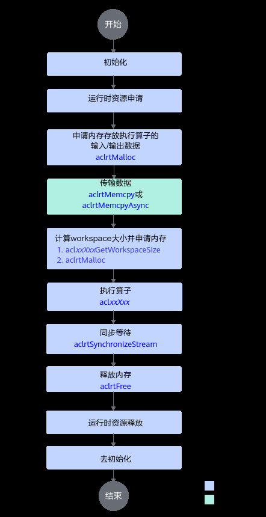

# 单算子API调用

> **Section**: 2.10.2.9  
> **PDF Pages**: 314–318  

---

<!-- page 314 -->

–[KERNEL_FILE <file>]：可选，指定算子入口的Kernel实现文件名。

若算子的Kernel实现cpp文件需要自定义命名，需同时指定OP_TYPE（算子类型）和KERNEL_FILE（Kernel实现cpp文件名），以配置两者之间的对应关系。不配置时，Kernel实现cpp文件名和OpType之间需满足转换规则。

7.npu_op_device_tiling_library

创建Device侧Tiling库。使用该选项时，package的类型仅支持配置为RUN（run包模式）。

```cpp
npu_op_device_tiling_library(<target_name> <type> <files>)
```

参数说明如下：

–<target_name>：必选，目标的名称。

–<type>：必选，指定Tiling产物的类型。支持取值为SHARED、STATIC。

–<files>：必选，指定Tiling源码文件。

8.npu_op_code_gen

执行代码生成过程，生成aclnn单算子调用代码和入图所需的原型定义代码。

```cpp
npu_op_code_gen(SRC <src_files> OUT_DIR <output_dir> PACKAGE <pkg_name> [COMPILE_OPTIONS ...])
```

参数说明如下：

–SRC <src_files>：必选，参与代码生成的源文件范围。

–OUT_DIR <output_dir>：必选，生成代码的输出路径。

–PACKAGE <pkg_name>：必选，指定生成代码的package名称。

–[COMPILE_OPTIONS ...]：可选，自定义编译过程中的编译选项。

## 2.10.2.9 单算子API 调用

单算子API调用方式，是指直接调用单算子API接口，基于C语言的API执行算子。算子工程创建完成后，基于工程代码框架完成算子原型定义、kernel侧算子实现、host侧tiling实现，通过工程编译脚本完成算子的编译部署，之后再进行单算子API的调用。

基本原理

完成自定义算子编译后，会自动生成单算子API，可以直接在应用程序中调用。

单算子API的形式一般定义为“两段式接口”，形如：

aclnnStatus aclnnXxxGetWorkspaceSize(const aclTensor *src, ..., aclTensor *out, uint64_t *workspaceSize, aclOpExecutor **executor);aclnnStatus aclnnXxx(void *workspace, uint64_t workspaceSize, aclOpExecutor *executor, aclrtStream stream);

其中aclnnXxxGetWorkspaceSize/aclnnXxxTensorGetWorkspaceSize为第一段接口，主要用于计算本次API调用过程中需要多少workspace内存，获取到本次计算所需的workspaceSize后，按照workspaceSize申请NPU内存，然后调用第二段接口aclnnXxx执行计算。Xxx代表算子原型注册时传入的算子类型。

**aclnnXxxGetWorkspaceSize接口的输入输出参数生成规则如下：**

●可选输入的命名增加Optional后缀。如下样例中，x是可选输入。aclnnStatus aclnnXxxGetWorkspaceSize(const aclTensor *xOptional, ..., aclTensor *out, uint64_t *workspaceSize, aclOpExecutor **executor);

●输入输出同名、使用同一个Tensor承载的情况下，生成的aclnn接口中只保留input参数同时去掉input的const修饰，并以Ref作为后缀。如下样例中，原型定义input、output都定义为x，xRef既作为输入，又作为输出。

<!-- page 315 -->

aclnnStatus aclnnXxxGetWorkspaceSize(aclTensor *xRef, ..., uint64_t *workspaceSize, aclOpExecutor **executor);

●如果仅有一个输出，输出参数命名为out；如果存在多个输出，每个输出后面都以Out作为后缀。// 仅有一个输出aclnnStatus aclnnXxxGetWorkspaceSize(const aclTensor *src, ..., aclTensor *out, uint64_t *workspaceSize, aclOpExecutor **executor);// 存在多个输出aclnnStatus aclnnXxxGetWorkspaceSize(const aclTensor *src, ..., aclTensor *yOut, aclTensor *y1Out, ..., uint64_t *workspaceSize, aclOpExecutor **executor);

●如果算子包含属性，则属性参数的位置介于输入输出之间。如下示例中，x是算子输入，negativeSlope是算子属性，out是算子输出。aclnnStatus aclnnXxxGetWorkspaceSize(const aclTensor *x, double negativeSlope, aclTensor *out, uint64_t *workspaceSize, aclOpExecutor **executor);

当算子原型注册时使用ValueDepend接口标识输入为数据依赖输入时，会额外生成一个API，该API支持值依赖场景输入数据为空的一阶段计算。

aclnnStatus aclnnXxxTensorGetWorkspaceSize(const aclTensor *src, ..., aclTensor *out, uint64_t *workspaceSize, aclOpExecutor **executor);

在aclnnXxxTensorGetWorkspaceSize中，aclnnXxxGetWorkspaceSize参数的数据类型（aclIntArray、aclFloatArray和aclBoolArray）将被转换为aclTensor数据类型，其他输入输出参数生成规则与aclnnXxxGetWorkspaceSize一致。如下示例中，x0、x1、x2是算子声明为数据依赖的输入，数据类型分别为DT_INT64、DT_BOOL、DT_FLOAT，out是算子输出。aclnnStatus aclnnXxxGetWorkspaceSize(const aclIntArray *x0, const aclBoolArray *x1, const aclFloatArray *x2, aclTensor *out, uint64_t *workspaceSize, aclOpExecutor **executor);aclnnStatus aclnnXxxTensorGetWorkspaceSize(const aclTensor *x0, const aclTensor *x1, const aclTensor *x2, aclTensor *out, uint64_t *workspaceSize, aclOpExecutor **executor);

前置步骤

●参考2.10.2.2 创建算子工程完成自定义算子工程的创建。

●参考2.10.2.4 Kernel侧算子实现完成kernel侧实现的相关准备，参考2.10.2.5Host侧Tiling实现、2.10.2.3 算子原型定义完成host侧实现相关准备。

●对于算子包编译场景，参考2.10.2.6.1 算子工程编译、2.10.2.6.2 算子包部署完成算子的编译部署，编译部署时需要开启算子的二进制编译功能：修改算子工程中的编译配置项文件CMakePresets.json，将ENABLE_BINARY_PACKAGE设置为True。编译部署时可将算子的二进制部署到当前环境，便于后续算子的调用。"ENABLE_BINARY_PACKAGE": {                    "type": "BOOL","value": "True"                },

算子编译部署后，会在算子包安装目录下的op_api目录生成单算子调用的头文件aclnn_xx.h和动态库libcust_opapi.so。

以默认安装场景为例，单算子调用的头文件.h和动态库libcust_opapi.so所在的目录结构，如下所示：├── opp    //算子库目录│   ├── vendors     //自定义算子所在目录│       ├── config.ini│       └── vendor_name1   // 存储对应厂商部署的自定义算子，此名字为编译自定义算子安装包时配置的vendor_name，若未配置，默认值为customize│           ├── op_api│           │   ├── include│           │   │  └── aclnn_xx.h│           │   └── lib│           │       └── libcust_opapi.so...

<!-- page 316 -->

●对于算子动态库编译场景，参考2.10.2.7 算子动态库和静态库编译完成算子的编译。编译完成后会在如下路径生成单算子调用的头文件aclnn_xx.h和动态库libcust_opapi.so。其中CMAKE_INSTALL_PREFIX为开发者在cmake文件中配置的编译产物存放路径。

–动态库路径：${CMAKE_INSTALL_PREFIX}/op_api/lib/libcust_opapi.so

–头文件路径：${CMAKE_INSTALL_PREFIX}/op_api/include

准备验证代码工程

代码工程目录结构如下，您可以单击LINK，获取样例工程的完整样例：├── CMakeLists.txt    // 编译规则文件├── main.cpp    // 单算子调用主体流程实现文件

单算子调用流程

单算子API执行流程如下：

<!-- page 317 -->



<!-- page 318 -->

本节以AddCustom自定义算子调用为例，介绍如何编写单算子调用的代码逻辑。其他算子的调用逻辑与Add算子大致一样，请根据实际情况自行修改代码。

以下是关键步骤的代码示例，不可以直接拷贝编译运行，仅供参考，调用接口后，需增加异常处理的分支，并记录报错日志、提示日志，此处不一一列举。

说明

因为单算子API执行方式，会自动在编译工程的build_out/autogen目录下生成.cpp和.h，编写单算子的调用代码时，要包含自动生成的单算子API执行接口头文件。示例如下：

```cpp
#include "aclnn_add_custom.h"
```

// 1.初始化CHECK_ACL(aclnnInit(nullptr));

// 2.运行管理资源申请const int32_t deviceId = 0;CHECK_ACL(aclrtSetDevice(deviceId));

// 3.申请内存存放算子的输入输出// ......

// 4.传输数据CHECK_ACL(aclrtMemcpy(input0DeviceMem, bufferSize, input0HostData.data(), bufferSize, ACL_MEMCPY_HOST_TO_DEVICE));CHECK_ACL(aclrtMemcpy(input1DeviceMem, bufferSize, input1HostData.data(), bufferSize, ACL_MEMCPY_HOST_TO_DEVICE));

// 5.计算workspace大小并申请内存uint64_t workspaceSize = 0;aclOpExecutor* executor = nullptr;CHECK_ACL(aclnnAddCustomGetWorkspaceSize(input0, input1, output0, &workspaceSize, &executor));void* workspaceDeviceMem = nullptr;if (workspaceSize > 0) {    CHECK_ACL(aclrtMalloc(&workspaceDeviceMem, workspaceSize, ACL_MEM_MALLOC_HUGE_FIRST));}

// 6.执行算子CHECK_ACL(aclnnAddCustom(workspaceDeviceMem, workspaceSize, executor, stream));

// 7.同步等待CHECK_ACL(aclrtSynchronizeStream(stream));

// 8.处理执行算子后的输出数据，例如在屏幕上显示、写入文件等，由用户根据实际情况自行实现// ......

// 9.释放运行管理资源CHECK_ACL(aclrtResetDevice(deviceId));// ....

// 10.去初始化CHECK_ACL(aclnnFinalize());

## CMakeLists 文件

算子编译后，会生成单算子调用的头文件aclnn_xx.h和动态库libcust_opapi.so。具体路径请参考前置步骤。

编译算子调用程序时，需要在头文件的搜索路径include_directories中增加单算子调用的头文件目录，便于找到该头文件；同时需要链接cust_opapi动态库并在库文件的搜索路径link_directories中增加libcust_opapi.so所在目录。

●在头文件的搜索路径include_directories中增加单算子调用的头文件目录。以下样例仅为参考，请根据头文件的实际目录位置进行设置。target_include_directories(execute_add_op PRIVATE    $ENV{ASCEND_HOME_PATH}/include
