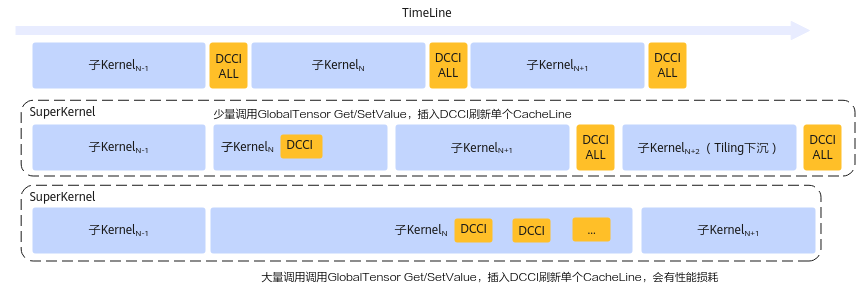

# SuperKernel开发

> **Section**: 2.10.3.4  
> **PDF Pages**: 331–332  

---

<!-- page 331 -->

当前Tiling下沉仅支持融合算子，为了模拟融合算子场景，通过KERNEL_TASK_TYPE_DEFAULT接口强制指定算子在AIC、AIV混合场景运行。extern "C" __global__ __aicore__ void add_custom_tiling_sink(GM_ADDR x, GM_ADDR y, GM_ADDR z, GM_ADDR workspace, GM_ADDR tiling){    REGISTER_TILING_DEFAULT(TilingSinkTilingData);    GET_TILING_DATA(tiling_data, tiling);    KERNEL_TASK_TYPE_DEFAULT(KERNEL_TYPE_MIX_AIC_1_2); // 将算子强制指定在AIC、AIV混合场景运行，模拟融合算子场景    if ASCEND_IS_AIC {        return;    }    AscendC::KernelAdd op;    op.Init(x, y, z, tiling_data.totalLength, tiling_data.tileNum);    op.Process();}

●修改op_host目录下的编译脚本CMakeLists.txt，添加Tiling下沉编译命令。具体代码如下所示：npu_op_device_tiling_library(cust_opmaster SHARED  # 任务名称，固定为cust_opmaster    add_custom_tiling_sink/add_custom_tiling_sink_tiling.cpp  # Tiling函数实现代码源文件)

## 2.10.3.4 SuperKernel 开发

SuperKernel是一种算子的二进制融合技术，与源码融合不同，它聚焦于内核函数(Kernel) 的二进制的调度方案，展开深度优化，于已编译的二进制代码基础上融合创建一个超级Kernel函数（SuperKernel），以调用子函数的方式调用多个其他内核函数，也就是子Kernel。相对于单算子下发，SuperKernel技术可以减少任务调度等待时间和调度开销，同时利用Task间隙资源进一步优化算子头开销。

说明

●SuperKernel仅适用于静态图场景。

●SuperKernel适用于如下型号：

●Atlas A3 训练系列产品/Atlas A3 推理系列产品

●Atlas 350 加速卡

自定义算子支持SuperKernel

自定义算子支持SuperKernel与普通算子在开发流程上并无显著差异，但需注意一些特定约束（详见下文）。当前SuperKernel特性仅支持在Pytorch框架使用，所以完成算子入图（GE图）开发开发后，还需要参考《PyTorch图模式使用指南(TorchAir)》中的“自定义算子入图”章节，完成Pytorch入图。同时，TorchAir提供标定SuperKernel范围的能力，用户可根据实际业务需求对融合范围内的算子进行标记和优化配置。具体内容请参考《PyTorch图模式使用指南(TorchAir)》中的“max-autotune模式功能>图内标定SuperKernel范围”章节。

开发时的特定约束说明如下：

●自定义算子若进行全核同步，需注意子Kernel（即该算子）启动的核数与SuperKernel的核数一致。若子Kernel启动的核数少于SuperKernel的核数，全核同步会等待所有核完成，导致卡住超时。

注：SuperKernel启动核数为子Kernel的最大启动核数。假设SuperKernel包括算子a（启动核数为4）和算子b（启动核数为2），此时SuperKernel启动核数为4。

–使用SyncAll时，为了解决该问题，可以通过在标定SuperKernel范围时开启feed-sync-all功能，此时系统会在SuperKernel内子Kernel的其余核中插入SyncAll指令，防止卡住超时。

<!-- page 332 -->

–若使用CrossCoreSetFlag和CrossCoreWaitFlag硬同步接口实现全核同步，仅支持子Kernel启动核数与SuperKernel核数相同。

●若自定义算子的Kernel类型设置为KERNEL_TYPE_MIX_AIC_1_1，因为SuperKernel会根据启动核数等信息调整SuperKernel的启动比例，此时需特别注意该算子也可以适应SuperKernel的1:2启动比例，确保AIC与AIV之间的硬同步操作正确执行。比如：算子内部使用了AIC与AIV之间的硬同步接口（CrossCoreSetFlag和CrossCoreWaitFlag），不要单独指定某些AIV核调用硬同步接口，使所有AIV核均调用硬同步接口，防止因为硬同步数量不匹配而导致卡死超时；使用Matmul高阶API时，算子逻辑应保证仅有一个AIV0核调用Matmul接口，防止启动两个AIV核之后出现AIV1核消息无法接收导致卡死超时。

●在开发自定义算子时，开发者必须确保所有对GM的标量读写操作都按需正确插入DataCacheCleanAndInvalid指令：在单算子编译场景下，毕昇编译器自动在算子末尾添加DataCacheCleanAndInvalid指令，刷新整个DCache（数据缓存）。在SuperKernel中，子Kernel被当做普通函数处理，编译器不会自动插入该指令来确保数据缓存一致性，开发者需要自行保证避免因容错机制改变而导致错误。

出于性能考虑，SuperKernel场景下Cache刷新机制如下：

如果开发者调用GlobalTensor的GetValue和SetValue接口对GM进行标量读写，SuperKernel编译时会自动在两个接口内部插入DataCacheCleanAndInvalid指令刷新单个Cache Line，保证一定的数据缓存一致性。不会在子Kernel调用前后插入DataCacheCleanAndInvalid。

但需要注意的是，过多调用GetValue和SetValue，在SuperKernel场景下会导致性能劣化，开发者需要尽量减少该接口调用。对于劣化过多的算子，SuperKernel提供了编译选项dcci-before-kernel-start、dcci-after-kernel-start、dcci-disable-on-kernel，可以关闭指定算子内GetValue/SetValue中自动插入的缓存刷新指令以提升模型性能，最终由模型用户决定是否在SuperKernel调用该算子前或后插入整个DCache刷新，编译选项具体内容请参考图内标定SuperKernel范围中编译选项说明。

特别地，对于Tiling下沉场景，通常会涉及二进制复用优化，无法在线选择上述的Cache刷新机制，SuperKernel框架统一在每个子Kernel调用前后都插入DataCacheCleanAndInvalid指令，刷新整个DCache。不会在GetValue和SetValue自动进行缓存刷新。

Cache刷新机制示意图如下图所示：

●在子Kernel中调用GetBlockNum接口获取核数时，无论是否融合SuperKernel，获取的核数保持不变，不受SuperKernel启动核数的影响。因此，在使用该接口时，开发者无需特别关注SuperKernel的启动核数，使用方法和开发普通算子时一样。

●针对Atlas A3 训练系列产品/Atlas A3 推理系列产品中，在不使能SuperKernel场景下，TPipe::Destroy接口内部最后会插入AscendC::PipeBarrier<PIPE_ALL>()指令，额外保障多个TPipe之间的流水同步；模型中绝大部分算子只会使用一个
