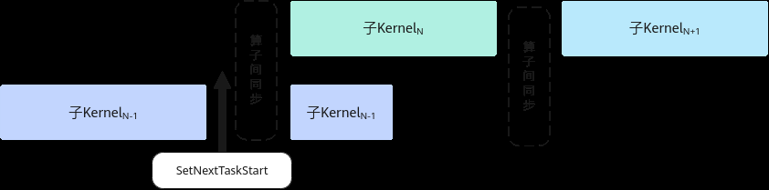
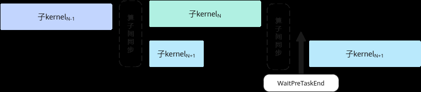

# 图编译和图执行

> **Section**: 2.10.3.5  
> **PDF Pages**: 333–335  

---

<!-- page 333 -->

TPipe对象，在对象析构时会调用Destroy，为不阻塞SetNextTaskStart和WaitPreTaskEnd性能提升，SuperKernel场景下默认关闭了TPipe::Destroy中插入的AscendC::PipeBarrier<PIPE_ALL>()指令，所以当算子需要多个TPipe对象并手动调用Destroy函数时，开发者需自行保障TPipe对象间流水的同步。

性能优化建议

●任务间同步

此外，开发者在进行Kernel侧编程时，可以通过调用SetNextTaskStart和WaitPreTaskEnd两个任务间接口，进一步提升性能。

–调用SetNextTaskStart后的指令可以和后续其他的子Kernel实现并行，提升整体性能。如图2-50所示，SuperKernel按序调用子Kernel，为保证子Kernel之间数据互不干扰，会在子Kernel间插入算子间同步进行保序，子KernelN-1调用该接口后，之后的指令会和后续子KernelN实现并行。

图2-50通过SetNextTaskStart 实现并行示意图



–调用WaitPreTaskEnd前的指令可以和前序其他的子Kernel实现并行，提升整体性能。如图2-51所示，SuperKernel按序调用子Kernel，为保证子Kernel之间数据互不干扰，会在子Kernel间插入算子间同步进行保序，子KernelN+1调用该接口之前的指令会和前序子KernelN实现并行。

图2-51通过WaitPreTaskEnd 实现并行示意图



●Tiling下沉场景，可以通过--op_relocatable_kernel_binary编译选项，开启二进制复用优化，提升编译性能，具体可参考LINK。

## 2.10.3.5 图编译和图执行

本节通过单算子模型执行的样例来介绍图模式下图编译和图执行流程。单算子模型执行是指基于图IR执行算子，先编译算子（例如，使用ATC工具将Ascend IR定义的单算子描述文件编译成算子om模型文件），再调用acl接口加载算子模型，最后调用acl接口执行算子。

环境要求

●已参考1.2 环境准备，完成CANN驱动和软件的安装，配置CANN软件所需基本环境变量。

<!-- page 334 -->

安装CANN软件后，使用CANN运行用户进行编译、运行时，需要以CANN运行用户登录环境，执行source ${INSTALL_DIR}/set_env.sh命令设置环境变量。${INSTALL_DIR}请替换为CANN软件安装后文件存储路径。以root用户安装为例，安装后文件默认存储路径为：/usr/local/Ascend/cann。

●已参考2.10.2 工程化算子开发完成算子的开发和部署。

准备验证代码工程

代码工程目录结构如下，您可以单击LINK，获取样例工程的完整样例：├── aclop_invocation│   ├── add_custom.json                   // 算子描述文件，用于构造单算子模型文件│   ├── CMakeLists.txt│   └── main.cpp                          // 将单算子编译为om文件并加载om文件执行

生成单算子离线模型文件

步骤1构造静态shape单算子描述文件add_custom_static_shape.json，描述算子的输入、输出及属性等信息。

AddCustom静态shape算子的描述文件示例如下：[    {        "op": "AddCustom",        "input_desc": [            {                "name": "x",                "param_type": "required",                "format": "ND",                "shape": [8, 2048],                "type": "float16"            },            {                "name": "y",                "param_type": "required",                "format":"ND",                "shape": [8, 2048],                "type": "float16"            }        ],        "output_desc": [            {                "name": "z",                "param_type": "required",                "format":  "ND",                "shape": [8, 2048],                "type": "float16"            }        ]    }]

步骤2使用ATC工具，将该算子描述文件编译成单算子模型文件（*.om文件）

ATC工具的命令示例如下：

```cpp
atc --singleop=../add_custom_static_shape.json --output=. --soc_version=<soc_version>
```

关键参数解释如下（详细参数说明，请参见《ATC离线模型编译工具》。）：

●--singleop：单算子描述文件（json格式）的路径。

●--output：存放om模型文件的目录。

●--soc_version：配置为AI处理器的型号，请根据实际环境进行替换。

<!-- page 335 -->

说明

AI处理器的型号请通过如下方式获取：

–针对如下产品：在安装AI处理器的服务器执行npu-smi info命令进行查询，获取Name信息。实际配置值为AscendName，例如Name取值为xxxyy，实际配置值为Ascendxxxyy。

Atlas A2 训练系列产品/Atlas A2 推理系列产品

Atlas 200I/500 A2 推理产品

Atlas 推理系列产品

Atlas 训练系列产品

–针对Atlas A3 训练系列产品/Atlas A3 推理系列产品，在安装AI处理器的服务器执行npu-smi info -t board -i id -c chip_id命令进行查询，获取Chip Name和NPU Name信息，实际配置值为Chip Name_NPU Name。例如Chip Name取值为Ascendxxx，NPU Name取值为1234，实际配置值为Ascendxxx_1234。其中：▪id：设备id，通过npu-smi info -l命令查出的NPU ID即为设备id。▪chip_id：芯片id，通过npu-smi info -m命令查出的Chip ID即为芯片id。

–针对Atlas 350 加速卡，在安装AI处理器的服务器执行npu-smi info -t board -i id命令进行查询，获取Chip Name和NPU Name信息，实际配置值为Chip Name_NPUName。例如Chip Name取值为Ascendxxx，NPU Name取值为1234，实际配置值为Ascendxxx_1234。

其中，id为设备id，通过npu-smi info -l命令查出的NPU ID即为设备id。

以上命令执行后，会在output参数指定路径下生成*.om后缀的离线模型文件。

**----结束**

编写验证代码

您可以参考如下样例编写单算子加载、执行的代码逻辑。

以下是关键步骤的代码示例，不可以直接拷贝编译运行，仅供参考，调用接口后，需增加异常处理的分支，并记录报错日志、提示日志，此处不一一列举。

// 1.初始化CHECK_ACL(aclInit(nullptr));

// 2.运行管理资源申请const int32_t deviceId = 0;CHECK_ACL(aclrtSetDevice(deviceId));

// 3.加载单算子模型文件（*.om文件）CHECK_ACL(aclopSetModelDir("."));

// 4.设置算子的输入，申请内存，然后读取输入数据保存至申请的内存中// ......

// 5.创建Stream流aclrtStream stream = nullptr;aclrtCreateStream(&stream);

// 6.执行算子// opType表示算子类型名称，例如AddCustom// inputDesc.size()表示算子输入个数，例如AddCustom算子是2个输入// inputDesc.data()表示算子输入tensor描述的数组，描述每个输入的format、shape、数据类型// inputBuffers.data()表示算子输入tensor数据// outputDesc.size()表示算子输出个数，例如AddCustom算子是1个输出// outputDesc.data()表示算子输出tensor描述的数组，描述每个输出的format、shape、数据类型// outputBuffers.data()表示算子输出tensor数据// opAttr表示算子属性，如果算子没有属性，也需要调用aclopCreateAttr接口创建aclopAttr类型的数据
