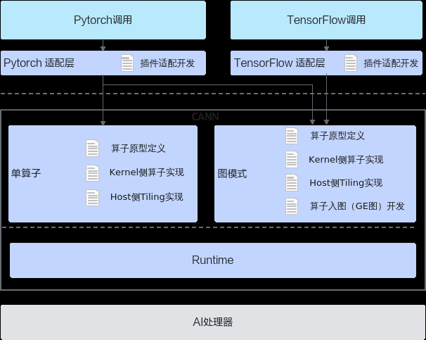
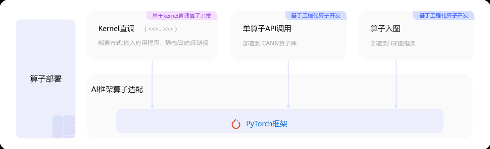

# 概述

> **Section**: 2.10.4.1  
> **PDF Pages**: 337–339  

---

<!-- page 337 -->

## 2.10.4.1 概述

本章节内容介绍AI框架调用自定义算子的方法。如下图所示，Pytorch支持单算子和图模式两种，TensorFlow仅支持图模式。

AI框架调用时，除了需要提供CANN框架调用时需要的代码实现文件，还需要进行插件适配开发。

## 2.10.4.2 PyTorch 框架

通过PyTorch框架进行模型的训练、推理时，会调用很多算子进行计算。开发者开发的自定义算子如果需要集成部署到PyTorch框架，有如下几种方式：

●Kernel直调：通过适配torch.library或Pybind注册自定义算子，可以实现PyTorch框架调用算子Kernel程序。

●单算子API调用：该模式下的适配插件开发流程和具体样例请参见《AscendExtension for PyTorch 框架特性指南》中的“基于OpPlugin算子适配开发”章节。

●图模式调用：自定义算子在Pytorch图模式下的适配开发指导请参见《PyTorch图模式使用指南(TorchAir)》中的“自定义算子入图”章节。

<!-- page 338 -->

图2-52 Pytorch 框架部署方式

本节主要提供通过torch.library与Pybind注册自定义算子并实现PyTorch框架调用算子Kernel程序的指导。

●torch.library是用于扩展PyTorch核心算子库的API集合。它允许开发者创建新的算子、并为其提供自定义实现。

●Pybind是一个开源的C++和Python之间的桥接工具，它旨在使C++代码能够无缝地集成到Python环境中。

Pybind适用于快速将C++函数暴露给Python，实现高效接口绑定。但其生成的算子无法被PyTorch的算子系统识别，不具备schema定义与图追踪能力，因此不支持torch.compile优化。相比之下，torch.library提供了与PyTorch核心算子系统深度集成的机制，支持算子注册、schema定义和图追踪能力，是支持torch.compile的必要条件。开发者可根据需求选择对应方式。

## torch.library

下面代码以add_custom（Add自定义算子为例）算子为例，介绍通过torch.library如何调用算子Kernel程序，文档中仅介绍核心步骤，完整样例请参考torch.library样例。

步骤1环境准备。

除了按照1.2 环境准备进行CANN软件包的安装，还需要安装以下依赖：

●安装PyTorch框架

●安装torch_npu插件

步骤2实现NPU上的自定义算子。

包括算子Kernel实现，并使用<<<>>>接口调用算子核函数完成指定的运算。样例中的c10_npu::getCurrentNPUStream接口用于获取当前npu流，返回值类型NPUStream，使用方式请参考《Ascend Extension for PyTorch 自定义API参考》中的“（beta）c10_npu::getCurrentNPUStream”章节。

需要注意的是，本样例的输入x，y的内存是在外层的Python调用脚本中分配的。namespace ascendc_ops {at::Tensor ascendc_add(const at::Tensor& x, const at::Tensor& y){    // 运行资源申请，通过c10_npu::getCurrentNPUStream()的函数获取当前NPU上的流    auto aclStream = c10_npu::getCurrentNPUStream().stream(false);    // 分配Device侧输出内存    at::Tensor z = at::empty_like(x);    uint32_t numBlocks = 8;    uint32_t totalLength = 1;    for (uint32_t size : x.sizes()) {        totalLength *= size;    }

<!-- page 339 -->

// 用<<<>>>接口调用核函数完成指定的运算    add_custom<<<numBlocks, nullptr, aclStream>>>((uint8_t*)(x.mutable_data_ptr()), (uint8_t*)(y.mutable_data_ptr()), (uint8_t*)(z.mutable_data_ptr()), totalLength);    // 将Device上的运算结果拷贝回Host并释放申请的资源    return z;}} // namespace ascendc_ops

步骤3自定义算子的注册。

PyTorch提供TORCH_LIBRARY宏作为自定义算子注册的核心接口，用于创建并初始化自定义算子库，注册后在Python侧可以通过torch.ops.namespace.op_name方式进行调用。TORCH_LIBRARY_IMPL用于将算子逻辑绑定到特定的DispatchKey（PyTorch设备调度标识），针对NPU设备，需要将算子实现注册到PrivateUse1这一专属的DispatchKey上。// 注册算子到torch.libraryTORCH_LIBRARY(ascendc_ops, m){    m.def("ascendc_add(Tensor x, Tensor y) -> Tensor");}

// 注册PrivateUse1实现，NPU设备TORCH_LIBRARY_IMPL(ascendc_ops, PrivateUse1, m){    m.impl("ascendc_add", TORCH_FN(ascendc_ops::ascendc_add));}

步骤4编译生成算子动态库。

步骤5使用Python测试脚本进行测试。

在add_custom_test.py中，首先通过torch.ops.load_library加载生成的自定义算子库，调用注册的ascendc_add函数，并通过对比NPU输出与CPU标准加法结果来验证自定义算子的数值正确性。

**----结束**

## Pybind

下面代码以add_custom算子为例，介绍通过Pybind方式实现Pytorch脚本中调用自定义算子的流程。文档中仅介绍核心步骤，完整样例请参考Pybind样例。

步骤1环境准备。

除了按照1.2 环境准备进行CANN软件包的安装，还需要安装以下依赖：

●安装PyTorch框架

●安装torch_npu插件

●安装pybind11pip3 install pybind11 expecttest

步骤2实现NPU上的自定义算子。

包括算子Kernel实现，并使用<<<>>>接口调用算子核函数完成指定的运算。样例中的c10_npu::getCurrentNPUStream接口用于获取当前npu流，返回值类型NPUStream，使用方式请参考《Ascend Extension for PyTorch 自定义API参考》中的“（beta）c10_npu::getCurrentNPUStream”章节。

需要注意的是，本样例的输入x，y的内存是在Python调用脚本中分配的。// Pybind和PyTorch调用所需的头文件#include <pybind11/pybind11.h>#include <torch/extension.h>
