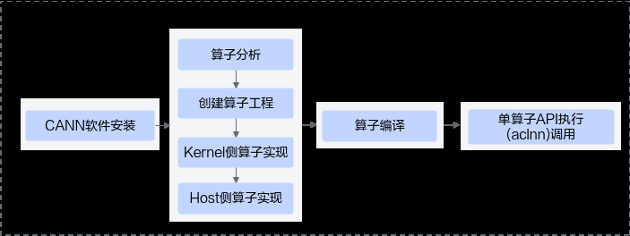
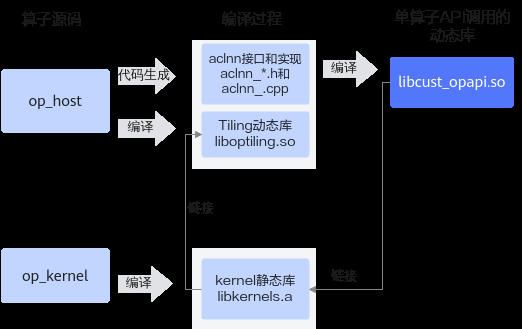

# 简易自定义算子工程

> **Section**: 2.10.8  
> **PDF Pages**: 385–389  

---

<!-- page 385 -->

说明

为了实现CPU域与NPU域代码归一，仅对部分acl接口进行适配，开发者在使用CPU域调测功能时，仅支持使用如下acl接口：

●有实际功能接口，支持CPU域调用

●aclDataTypeSize、aclFloat16ToFloat、aclFloatToFloat16。

●aclrtMalloc、aclrtFree、aclrtMallocHost、aclrtFreeHost、aclrtMemset、aclrtMemsetAsync、aclrtMemcpy、aclrtMemcpyAsync、aclrtMemcpy2d、aclrtMemcpy2dAsync、aclrtCreateContext、aclrtDestroyContext。

●无实际功能接口，打桩实现。

●Profiling数据采集

aclprofInit、aclprofSetConfig、aclprofStart、aclprofStop、aclprofFinalize。

●系统配置

aclInit、aclFinalize、aclrtGetVersion。

●运行时管理

aclrtSetDevice、aclrtResetDevice、aclrtCreateStream、aclrtCreateStreamWithConfig、aclrtDestroyStream、aclrtDestroyStreamForce、aclrtSynchronizeStream、aclrtCreateContext、aclrtDestroyContext。

## 2.10.8 简易自定义算子工程

本章节介绍的简易自定义算子工程，是上文中介绍的自定义算子工程的简化版，对算子的编译、打包、部署过程进行简化，便于开发者将该工程集成到自己的算子工程。

说明

●使用该工程，支持在如下平台进行自定义算子开发：

●Atlas A2训练系列产品/Atlas 800I A2推理产品

●Atlas 推理系列产品

●使用本工程开发的算子，只支持通过单算子API执行（aclnn）方式进行调用。

●本工程暂不支持算子的交叉编译功能。

基于简易自定义算子工程的算子开发流程图如下：

创建算子工程

和2.10.2.2 创建算子工程类似，简易自定义算子工程通过msOpGen生成，基于算子原型定义输出算子工程，包括算子host侧代码实现文件、算子kernel侧实现文件以及工

<!-- page 386 -->

程编译配置文件等。主要差异点在于：创建简易算子工程需要通过-f参数配置framework框架为aclnn。

使用msOpGen工具创建简易算子开发工程的步骤如下：

步骤1编写算子的原型定义json文件，用于生成算子开发工程。

例如，AddCustom算子的json文件命名为add_custom.json，文件内容如下：[    {        "op": "AddCustom",        "input_desc": [            {                "name": "x",                "param_type": "required",                "format": [                    "ND",                    "ND",                    "ND"                ],                "type": [                    "fp16",                    "float",                    "int32"                ]            },            {                "name": "y",                "param_type": "required",                "format": [                    "ND",                    "ND",                    "ND"                ],                "type": [                    "fp16",                    "float",                    "int32"                ]            }        ],        "output_desc": [            {                "name": "z",                "param_type": "required",                "format": [                    "ND",                    "ND",                    "ND"                ],                "type": [                    "fp16",                    "float",                    "int32"                ]            }        ]    }]

步骤2使用msOpGen工具生成算子的开发工程。以生成AddCustom的算子工程为例，下文仅针对关键参数进行解释，详细参数说明请参见《算子开发工具》。

**${INSTALL_DIR}/python/site-packages/bin/msopgen gen -i$HOME/sample/add_custom.json -c ai_core-<soc_version> -lan cpp -out $HOME/sample/AddCustom -f aclnn**

●${INSTALL_DIR}为CANN软件安装后文件存储路径，请根据实际环境进行替换。

●-i：指定算子原型定义文件add_custom.json所在路径，请根据实际情况修改。

<!-- page 387 -->

●-c：ai_core-<soc_version>代表算子在AI Core上执行，<soc_version>为昇腾AI处理器的型号。

说明

AI处理器的型号<soc_version>请通过如下方式获取：

–针对如下产品：在安装AI处理器的服务器执行npu-smi info命令进行查询，获取Name信息。实际配置值为AscendName，例如Name取值为xxxyy，实际配置值为Ascendxxxyy。

Atlas A2 训练系列产品/Atlas A2 推理系列产品

Atlas 200I/500 A2 推理产品

Atlas 推理系列产品

Atlas 训练系列产品

–针对Atlas A3 训练系列产品/Atlas A3 推理系列产品，在安装AI处理器的服务器执行npu-smi info -t board -i id -c chip_id命令进行查询，获取Chip Name和NPU Name信息，实际配置值为Chip Name_NPU Name。例如Chip Name取值为Ascendxxx，NPU Name取值为1234，实际配置值为Ascendxxx_1234。其中：▪id：设备id，通过npu-smi info -l命令查出的NPU ID即为设备id。

▪chip_id：芯片id，通过npu-smi info -m命令查出的Chip ID即为芯片id。

–针对Atlas 350 加速卡，在安装AI处理器的服务器执行npu-smi info -t board -i id命令进行查询，获取Chip Name和NPU Name信息，实际配置值为Chip Name_NPUName。例如Chip Name取值为Ascendxxx，NPU Name取值为1234，实际配置值为Ascendxxx_1234。

其中，id为设备id，通过npu-smi info -l命令查出的NPU ID即为设备id。

基于同系列的AI处理器型号创建的算子工程，其基础功能（基于该工程进行算子开发、编译和部署）通用。

●-lan：参数cpp代表算子基于Ascend C编程框架，使用C/C++编程语言开发。

●-out：生成文件所在路径，可配置为绝对路径或者相对路径，并且工具执行用户对路径具有可读写权限。若不配置，则默认生成在执行命令的当前路径。

●-f：表示框架类型，aclnn表示生成简易工程。

步骤3命令执行完后，会在-out指定目录或者默认路径下生成算子工程目录，工程中包含算子实现的模板文件，编译脚本等，以AddCustom算子为例，目录结构如下所示：

AddCustom├── build.sh                        // 编译入口脚本├── cmake │   ├── config.cmake// 编译配置项│   ├── func.cmake│   ├── intf.cmake│   └── util                       // 算子工程编译所需脚本及公共编译文件存放目录├── CMakeLists.txt                  // 算子工程的CMakeLists.txt├── op_host                         // host侧实现文件│   ├── add_custom_tiling.h     // 算子tiling定义文件│   ├── add_custom.cpp          // 算子原型注册、tiling实现等内容文件│   ├── CMakeLists.txt├── op_kernel                       // kernel侧实现文件│   ├── CMakeLists.txt   │   ├── add_custom.cpp          // 算子代码实现文件

说明

上述目录结构中的粗体文件为后续算子开发过程中需要修改的文件，其他文件无需修改。

**----结束**

<!-- page 388 -->

算子实现

参考2.10.2.4 Kernel侧算子实现、2.10.2.5 Host侧Tiling实现、2.10.2.3 算子原型定义完成算子实现。

算子编译

算子kernel侧和host侧实现开发完成后，需要对算子进行编译，生成算子静态库；自动生成aclnn调用实现代码和头文件，链接算子静态库生成aclnn动态库，以支持后续的单算子API执行方式（aclnn）的算子调用。编译过程如下：

●根据host侧算子实现文件自动生成aclnn接口aclnn_*.h和aclnn实现文件aclnn_.cpp。

●编译Tiling实现和算子原型定义生成Tiling动态库liboptiling.so（libcust_opmaster_rt2.0）。

●编译kernel侧算子实现文件，并加载Tiling动态库，生成kernel静态库libkernels.a。

●编译aclnn实现文件，并链接kernel静态库libkernels.a生成单算子API调用的动态库libcust_opapi.so。

上述编译过程示意图如下：

图2-58编译过程示意图

上文描述的过程都封装在编译脚本中，开发者进行编译时参考如下的步骤进行操作：

步骤1完成工程编译相关配置。

●修改cmake目录下config.cmake中的配置项，config.cmake文件内容如下：set(CMAKE_CXX_FLAGS_DEBUG "")set(CMAKE_CXX_FLAGS_RELEASE "")

if (NOT DEFINED CMAKE_BUILD_TYPE)    set(CMAKE_BUILD_TYPE Release CACHE STRING "")

<!-- page 389 -->

endif()if (CMAKE_INSTALL_PREFIX_INITIALIZED_TO_DEFAULT)     set(CMAKE_INSTALL_PREFIX "${CMAKE_SOURCE_DIR}/build_out" CACHE PATH "" FORCE)endif()if (NOT DEFINED ASCEND_CANN_PACKAGE_PATH)    set(ASCEND_CANN_PACKAGE_PATH /usr/local/Ascend/cann CACHE PATH "") //请替换为CANN软件包安装后的实际路径endif()if (NOT DEFINED ASCEND_PYTHON_EXECUTABLE)    set(ASCEND_PYTHON_EXECUTABLE python3 CACHE STRING "")endif()if (NOT DEFINED ASCEND_COMPUTE_UNIT)    set(ASCEND_COMPUTE_UNIT ascendxxx CACHE STRING "")endif()if (NOT DEFINED ENABLE_TEST)    set(ENABLE_TEST FALSE CACHE BOOL "")endif()if (NOT DEFINED ENABLE_CROSS_COMPILE)    set(ENABLE_CROSS_COMPILE  FALSE CACHE BOOL "")endif()if (NOT DEFINED CMAKE_CROSS_PLATFORM_COMPILER)    set(CMAKE_CROSS_PLATFORM_COMPILER "/your/cross/compiler/path" CACHE PATH "")endif()set(ASCEND_TENSOR_COMPILER_PATH ${ASCEND_CANN_PACKAGE_PATH}/compiler)set(ASCEND_CCEC_COMPILER_PATH ${ASCEND_TENSOR_COMPILER_PATH}/ccec_compiler/bin)set(ASCEND_AUTOGEN_PATH ${CMAKE_BINARY_DIR}/autogen)file(MAKE_DIRECTORY ${ASCEND_AUTOGEN_PATH})set(CUSTOM_COMPILE_OPTIONS "custom_compile_options.ini")execute_process(COMMAND rm -rf ${ASCEND_AUTOGEN_PATH}/${CUSTOM_COMPILE_OPTIONS}                COMMAND touch ${ASCEND_AUTOGEN_PATH}/${CUSTOM_COMPILE_OPTIONS})

表2-55需要开发者配置的常用参数列表

参数名称参数描述默认值

ASCEND_CANN_PACKAGE_PATH

CANN软件包安装路径，请根据实际情况进行修改。

“/usr/local/Ascend/cann”

CMAKE_BUILD_TYPE编译模式选项，可配置为：

“Release”

–“Release”，Release版本，不包含调试信息，编译最终发布的版本。

–“Debug”，“Debug”版本，包含调试信息，便于开发者开发和调试。

CMAKE_INSTALL_PREFIX

${CMAKE_SOURCE_DIR}/build_out：

编译产物存放的目录，不指定则为默认值。

算子工程目录下的build_out目录

●配置编译相关环境变量（可选）
