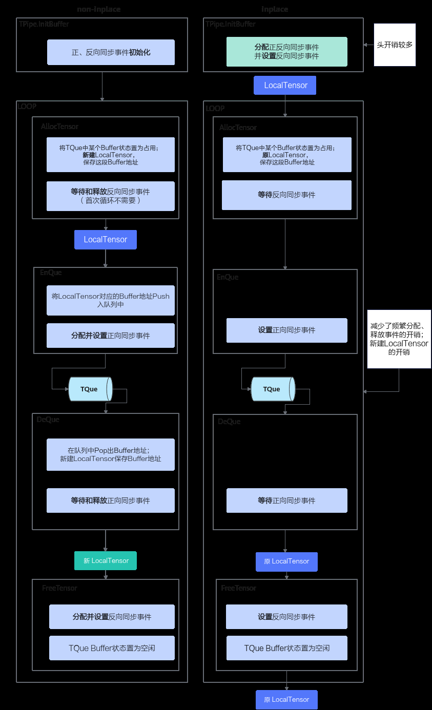

# 如何使用Tensor原地操作提升算子性能

> **Section**: 2.10.9.5  
> **PDF Pages**: 396–398  

---

<!-- page 396 -->

```cpp
return 0;}
```

步骤3编译测试代码。

```cpp
g++ test.cpp -I${INSTALL_DIR}/include  -L${INSTALL_DIR}/lib64 -Wl,-rpath,${INSTALL_DIR}/lib64 -ltiling_api -lc_sec -lgraph_base -lregister -lunified_dlog -lplatform -o test
```

●${INSTALL_DIR}请替换为CANN软件安装后文件存储路径。以root用户安装为例，安装后文件默认存储路径为：/usr/local/Ascend/cann。

●开发者根据需要链接依赖的动态库，必需链接的动态库有：

–libtiling_api.so：Tiling功能相关的动态库，包含ContextBuilder类、OpTilingRegistry类等。

–libc_sec.so：安全函数库，libtiling_api.so依赖该库。

–libgraph_base.so：基础数据结构与接口库，libtiling_api.so依赖该库。

–libregister.so：业务函数注册相关库（例如Tiling函数注册，算子原型注册等）。

–libunified_dlog.so：log库，libtiling_api.so依赖该库。

–libplatform.so：平台信息库，libtiling_api.so依赖该库；Tiling函数中使用硬件平台信息时，需要依赖该库。

步骤4执行可执行文件。

```cpp
./test
```

**----结束**

## 2.10.9.5 如何使用Tensor 原地操作提升算子性能

Tensor原地操作（inplace接口）是一种优化技术，全局申请、保留LocalTensor内存，避免了频繁创建和销毁LocalTensor对象。AllocTensor、FreeTensor、EnQue、DeQue接口不产生新的LocalTensor，而是在该全局LocalTensor上反复申请、释放、入队、出队。其实现原理如下图所示：

<!-- page 397 -->

图2-59 Tensor 原地操作实现原理



<!-- page 398 -->

## Tensor 原地操作的优势

●减少栈变换：相比构造新Tensor的方式，inplace接口减少了LocalTensor的栈变换，允许Tensor被反复使用。

●减少入队/出队操作：在调用EnQue、DeQue的过程中，TQue对象没有存储该Tensor对应的Buffer地址，实际没有真正入队、出队，减少了反复入队、出队的Scalar指令。

保留EnQue 和DeQue 的原因

既然Tensor原地操作没有执行真正的入队出队操作，为什么还需要保留EnQue和DeQue接口呢？

●编程兼容性：为了保持编程接口的一致性，inplace接口仍然需要调用EnQue和DeQue，确保代码结构的统一性和可维护性。

●内存同步功能：EnQue和DeQue操作中实现了内存读写同步功能，确保数据的一致性和正确性，即使没有实际的队列操作，这些同步机制仍然需要保留。

适用场景

适合计算循环次数多的场景：如图2-59所示，inplace接口虽然增加了TQue对象InitBuffer的初始化开销，但显著减少了每次循环中AllocTensor、EnQue、DeQue和FreeTensor内部对LocalTensor和事件的操作次数，特别适合需要多次循环来完成计算的场景。

使用方法

●配置TQue对象：在创建TQue对象时，设置深度（depth）为0，启用inplace操作模式。

●调用原地操作接口：使用inplace接口直接操作LocalTensor。

–AllocTensor和DeQue区分non-inplace和inplace接口，详情请参考AllocTensor、 DeQue。

–FreeTensor和EnQue不区分non-inplace和inplace接口。

示例代码

```cpp
// ...namespace AscendC {class MyKernel {public:    __aicore__ inline MyKernel() {}    __aicore__ inline void Init(__gm__ uint8_t* src0Gm, __gm__ uint8_t* src1Gm, __gm__ uint8_t* dstGm)    {        src0Global.SetGlobalBuffer((__gm__ half*)src0Gm);
        src1Global.SetGlobalBuffer((__gm__ half*)src1Gm);
        dstGlobal.SetGlobalBuffer((__gm__ half*)dstGm);
        pipe.InitBuffer(srcQue0, 1, BLOCK_SIZE * sizeof(half));
        pipe.InitBuffer(srcQue1, 1, BLOCK_SIZE * sizeof(half));
        pipe.InitBuffer(dstQue0, 1, BLOCK_SIZE * sizeof(half));    }
__aicore__ inline void Process()    {        for (int i = 0;
 i < REPTIMES;
 i++) {            CopyIn(i);
            Compute(i);
            CopyOut(i);        }
```
