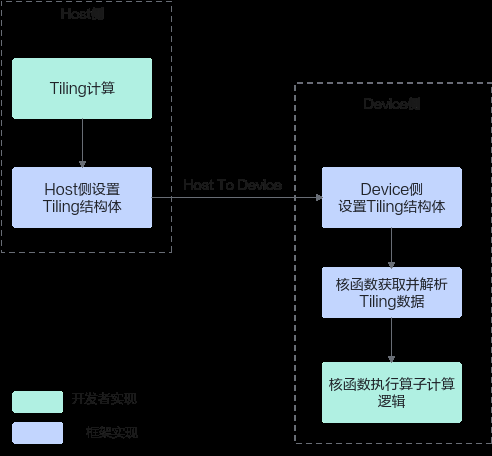

# 概述

> **Section**: 3.3.1  
> **PDF Pages**: 419–419  

---

<!-- page 419 -->

过调用计算、数据搬运、内存管理、任务同步等API实现算子逻辑。其核心逻辑基本上都为计算密集型任务，适合在Device侧NPU上执行。

算子数据流

算子执行过程中涉及到Host和Device的数据交换。这里仅针对Tiling参数的传递，给出具体的数据流：Host侧Tiling算法根据算子具体输入输出的信息，完成Tiling参数的计算，并存放在Tiling结构体中；将Host侧的Tiling结构体发送到Device侧，Device侧的算子获取并解析Tiling结构体，基于该信息执行后续的算子计算逻辑。

图3-2算子Tiling 传递数据流

## 3.3 SIMD 算子实现

## 3.3.1 概述

Ascend C的算子实现主要包含两个部分：

●Host侧Tiling实现

由于NPU中AI Core内部存储无法完全容纳算子输入输出的所有数据，需要每次搬运一部分输入数据进行计算然后搬出，再搬运下一部分输入数据进行计算，这个过程就称之为Tiling。切分数据的算法称为Tiling算法或者Tiling策略。根据算子的shape等信息来确定数据切分算法相关参数（比如每次搬运的块大小，以及总共循
