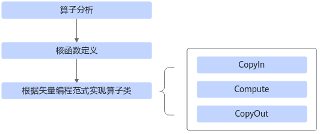
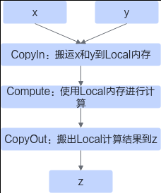
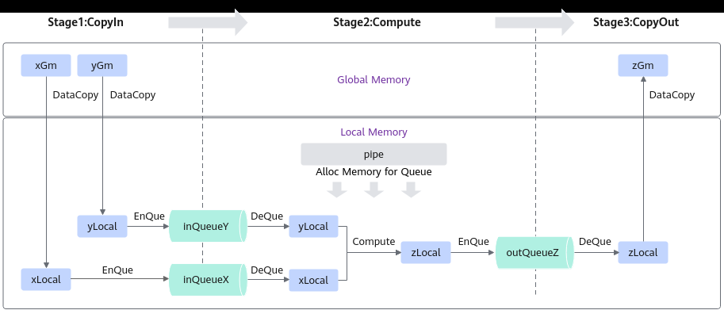

# 基础矢量算子

> **Section**: 3.3.2.2  
> **PDF Pages**: 421–425  

---

<!-- page 421 -->

## 3.3.2.2 基础矢量算子

基于Ascend C方式实现基础矢量算子核函数的流程如下图所示。

图3-3矢量算子核函数实现流程



●算子分析：分析算子的数学表达式、输入、输出以及计算逻辑的实现，明确需要调用的Ascend C接口。

●核函数定义：定义Ascend C算子入口函数。

●根据矢量编程范式实现算子类：完成核函数的内部实现，包括3个基本任务：CopyIn，Compute，CopyOut。

下文以输入为half数据类型且shape的最后一维为32Bytes对齐、在单核上运行的、一次完成计算的Add算子为例，对上述步骤进行详细介绍。本样例中介绍的算子完整代码请参见基础Add算子样例。

算子分析

算子分析具体步骤如下：

步骤1明确算子的数学表达式及计算逻辑。

Add算子的数学表达式为：

```cpp
z = x + y
```

计算逻辑是：Ascend C提供的矢量计算接口的操作元素都为LocalTensor，输入数据需要先从外部存储（Global Memory）搬运进片上存储（Unified Buffer），然后使用计算接口完成两个输入参数相加，得到最终结果，再搬出到外部存储上。Ascend CAdd算子的计算逻辑如下图所示。

<!-- page 422 -->

图3-4算子计算逻辑



步骤2明确输入和输出。

●Add算子有两个输入：x与y；输出为z。

●本样例中算子的输入支持的数据类型为half（float16），算子输出的数据类型与输入的数据类型相同。

●算子输入支持的shape为（1，2048），输出shape与输入shape相同。

●算子输入支持的format为：ND。

步骤3确定核函数名称和参数。

●您可以自定义核函数名称，本样例中核函数命名为vec_add_custom。

●根据对算子输入输出的分析，确定核函数有3个参数x，y，z；x，y为输入在Global Memory上的内存地址，z为输出在Global Memory上的内存地址。

步骤4确定算子实现所需接口。

●实现涉及外部存储和内部存储间的数据搬运，查看Ascend C API参考中的数据搬运接口，需要使用DataCopy来实现数据搬运。

●本样例只涉及矢量计算的加法操作，查看Ascend C API参考中的矢量计算接口，初步分析可使用基础算术Add接口Add实现x+y。

●使用Queue队列管理计算中使用的Tensor数据结构，具体使用EnQue、DeQue等接口。

**----结束**

通过以上分析，得到Ascend C Add算子的设计规格如下：

●算子类型（OpType）：Add

●算子输入输出：

表3-1 Add 算子输入输出规格

**nameshapedata typeformat**

x（输入）(1, 2048)halfND

<!-- page 423 -->

**nameshapedata typeformat**

y（输入）(1, 2048)halfND

z（输出）(1, 2048)halfND

●核函数名称：vec_add_custom

●使用的主要接口：

–DataCopy：数据搬移接口

–Add：矢量基础算术接口

–EnQue、DeQue等接口：Queue队列管理接口

●算子实现文件名称：vector_add.asc

核函数定义

根据核函数中介绍的规则进行核函数的定义。

步骤1函数原型定义

本样例中，函数名为vector_add_custom（核函数名称可自定义），根据算子分析中对算子输入输出的分析，确定有3个参数x，y，z，其中x，y为输入内存，z为输出内存。根据核函数的规则介绍，函数原型定义如下所示：使用__global__函数类型限定符标识它是一个核函数，可以被<<<>>>调用；使用__vector__函数类型限定符标识该核函数在设备端aicore的Vector Core上执行；为方便起见，统一使用GM_ADDR宏修饰入参，GM_ADDR宏定义请参考核函数。

```cpp
__global__ __vector__ void vector_add_custom(GM_ADDR x, GM_ADDR y, GM_ADDR z){}
```

步骤2调用算子类的Init和Process函数。

算子类的Init函数，完成内存初始化相关工作，Process函数完成算子实现的核心逻辑，具体介绍参见算子类实现。__global__ __vector__ void vector_add_custom(GM_ADDR x, GM_ADDR y, GM_ADDR z){    AscendC::TPipe pipe;    KernelAdd op;    op.Init(x, y, z, &pipe);    op.Process();}

步骤3根据核函数定义和调用章节，调用核函数时，除了需要传入参数x，y，z，还需要传入numBlocks（核函数执行的核数），nullptr（保留参数，设置为nullptr），stream（应用程序中维护异步操作执行顺序的stream）来规定核函数的执行配置。

```cpp
vector_add_custom<<<numBlocks, nullptr, stream>>>(xDevice, yDevice, zDevice);
```

**----结束**

算子类实现

根据上一节介绍，核函数中会调用算子类的Init和Process函数，本节具体讲解如何基于编程范式实现算子类。

根据矢量编程范式对Add算子的实现流程进行设计的思路如下，矢量编程范式请参考矢量编程范式，设计完成后得到的Add算子实现流程图参见图3 Add算子实现流程：

<!-- page 424 -->

●Add算子的实现流程分为3个基本任务：CopyIn，Compute，CopyOut。CopyIn任务负责将Global Memory上的输入Tensor xGm和yGm搬运至Local Memory，分别存储在xLocal，yLocal，Compute任务负责对xLocal，yLocal执行加法操作，计算结果存储在zLocal中，CopyOut任务负责将输出数据从zLocal搬运至GlobalMemory上的输出Tensor zGm中。

●CopyIn，Compute任务间通过VECIN队列inQueueX，inQueueY进行同步，Compute，CopyOut任务间通过VECOUT队列outQueueZ进行同步。

●任务间交互使用到的内存、临时变量的内存统一使用Pipe内存管理对象进行管理。

图3-5 Add 算子实现流程



算子类中主要实现上述流程，包含对外开放的初始化Init函数和核心处理函数Process，Process函数中会对上图中的三个基本任务进行调用；同时包括一些算子实现中会用到的私有成员，比如上图中的GlobalTensor（xGm、yGm、zGm）和VECIN、VECOUT队列等。KernelAdd算子类具体成员如下：

class KernelAdd {public:    __aicore__ inline KernelAdd() {}    // 初始化函数，完成内存初始化相关操作    __aicore__ inline void Init(GM_ADDR x, GM_ADDR y, GM_ADDR z, AscendC::TPipe* pipeIn){}    // 核心处理函数，实现算子逻辑，调用私有成员函数CopyIn、Compute、CopyOut完成矢量算子的三级流水操作    __aicore__ inline void Process(){}

private:    // 搬入函数，完成CopyIn阶段的处理，被核心Process函数调用    __aicore__ inline void CopyIn(){}    // 计算函数，完成Compute阶段的处理，被核心Process函数调用    __aicore__ inline void Compute(){}    // 搬出函数，完成CopyOut阶段的处理，被核心Process函数调用    __aicore__ inline void CopyOut(){}

private:    AscendC::TPipe* pipe;  // Pipe内存管理对象    AscendC::TQue<AscendC::TPosition::VECIN, 1> inQueueX;  // 输入数据Queue队列管理对象，TPosition为VECIN    AscendC::TQue<AscendC::TPosition::VECIN, 1> inQueueY;  // 输入数据Queue队列管理对象，TPosition为VECIN    AscendC::TQue<AscendC::TPosition::VECOUT, 1> outQueueZ;  // 输出数据Queue队列管理对象，TPosition为VECOUT    AscendC::GlobalTensor<half> xGm;  // 管理输入输出Global Memory内存地址的对象，其中xGm, yGm为输入，zGm为输出    AscendC::GlobalTensor<half> yGm;

<!-- page 425 -->

```cpp
AscendC::GlobalTensor<half> zGm;};
```

初始化函数主要完成以下内容：

●设置输入输出Global Tensor的Global Memory内存地址。

本样例中的分配方案是：数据整体长度TOTAL_LENGTH为1 * 2048，使用GlobalTensor类的SetGlobalBuffer接口设定该核上Global Memory的起始地址以及长度。

```cpp
xGm.SetGlobalBuffer((__gm__ half *)x, TOTAL_LENGTH);
```

●通过Pipe内存管理对象为输入输出Queue分配内存。

比如，为输入x的Queue分配内存，可以通过如下代码段实现：

```cpp
pipe->InitBuffer(inQueueX, 1, TOTAL_LENGTH * sizeof(half))
```

具体的初始化函数代码如下：

constexpr int32_t TOTAL_LENGTH = 1 * 2048;  // 数据总长__aicore__ inline void Init(GM_ADDR x, GM_ADDR y, GM_ADDR z, AscendC::TPipe* pipeIn){    pipe = pipeIn;        // 设置Global Memory的起始地址以及长度    xGm.SetGlobalBuffer((__gm__ half*)x, TOTAL_LENGTH);    yGm.SetGlobalBuffer((__gm__ half*)y, TOTAL_LENGTH);    zGm.SetGlobalBuffer((__gm__ half*)z, TOTAL_LENGTH);

// 通过Pipe内存管理对象为输入输出Queue分配内存    pipe->InitBuffer(inQueueX, 1, TOTAL_LENGTH * sizeof(half));    pipe->InitBuffer(inQueueY, 1, TOTAL_LENGTH * sizeof(half));    pipe->InitBuffer(outQueueZ, 1, TOTAL_LENGTH * sizeof(half));}

基于矢量编程范式，将核函数的实现分为3个基本任务：CopyIn，Compute，CopyOut。Process函数中通过如下方式调用这三个函数。

```cpp
__aicore__ inline void Process(){    CopyIn();
    Compute();
    CopyOut();}
```

根据编程范式上面的算法分析，将整个计算拆分成三个Stage，用户单独编写每个Stage的代码，三阶段流程示意图参见图3-5，具体流程如下：

步骤1Stage1：CopyIn函数实现。

1.使用DataCopy接口将GlobalTensor数据拷贝到LocalTensor。

2.使用EnQue将LocalTensor放入VECIN的Queue中。

__aicore__ inline void CopyIn(){    // 从Que中为LocalTensor分配内存    AscendC::LocalTensor<half> xLocal = inQueueX.AllocTensor<half>();    AscendC::LocalTensor<half> yLocal = inQueueY.AllocTensor<half>();    // 将GlobalTensor数据拷贝到LocalTensor    AscendC::DataCopy(xLocal, xGm, TOTAL_LENGTH);    AscendC::DataCopy(yLocal, yGm, TOTAL_LENGTH);    // LocalTensor放入VECIN的Queue中    inQueueX.EnQue(xLocal);    inQueueY.EnQue(yLocal);}

步骤2Stage2：Compute函数实现。
