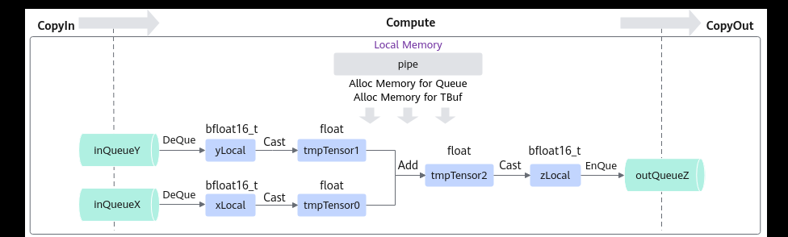

# TBuf的使用

> **Section**: 3.3.2.3  
> **PDF Pages**: 426–427  

---

<!-- page 426 -->

1.使用DeQue从VECIN中取出LocalTensor。

2.使用Ascend C接口Add完成矢量计算。

3.使用EnQue将计算结果LocalTensor放入到VECOUT的Queue中。

4.使用FreeTensor释放不再使用的LocalTensor。

__aicore__ inline void Compute(){    // 将Input从VECIN的Queue中取出    AscendC::LocalTensor<half> xLocal = inQueueX.DeQue<half>();    AscendC::LocalTensor<half> yLocal = inQueueY.DeQue<half>();    AscendC::LocalTensor<half> zLocal = outQueueZ.AllocTensor<half>();    // 调用Add算子进行计算    AscendC::Add(zLocal, xLocal, yLocal, TOTAL_LENGTH);    // 将计算结果LocalTensor放入到VECOUT的Queue中    outQueueZ.EnQue<half>(zLocal);    // 释放LocalTensor    inQueueX.FreeTensor(xLocal);    inQueueY.FreeTensor(yLocal);}

步骤3Stage3：CopyOut函数实现。

1.使用DeQue接口从VECOUT的Queue中取出LocalTensor。

2.使用DataCopy接口将LocalTensor拷贝到GlobalTensor上。

3.使用FreeTensor将不再使用的LocalTensor进行回收。

__aicore__ inline void CopyOut(){    // 将计算结果从VECOUT的Queue中取出    AscendC::LocalTensor<half> zLocal = outQueueZ.DeQue<half>();    // 将计算结果从LocalTensor数据拷贝到GlobalTensor    AscendC::DataCopy(zGm, zLocal, TOTAL_LENGTH);    // 释放LocalTensor    outQueueZ.FreeTensor(zLocal);}

**----结束**

## 3.3.2.3 TBuf 的使用

在大多数算子开发时，核函数计算过程需要使用临时内存来存储运算的中间结果，这些中间结果以临时变量表示，临时变量占用的内存可以使用TBuf数据结构来管理，具体介绍请参考TBuf。下文将以输入的数据类型为bfloat16_t、在单核上运行的Add算子为例，介绍TBuf的使用方式。本样例中介绍的算子完整代码请参见使用临时内存的Add算子样例。

在Atlas A2 训练系列产品/Atlas 800I A2 推理产品上，Add接口不支持对数据类型bfloat16_t的源操作数进行求和计算。因此，需要先将算子输入的数据类型转换成Add接口支持的数据类型，再进行计算。为保证计算精度，调用Cast接口将输入bfloat16_t类型转换为float类型，再进行Add计算，并在计算结束后将float类型转换回bfloat16_t类型。

通过以上分析，得到Ascend C Add算子的设计规格如下：

●算子类型（OpType）：Add

●算子输入输出：

<!-- page 427 -->

表3-2 Add 算子输入输出规格

**nameshapedata typeformat**

x（输入）(1, 2048)bfloat16_tND

y（输入）(1, 2048)bfloat16_tND

z（输出）(1, 2048)bfloat16_tND

●核函数名称：tmp_buffer_custom

●使用的主要接口：

–DataCopy：数据搬移接口

–Cast：矢量精度转换接口

–Add：矢量基础算术接口

–EnQue、DeQue等接口：Queue队列管理接口

●算子实现文件名称：tmp_buffer.asc

算子类实现

该样例的CopyIn，CopyOut任务与基础矢量算子相同，Compute任务的具体流程如下图所示。

图3-6输入为bfloat16_t 类型的Add 计算流程

在Compute任务中，表示Cast转换结果、Add计算结果的临时变量均需要使用临时内存存储。与基础矢量算子实现的KernelAdd算子类相比，本样例新增两个TBuf类型的成员变量tmpBuf0、tmpBuf1，用于管理计算过程中使用的临时内存，代码如下。class KernelAdd {public:    __aicore__ inline KernelAdd() {}    __aicore__ inline void Init(GM_ADDR x, GM_ADDR y, GM_ADDR z, AscendC::TPipe* pipeIn){}    __aicore__ inline void Process(){}private:    __aicore__ inline void CopyIn(){}    __aicore__ inline void Compute(){}    __aicore__ inline void CopyOut(){}private:    AscendC::TPipe* pipe;    AscendC::TQue<AscendC::TPosition::VECIN, 1> inQueueX;    AscendC::TQue<AscendC::TPosition::VECIN, 1> inQueueY;    AscendC::TQue<AscendC::TPosition::VECOUT, 1> outQueueZ;    AscendC::TBuf<AscendC::TPosition::VECCALC> tmpBuf0;         AscendC::TBuf<AscendC::TPosition::VECCALC> tmpBuf1;    AscendC::GlobalTensor<bfloat16_t> xGm;
