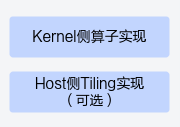

# 概述

> **Section**: 3.3.2.4.1  
> **PDF Pages**: 429–429  

---

<!-- page 429 -->

## 3.3.2.4.1 概述

Ascend C核函数是运行在一个核上的处理函数，上述介绍的基础矢量算子与TBuf的使用样例均为在单核上运行的算子，不涉及Host侧Tiling实现。矢量算子实现的组成如下图所示。

为了提高算子的执行效率，通常在算子中实现多核并行计算，即对输入数据进行切分，并将不同的数据块分配到不同的核上处理。此外，由于单个核上内部存储LocalMemory大小有限，存在无法一次完整地容纳算子的输入和输出数据的场景，因此需要每次搬运一部分输入进行计算然后搬出，再搬运下一部分输入进行计算，直到获得最终的完整结果，这个数据切分、分块计算的过程称之为Tiling。切分数据的算法称为Tiling算法或者Tiling策略。根据算子的shape等信息来确定数据切分算法相关参数（比如每次搬运的块大小，以及总共循环多少次）的计算程序，称之为Tiling实现，也叫Tiling函数（Tiling Function）。由于Tiling实现中完成的均为标量计算，AI Core并不擅长，所以我们将其独立出来放在Host侧CPU上执行。核函数内部通过解析Host侧传入的Tiling结构体获取Tiling信息，根据Tiling信息控制数据搬入、搬出Local Memory的流程；通过调用计算、数据搬运、内存管理、任务同步API，实现算子逻辑。

图3-7算子实现组成

由于硬件限制，在对输入数据进行数据切分时应遵循以下几个原则：

1.由于AI Core中Unified Buffer上的物理限制，要求Unified Buffer上的数据存储空间必须保持32字节对齐。

–输入数据不满足32字节对齐时，需要取输入数据长度向上对齐到32字节的长度作为输入数据总长度。

–进行Tiling有关计算时，以32字节为最小单位进行计算。

2.尽可能最大利用Unified Buffer空间。

AI Core与外部存储交互时会产生性能开销，频繁的进行数据搬运会导致性能瓶颈，因此应尽可能充分利用Unified Buffer空间，减少从Global Memory上搬运数据的次数。

3.AI处理器包含多个AI Core，应该充分均衡利用多核计算能力，将计算均衡分配到多个AI Core上。

本章将基于以上原则对几种典型场景进行说明，完整代码请参见多核Add算子样例。
