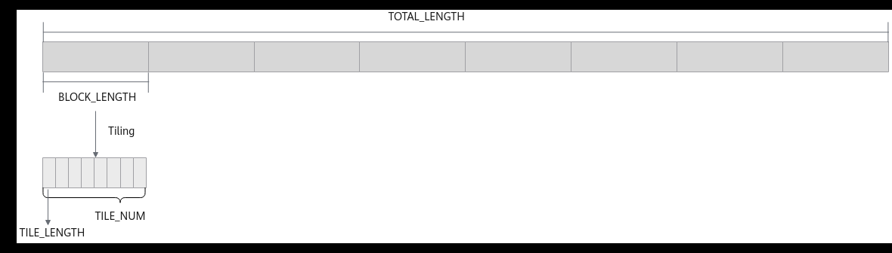
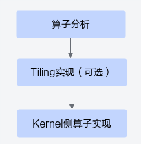
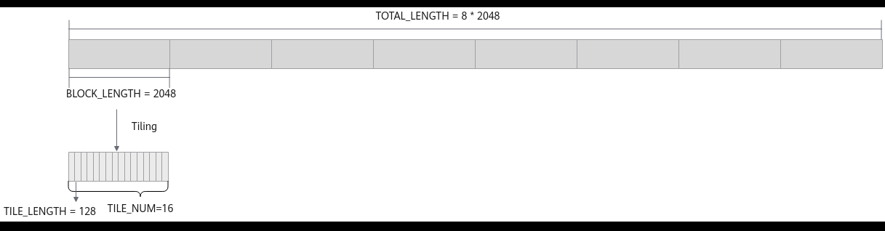
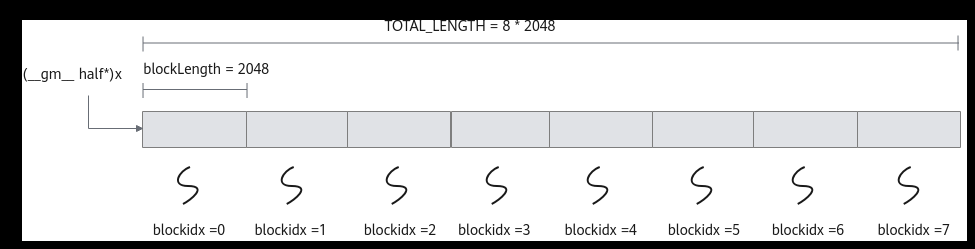
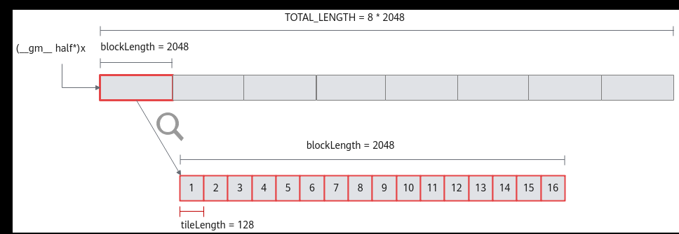

# 多核Tiling

> **Section**: 3.3.2.4.2  
> **PDF Pages**: 430–433  

---

<!-- page 430 -->

图3-8多核及Tiling 示意图



数据切分示意如上图所示，将长度为TOTAL_LENGTH的算子输入分配到多个核上进行计算，每个核上计算的数据长度为BLOCK_LENGTH。对于每个核的计算数据，基于Local Memory的大小进一步切分，切分数据块的个数为TILE_NUM，得到的每个数据块的长度为TILE_LENGTH。

根据每个核计算的数据量是否相同、核内每个数据块的数据量是否相同，切分策略可能会存在以下几种场景：

1.核间均分，核内均分：每个核处理的数据量相同，核内每个数据块的数据量相同。在此场景中，通过多核Tiling将数据均匀分配到各个核上执行，每个核上每次计算的数据长度相同。

2.核间均分，核内不均分：每个核处理的数据量相同，核内各数据块的数据量不完全相同。此场景基于多核Tiling，核内数据不能切分为多个数据量相同且32字节对齐的数据块，需要通过尾块Tiling处理尾块数据的计算。

3.核间不均分，核内均分：每个核处理的数据量不同，核内每个数据块的数据量相同。在此场景中，通过尾核Tiling的处理解决数据无法在各核间均匀分配的问题。

4.核间不均分，核内不均分：每个核处理的数据量不同，核内各数据块的数据量不完全相同。该场景下需要同时考虑尾核&尾块，处理多核间及核内数据的合理切分。

## 3.3.2.4.2 多核Tiling

基于Ascend C方式实现带有Tiling的算子的开发流程如下图所示。

图3-9算子开发流程



<!-- page 431 -->

算子分析

本样例为输入数据在核间均分、核内均分场景。本样例的Tiling策略为：数据整体长度TOTAL_LENGTH为8 * 2048，数据平均分配到8个核上运行，每个核上计算的数据长度BLOCK_LENGTH为2048，将单核上的数据切分成16块（此处切分成16块仅用来作为Tiling的样例，并不代表性能最佳，仅供参考），每块数据的长度TILE_LENGTH为128。数据切分示意如下图所示：

图3-10数据切分示意图



通过以上分析，得到Ascend C Add算子的设计规格如下：

●算子类型（OpType）：Add

●算子输入输出：

表3-3 Add 算子输入输出规格

**nameshapedata typeformat**

x（输入）(8, 2048)halfND

y（输入）(8, 2048)halfND

z（输出）(8, 2048)halfND

●核函数名称：tiling_strategy_custom

●使用的主要接口：

–DataCopy：数据搬移接口

–Add：矢量基础算术接口

–EnQue、DeQue等接口：Queue队列管理接口

●算子实现文件名称：tiling_strategy.asc

## Tiling 实现

前述场景中算子的输入和输出均为固定shape，然而在实际的算子开发场景中，这些信息是支持动态变化的，场景会更加灵活和复杂。动态shape场景下，输入的shape是未知的。一些与输入shape相关的变量（比如每次搬运的块大小等），需要通过Tiling计算出来，然后传递到kernel侧，kernel侧使用该参数进行后续的计算。

具体实现方式为：分析设计Tiling参数、定义Tiling结构体，在Host侧通过上下文获取输入输出的shape信息，根据shape信息，计算Tiling参数并设置到对应的Tiling结构体中；通过核函数入口参数将Tiling信息传入核函数，在核函数内通过解析Tiling结构体，获取并使用相关参数来实现核函数内部逻辑，详细介绍请参考Host侧tiling实现。本节将以上述分析中的切分策略为例，说明如何实现Tiling。

<!-- page 432 -->

基于本节的切分策略，Tiling需要定义如下参数：

●blockLength：每个核的计算数据长度；

●tileNum：每个核需要计算的数据块个数；

●tileLength：每个核内每个数据块的长度。

根据确定的Tiling参数，使用C++语法定义TilingData结构体，代码如下。

```cpp
struct AddCustomTilingData {    uint32_t blockLength;
    uint32_t tileNum;
    uint32_t tileLength;    ...}
```

接下来完成Tiling参数的计算。由于每个核内数据被切分为16块，根据使用的核数和核内切分数，计算Tiling参数，并写入到Tiling结构体内。代码示例如下：constexpr int32_t NUM_BLOCKS = 8;                             // 使用的核数constexpr int32_t TILE_NUM = 16;                             // 核内切分数量void GenerateTilingData(uint8_t* tilingBuf, uint32_t numBlocks){    uint32_t totalLength;    // 此处省略如何获取数据总长TOTAL_LENGTH，可以根据具体情况实现。本章节仅介绍Tiling相关内容。    AddCustomTilingData* tiling = reinterpret_cast<AddCustomTilingData *>(tilingBuf);    uint32_t blockLength = TOTAL_LENGTH / numBlocks;    uint32_t tileNum = TILE_NUM;    uint32_t tileLength = blockLength / tileNum;

```cpp
tiling->blockLength = blockLength;
    tiling->tileNum = tileNum;
    tiling->tileLength = tileLength;}
```

最后，在Host侧调用程序中，调用上述Tiling参数计算函数，计算出相关参数，然后传递到Kernel侧核函数。

constexpr int32_t NUM_BLOCKS = 8;    ...    uint8_t *tiling = nullptr;    size_t tilingSize = sizeof(AddCustomTilingData);    GenerateTilingData(tiling, NUM_BLOCKS);  // 调用tiling参数计算函数    ....    tiling_strategy_custom<<<NUM_BLOCKS, nullptr, stream>>>(xDevice, yDevice, zDevice,                                               *reinterpret_cast<AddCustomTilingData*>(tiling));    ....

算子类实现

Kernel侧算子实现仍遵循矢量算子核函数实现流程，接下来重点介绍本场景中算子类实现的不同点。

●设置输入输出Global Tensor的Global Memory内存地址。

由于本样例中将数据分配到了多个核上进行处理，每个核处理不同的数据，因此不同核要处理的数据在Global Memory上的地址不同，在初始化函数Init中，需要获取单核所需处理的输入输出在Global Memory上的内存偏移地址，并将该偏移地址设置到GlobalTensor中。

以获取输入x在Global Memory上的内存偏移地址为例，数据整体长度TOTAL_LENGTH为8 * 2048，平均分配到8个核上运行，每个核上处理的数据长度blockLength为2048，调用GetBlockIdx接口获取当前核的index，x +blockLength * GetBlockIdx()即为单核处理程序中x在Global Memory上的内存偏移地址，获取偏移地址后，使用GlobalTensor类的SetGlobalBuffer接口设定该核

<!-- page 433 -->

上Global Memory的起始地址以及长度，具体示意图请参考图3-11。代码如下所示：

```cpp
xGm.SetGlobalBuffer((__gm__ half *)x + this->blockLength * AscendC::GetBlockIdx(), this->blockLength);
```

图3-11多核并行处理示意图



●通过Pipe内存管理对象为输入输出Queue分配内存。

对于单核上的处理数据，可以进行数据切块（Tiling），在本示例中，仅作为参考，将单核上的数据（2048个数）切分成16块（并不意味着16块就是性能最优），每块tileLength（128）个数据。数据切分示意图如图3-12所示。

图3-12单核数据切分示意图



与基础矢量算子相比，在通过Pipe内存管理对象为输入输出Queue分配内存时，需使用单核内每个数据块的长度tileLength作为分配内存的长度。比如，为输入x的Queue分配内存，可以通过如下代码段实现，Pipe为inQueueX分配了一块大小为tileLength * sizeof(half)个字节的内存块，每个内存块能容纳tileLength（128）个half类型数据。

```cpp
pipe->InitBuffer(inQueueX, 1, this->tileLength * sizeof(half))
```

具体的初始化函数代码如下：__aicore__ inline void Init(GM_ADDR x, GM_ADDR y, GM_ADDR z, AddCustomTilingData tiling, AscendC::TPipe* pipeIn){    pipe = pipeIn;    this->blockLength = tiling.blockLength;    this->tileNum = tiling.tileNum;    this->tileLength = tiling.tileLength;    // 计算每个核上的地址偏移    xGm.SetGlobalBuffer((__gm__ half *)x + this->blockLength * AscendC::GetBlockIdx(), this->blockLength);    yGm.SetGlobalBuffer((__gm__ half *)y + this->blockLength * AscendC::GetBlockIdx(), this->blockLength);    zGm.SetGlobalBuffer((__gm__ half *)z + this->blockLength * AscendC::GetBlockIdx(), this->blockLength);    // pipe alloc memory to queue, the unit is Bytes    pipe->InitBuffer(inQueueX, 1, this->tileLength * sizeof(half));    pipe->InitBuffer(inQueueY, 1, this->tileLength * sizeof(half));    pipe->InitBuffer(outQueueZ, 1, this->tileLength * sizeof(half));}
