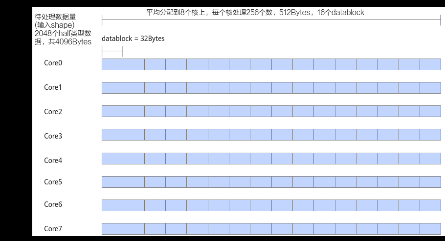
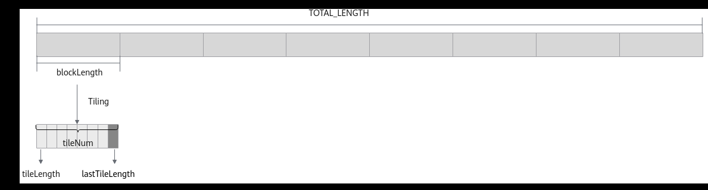

# 尾块Tiling

> **Section**: 3.3.2.4.3  
> **PDF Pages**: 434–437  

---

<!-- page 434 -->

每个核需要对tileNum个数据块分别进行搬入、计算、搬出处理，因此Process函数内将tileNum作为循环上限。__aicore__ inline void Process(){    int32_t loopCount = this->tileNum;    // tiling strategy, pipeline parallel    for (int32_t i = 0; i < loopCount; i++) {        CopyIn(i, this->tileLength);        Compute(i, this->tileLength);        CopyOut(i, this->tileLength);    }}

对应的，每个核内搬入、搬出每个数据块时，需定位到每个数据块所在GlobalMemory上的内存偏移地址，因此在CopyIn和CopyOut函数内部使用DataCopy接口时，需增加每个数据块的地址偏移。Compute函数没有变化，与基础矢量算子相同。

CopyIn函数实现代码如下：__aicore__ inline void CopyIn(int32_t progress, uint32_t tileLength){    ...    // copy progress_th tile from global tensor to local tensor    AscendC::DataCopy(xLocal, xGm[progress * this->tileLength], tileLength);    AscendC::DataCopy(yLocal, yGm[progress * this->tileLength], tileLength);    ...}

CopyOut函数实现代码如下： __aicore__ inline void CopyOut(int32_t progress, uint32_t tileLength){    ...    // copy progress_th tile from local tensor to global tensor    AscendC::DataCopy(zGm[progress * this->tileLength], zLocal, tileLength);    ...}

## 3.3.2.4.3 尾块Tiling

如下图中的示例，算子的输入shape为（1，2048），支持的数据类型为half类型，输入数据可以对齐到一个datablock的大小（32字节），输入数据为2048 * 2 / 32 = 128个datablock，因此可以平均分配到每个核上（假设使用8个核），每个核上处理256个数，16个datablock。此时不需要进行尾块处理。

<!-- page 435 -->

图3-13 shape 对齐场景



针对一些shape，比如算子的输入shape为（1，1904），支持的数据类型为half类型，输入数据可以对齐到一个datablock的大小（32字节），可以平均分配到每个核上（假设使用8个核），每个核上处理238个数，238个数无法均分到datablock上，分满14个datablock后，剩余14个数（28字节），多核切分后需要进行尾块处理。

对于不同shape的输入进行数据切分时，可能会发生Tiling后的数据平均分配到多核上，但每个核内的数据无法均分的情况。针对此种场景，在Tiling参数中增加变量lastTileLength，用来表示最后一个分块，即尾块的大小。因此，在定义算子的Tiling结构体时包含以下四个成员：

●blockLength：每个核上计算的数据长度；

●tileNum：每个核上切分的主块数据块的个数；

●tileLength：每个核上主块数据块的长度；

●lastTileLength：每个核上尾块的长度。

图3-14多核Tiling 尾块示意图



## Tiling 实现

算子的Tiling结构体定义如下：

```cpp
struct AddCustomTilingData {    uint32_t blockLength;
    uint32_t tileNum;
    uint32_t tileLength;
```

<!-- page 436 -->

```cpp
uint32_t lastTileLength;    ...};
```

Host侧Tiling实现的主要内容为计算以上四个成员变量。步骤如下：

步骤1判断数据总长度totalLength是否满足32字节对齐，如不满足，则计算totalLength向上32字节对齐后的长度totalLengthAligned。

constexpr uint32_t BLOCK_SIZE = 32;// 为方便计算，这里根据数据类型定义变量alignNum作为对齐数uint32_t alignNum = BLOCK_SIZE / dataTypeSize;// totalLength为数据总量totalLengthAligned = (totalLength % alignNum == 0U) ?                      static_cast<uint32_t>(totalLength) :                      ((static_cast<uint32_t>(totalLength) + alignNum - 1) / alignNum) * alignNum;

步骤2判断totalLengthAligned是否能被使用的核数NumBlocks均分，如果可以，则计算每个核上计算数据长度blockLength。

constexpr uint32_t NUM_BLOCKS = 8;constexpr uint32_t UB_BLOCK_NUM = 100;  // 此处为方便验证，使用UB_BLOCK_NUM作为Unified Buffer可用的Block数量，因此可得出可用UB空间的大小为UB_BLOCK_NUM * BLOCK_SIZEuint32_t blockLength, tileNum;if ((totalLengthAligned / alignNum) % NUM_BLOCKS == 0U) {    blockLength = totalLengthAligned / NUM_BLOCKS;}

步骤3计算tileNum。为了减少数据搬运开销，应尽量使用核内的Unified Buffer空间。基于每个核上的计算量以及可用Unified Buffer空间的大小，计算tileNum。

```cpp
tileNum = blockLength / (alignNum * UB_BLOCK_NUM);
```

步骤4根据计算出的tileNum，计算tileLength和lastTileLength。

如果每个核的计算量能够被当前可用Unified Buffer空间均分，则按照无尾块场景处理。

if (static_cast<uint32_t>(blockLength / alignNum) % UB_BLOCK_NUM == 0U) {    // 单核的计算量能被当前可用UB空间均分，仅有主块，无尾块    tileLength = UB_BLOCK_NUM * alignNum;    lastTileLength = 0U;}

反之，按照尾块场景处理，尾块长度为单核计算数据长度 - tileNum * tileLength。

if (tileNum == 0U) {    // 单核需要计算的长度小于UB可用空间，按照仅有尾块处理    tileLength = 0U;    lastTileLength = static_cast<uint32_t>(((blockLength + alignNum - 1) / alignNum) * alignNum);} else {    // 同时有主块和尾块    tileLength = UB_BLOCK_NUM * alignNum;    lastTileLength = static_cast<uint32_t>(blockLength - tileNum * tileLength);}

**----结束**

Host侧Tiling实现的代码如下：

constexpr uint32_t BLOCK_SIZE = 32;constexpr uint32_t NUM_BLOCKS = 8;constexpr uint32_t UB_BLOCK_NUM = 100;  // 此处为方便验证，使用UB_BLOCK_NUM作为UB可用的Block数量，因此可得出可用UB空间的大小为UB_BLOCK_NUM * BLOCK_SIZE...

uint32_t alignNum = BLOCK_SIZE / dataTypeSize;  // 为方便计算，这里根据数据类型定义变量alignNum作为对齐数，dataTypeSize为运算数据的数据类型对应的字节数// totalLength为数据总量totalLengthAligned = (totalLength % alignNum == 0U) ?

<!-- page 437 -->

```cpp
static_cast<uint32_t>(totalLength) :                             ((static_cast<uint32_t>(totalLength) + alignNum - 1) / alignNum) * alignNum;uint32_t blockLength, tileNum;if ((totalLengthAligned / alignNum) % NUM_BLOCKS == 0U) {    blockLength = totalLengthAligned / NUM_BLOCKS;
    tileNum = blockLength / alignNum / UB_BLOCK_NUM;
```

if (tileNum == 0) {        // 单核需要计算的长度小于UB可用空间，按照仅有尾块处理        tileLength = 0;        lastTileLength = ((blockLength + alignNum - 1) / alignNum) * alignNum;    } else if ((blockLength / alignNum) % UB_BLOCK_NUM == 0) {        // 单核的计算量能被当前可用UB空间均分，仅有主块，无尾块        tileLength = UB_BLOCK_NUM * alignNum;        lastTileLength = 0;    } else {        // 同时有主块和尾块        tileLength = UB_BLOCK_NUM * alignNum;        lastTileLength = blockLength - tileNum * tileLength;    }    ...}

(1，1904)形状的输入数据计算后，tiling结构体内各个变量的值如下：

struct AddCustomTilingData {    uint32_t blockLength = 238;      // 每个核计算238个half，8个核共计算1904个half    uint32_t tileNum = 0;            // 可用的UB空间足够，为仅有尾块的场景    uint32_t tileLength = 0;         // 没有主块，主块长度为0    uint32_t lastTileLength = 240;   // 238个half未32B对齐，对齐到240个half搬运    ...};

算子类实现

与多核Tiling相比，在Init函数中通过Pipe内存管理对象为输入输出Queue分配内存时，取tileLength与lastTileLength中的最大值作为分配内存的长度。例如，当单核需要计算的长度小于UB可用空间时，按照仅有尾块处理，此时tileLength为0，而lastTileLength为数据块长度。因此，需要取两者中的较大值来分配内存。

```cpp
uint32_t initBufferLength = AscendC::Std::max(this->tileLength, this->lastTileLength);pipe->InitBuffer(inQueueX, 1, this->initBufferLength * sizeof(dataType));
```

由于尾块长度为lastTileLength，与主块数据块的长度不同，因此在CopyIn函数、Compute函数、CopyOut函数中传入本次循环待处理的数据块长度参数tileLength，即待处理的主块或尾块的数据长度。

Process函数实现代码如下：__aicore__ inline void Process(){    // 计算主块数据，对应数据块长度为tileLength    for (uint32_t i = 0; i < this->tileNum; i++) {        CopyIn(i, this->tileLength);        Compute(i, this->tileLength);        CopyOut(i, this->tileLength);    }    // 计算尾块数据，对应数据块长度为lastTileLength    if (this->lastTileLength > 0) {        CopyIn(this->tileNum, this->lastTileLength);        Compute(this->tileNum, this->lastTileLength);        CopyOut(this->tileNum, this->lastTileLength);    }}

CopyIn函数实现代码如下：__aicore__ inline void CopyIn(int32_t progress, uint32_t tileLength){
