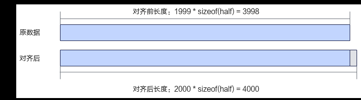
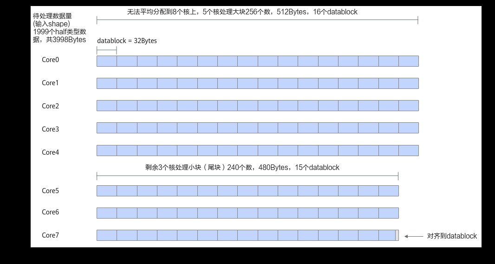

# 尾核Tiling

> **Section**: 3.3.2.4.4  
> **PDF Pages**: 438–439  

---

<!-- page 438 -->

```cpp
AscendC::LocalTensor<T> xLocal = inQueueX.AllocTensor<T>();
    AscendC::LocalTensor<T> yLocal = inQueueY.AllocTensor<T>();
    AscendC::DataCopy(xLocal, xGm[progress * this->tileLength], tileLength);
    AscendC::DataCopy(yLocal, yGm[progress * this->tileLength], tileLength);
    inQueueX.EnQue(xLocal);
    inQueueY.EnQue(yLocal);}
```

Compute函数实现代码如下：__aicore__ inline void Compute(int32_t progress, uint32_t tileLength){    AscendC::LocalTensor<T> xLocal = inQueueX.DeQue<T>();    AscendC::LocalTensor<T> yLocal = inQueueY.DeQue<T>();    AscendC::LocalTensor<T> zLocal = outQueueZ.AllocTensor<T>();    AscendC::Add(zLocal, xLocal, yLocal, tileLength);    outQueueZ.EnQue<T>(zLocal);    inQueueX.FreeTensor(xLocal);    inQueueY.FreeTensor(yLocal);}

CopyOut函数实现代码如下：__aicore__ inline void CopyOut(int32_t progress, uint32_t tileLength){    AscendC::LocalTensor<T> zLocal = outQueueZ.DeQue<T>();    AscendC::DataCopy(zGm[progress * this->tileLength], zLocal, tileLength);    outQueueZ.FreeTensor(zLocal);}

## 3.3.2.4.4 尾核Tiling

对于不同shape的输入进行数据切分时，可能会发生数据无法平均分配到多个核的情况。例如当算子的输入shape为[1, 1999]，使用核数为8，数据类型为half时，需要计算的数据总量为1 * 1999 * sizeof(half) = 3998字节，3998字节既不满足32字节对齐，也无法平均分配到8个核上。因此该场景下，对数据进行多核切分后，每个核的计算数据量不同。此种情况下，应该尽可能均匀的分配数据，所有核上的计算数据量有两种情况，将计算量较多的核称为整核，计算量较少的核称为尾核。

图3-15数据对齐示意图



## Tiling 实现

●因为AI处理器在进行数据搬运和Vector计算时，对于搬运的数据长度和UnifiedBuffer首地址都有必须32字节对齐的要求，首先待处理数据需要先保证向上对齐到32字节的大小。该场景下后续搬运和计算的处理细节请参考3.3.2.7 非对齐场景。如下代码片段展示了将数据对齐到datablock大小的示例：constexpr uint32_t SIZE_OF_HALF = 2;constexpr uint32_t BLOCK_SIZE = 32;constexpr uint32_t NUM_BLOCKS = 8;constexpr uint32_t ALIGN_NUM = BLOCK_SIZE / SIZE_OF_HALF;// shape需要对齐到的32字节，假设原totalLength为1999，向上满足32字节对齐后为2000uint32_t totalLengthAligned = (totalLength % ALIGN_NUM == 0U) ?

<!-- page 439 -->

```cpp
static_cast<uint32_t>(totalLength) :                      ((static_cast<uint32_t>(totalLength) + ALIGN_NUM - 1) / ALIGN_NUM) * ALIGN_NUM;
```

●满足32字节对齐后的数据，应尽可能的均分到每个核上。如果无法均分，那么先将可以均分的部分平均分配，剩余的部分分配给部分核，会有部分核多算一个datablock。为了保证切分后的数据仍是满足32字节对齐的，以ALIGN_NUM（ALIGN_NUM个数据为32字节）为粒度，将数据分配到所有核上。在本样例中，数据类型为half，ALIGN_NUM = BLOCK_SIZE / sizeof(half) = 16。将对齐后的数据总量按ALIGN_NUM为粒度分成x个数据块，x = 2000 / 16 = 125。

AI处理器的核数NUM_BLOCKS为8，无法将125个数据块均分到8个核上。按照以下步骤将数据块尽可能的均分到每个核上：

a.计算x / NUM_BLOCKS = 15；

b.计算x % NUM_BLOCKS = 5。

根据上述步骤得出，如果每个核上分配15个数据块，那么将有5个数据块剩余。将这5个剩余的数据块分配到5个核上，这样可以得到5个计算16个数据块的整核和3个计算15个数据块的尾核。下图展示了数据无法均分时多核切分的示例。

图3-16无法均分到每个核上的示例



基于上文，设计如下的算子Tiling结构体成员：

●formerNum：分配到数据量较多的核数，即整核的核数。

●tailNum：分配到数据量较少的核数，即尾核的核数。

●formerLength：整核计算的数据长度。

●tailLength：尾核计算的数据长度。

Tiling参数的计算代码如下：

constexpr uint32_t NUM_BLOCKS = 8;constexpr uint32_t SIZE_OF_HALF = 2;constexpr uint32_t BLOCK_SIZE = 32;// shape需要对齐到的最小单位constexpr uint32_t ALIGN_NUM = BLOCK_SIZE / SIZE_OF_HALF;...void GenerateTilingData(uint8_t* tilingBuf, uint32_t numBlocks){    // shape需要对齐到的datablock,假设原totalLength为1999，向上满足32字节对齐后为2000    uint32_t totalLengthAligned = (totalLength % ALIGN_NUM == 0U) ?                      static_cast<uint32_t>(totalLength) :
