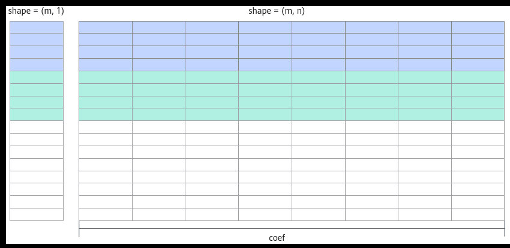

# Broadcast场景

> **Section**: 3.3.2.6  
> **PDF Pages**: 445–448  

---

<!-- page 445 -->

}    // 尾块进行计算, 不做DoubleBuffer操作    if (this->lastTileLength > 0U) {        CopyIn(loopCount, this->lastTileLength);        Compute(loopCount, this->lastTileLength);        CopyOut(loopCount, this->lastTileLength);    }}

## 3.3.2.6 Broadcast 场景

在某些场景下，可能会存在两个输入shape不相同的情况。由于Add接口只支持对shape相同的输入进行计算，因此需要先对输入进行shape变换，再进行Add计算。本节将对满足Broadcast条件的输入在算子实现中的Broadcast处理进行介绍，其他场景可以参考本章节中提供的思路。

须知

Broadcast机制通过扩展较小维度的数据，使得不同shape的输入能够进行运算，从而避免了显式的复制操作，提高了计算效率。数据进行Broadcast需满足：两个输入的维度个数相同，并且仅在某一个维度上的长度不同，某一个输入在此维度的长度为1。比如：shape为(32, 8) 和 (32, 1) 的两个输入可以进行Broadcast，因为它们都是二维，且第一个维度大小相等，而不相等的维度中第二个输入的维度为1，满足条件。

本节中将使用Broadcast接口，因此输入需满足该API相关约束。同时，由于硬件限制，该API的输入地址需满足32字节对齐。本节以输入维度为2、第二个轴（axis = 1）需要Broadcast为例进行说明。完整的样例代码请参见输入Broadcast的Add算子样例。

## Tiling 实现

与输入shape相同的场景相比，在Tiling结构体中增加相应的成员变量，表示是否需要对输入进行Broadcast、需要对哪个维度进行Broadcast、Broadcast的轴需要扩充的倍数。因此新增四个Tiling结构体成员：

●xLen和yLen：表示两个输入的数据长度。

●axis：表示对输入的哪个维度进行Broadcast。

●coef：表示Broadcast的输入需要扩维的倍数。例如，x shape为(m, 1)，y shape为(m, n)，则coef = n。如下图所示，图中相同颜色部分为单次计算的数据块。

<!-- page 446 -->

图3-18 axis=1 时coef 示意图



Tiling结构体定义代码如下所示：

```cpp
struct AddCustomTilingData {    uint32_t xLen;
    uint32_t yLen;
    uint32_t coef;
    uint32_t axis;    ...};
```

设需要进行Broadcast的输入长度为shorterAxisLen；不需要进行Broadcast的输入长度为totalLength。

constexpr uint32_t BLOCK_SIZE = 32;...  // 读入数据uint32_t totalLength = (xLen > yLen)? xLen : yLen;uint32_t shorterAxisLen = (xLen < yLen)? xLen : yLen;

使用shorterAxisLen进行分核计算，并使用分核后的长度与coef相乘作为totalLength的分核长度。constexpr uint32_t BLOCK_SIZE = 32;uint32_t alignCoef = (tiling->axis == 0U) ? shorterAxisLen : totalLength / shorterAxisLen;uint32_t divDimCoef = (tiling->axis == 0U) ? totalLength / shorterAxisLen : shorterAxisLen;if (divDimCoef % blockDim == 0U) {    uint32_t blockLength = divDimCoef / blockDim * alignCoef;        ...} else {    uint32_t formerNum = (divDimCoef / BUFFER_NUM) % blockDim;    uint32_t tailNum = blockDim - formerNum;

```cpp
uint32_t formerLength = ((divDimCoef / BUFFER_NUM) / blockDim + 1U) * BUFFER_NUM * alignCoef;
    uint32_t tailLength = ((divDimCoef / BUFFER_NUM) / blockDim) * BUFFER_NUM * alignCoef;    ....}
```

进行核内数据切分时，需要计算Unified Buffer数据块的数量向coef和BUFFER_NUM对齐之后的数量ubBlockAligned。uint32_t ubBlockAligned =        (MAX_AVAILABLE_UB_BLOCK_NUM * alignNum / (alignCoef * BUFFER_NUM) * (alignCoef * BUFFER_NUM) == 0U) ?            MAX_AVAILABLE_UB_BLOCK_NUM :            MAX_AVAILABLE_UB_BLOCK_NUM * alignNum / (alignCoef * BUFFER_NUM) * (alignCoef * BUFFER_NUM);...tileNum = length / ubBlockAligned;

<!-- page 447 -->

```cpp
if (length % ubBlockAligned == 0U || tileNum == 0U) {    if (tileNum == 0U) {        tileNum = 1U;    }    if (length < ubBlockAligned) {        tileLength = length;
        lastTileLength = tileLength;    } else {        tileLength = ubBlockAligned;
        lastTileLength = tileLength;    }} else {    tileNum++;
    tileLength = ubBlockNum;
    lastTileLength = (uint32_t)(length - (tileNum - 1) * tileLength);}
```

算子类实现

在核函数初始化阶段，根据Tiling结构体传入的参数确定对哪个输入进行Broadcast。由于针对输入的第二个轴（axis = 1）进行Broadcast，可以计算出，对于需要进行Broadcast的输入，每个核搬入数据长度为blockLength / coef。

初始化函数代码如下：

```cpp
__aicore__ inline void Init(GM_ADDR x, GM_ADDR y, GM_ADDR z, AddCustomTilingData tiling, AscendC::TPipe* pipeIn){    pipe = pipeIn;
    GM_ADDR longerInputPtr;
    GM_ADDR shorterInputPtr;
    if (tiling.xLen > tiling.yLen) {        longerInputPtr = x;
        shorterInputPtr = y;    } else {        longerInputPtr = y;
        shorterInputPtr = x;    }    this->coef = tiling.coef;
    if (tiling.isEvenCore) {        this->tileNum = tiling.tileNum;
        this->tileLength = tiling.tileLength / BUFFER_NUM;
        this->lastTileLength = tiling.lastTileLength;
        xGm.SetGlobalBuffer((__gm__ T*)longerInputPtr + tiling.blockLength * AscendC::GetBlockIdx(), tiling.blockLength);
        yGm.SetGlobalBuffer((__gm__ T*)shorterInputPtr + tiling.blockLength * AscendC::GetBlockIdx() / this->coef, tiling.blockLength / this->coef);
        zGm.SetGlobalBuffer((__gm__ T*)z + tiling.blockLength * AscendC::GetBlockIdx(), tiling.blockLength);    } else {        if (AscendC::GetBlockIdx() < tiling.formerNum) {            this->tileNum = tiling.formerTileNum;
            this->tileLength = tiling.formerTileLength / BUFFER_NUM;
            this->lastTileLength = tiling.formerLastTileLength;
            xGm.SetGlobalBuffer((__gm__ T*)longerInputPtr + tiling.formerLength * AscendC::GetBlockIdx(), tiling.formerLength);
            yGm.SetGlobalBuffer((__gm__ T*)shorterInputPtr + tiling.formerLength * AscendC::GetBlockIdx() / this->coef, tiling.formerLength / this->coef);
            zGm.SetGlobalBuffer((__gm__ T*)z + tiling.formerLength * AscendC::GetBlockIdx(), tiling.formerLength);        } else {            this->tileNum = tiling.tailTileNum;
            this->tileLength = tiling.tailTileLength / BUFFER_NUM;
            this->lastTileLength = tiling.tailLastTileLength;
            xGm.SetGlobalBuffer((__gm__ T*)longerInputPtr + tiling.formerLength * tiling.formerNum +                tiling.tailLength * (AscendC::GetBlockIdx() - tiling.formerNum), tiling.tailLength);
            yGm.SetGlobalBuffer((__gm__ T*)shorterInputPtr + tiling.formerLength * tiling.formerNum / this->coef +            tiling.tailLength * (AscendC::GetBlockIdx() - tiling.formerNum) / this->coef, tiling.tailLength / this-
```

<!-- page 448 -->

```cpp
>coef);
            zGm.SetGlobalBuffer((__gm__ T*)z + tiling.formerLength * tiling.formerNum +                tiling.tailLength * (AscendC::GetBlockIdx() - tiling.formerNum), tiling.tailLength);        }    }    pipe->InitBuffer(inQueueX, BUFFER_NUM, this->tileLength * sizeof(T));
    pipe->InitBuffer(inQueueY, BUFFER_NUM, this->coef * sizeof(T));
    pipe->InitBuffer(outQueueZ, BUFFER_NUM, this->tileLength * sizeof(T));
    pipe->InitBuffer(tmpBuf2, this->tileLength * sizeof(dataType));}
```

由于数据是向coef对齐的，在数据拷贝的过程中可能会出现地址不满足32字节对齐的场景，因此CopyIn函数、CopyOut函数中使用DataCopyPad进行数据拷贝。

CopyIn函数实现代码如下：

```cpp
__aicore__ inline void CopyIn(int32_t progress){    AscendC::LocalTensor<T> xLocal = inQueueX.AllocTensor<T>();
    AscendC::LocalTensor<T> yLocal = inQueueY.AllocTensor<T>();
    AscendC::DataCopyExtParams copyXParams = {1, (uint32_t)(this->tileLength * sizeof(T)), 0, 0, 0};
    AscendC::DataCopyExtParams copyYParams = {1, (uint32_t)(this->tileLength * sizeof(T) / this->coef), 0, 0, 0};
    AscendC::DataCopyPadExtParams<T> padParams = {false, 0, 0, 0};
    if (progress == (this->tileNum * BUFFER_NUM - 1)) {        AscendC::DataCopyPad<T>(xLocal, xGm[(progress - LAST_TWO_TILE) * this->tileLength + this->lastTileLength],            copyXParams, padParams);
        AscendC::DataCopyPad<T>(yLocal, yGm[((progress - LAST_TWO_TILE) * this->tileLength + this->lastTileLength) / this->coef],            copyYParams, padParams);    } else {        AscendC::DataCopyPad<T>(xLocal, xGm[progress * this->tileLength], copyXParams, padParams);
        AscendC::DataCopyPad<T>(yLocal, yGm[progress * this->tileLength / this->coef], copyYParams, padParams);    }    inQueueX.EnQue(xLocal);
    inQueueY.EnQue(yLocal);}
```

CopyOut函数实现代码如下：

```cpp
__aicore__ inline void CopyOut(int32_t progress){    AscendC::LocalTensor<T> zLocal = outQueueZ.DeQue<T>();
    AscendC::DataCopyExtParams copyParams = {1, (uint32_t)(this->tileLength * sizeof(T)), 0, 0, 0};
    if (progress == (this->tileNum * BUFFER_NUM - 1)) {        AscendC::DataCopyPad<T>(zGm[(progress - LAST_TWO_TILE) * this->tileLength + this->lastTileLength], zLocal, copyParams);    } else {        AscendC::DataCopyPad<T>(zGm[progress * this->tileLength], zLocal, copyParams);    }    outQueueZ.FreeTensor(zLocal);}
```

在Compute函数中，调用Add接口前需要先对输入进行Broadcast。这里需要计算Broadcast前后的shape。基于前文提到的数据关系，可以计算得出Broadcast前后的shape分别为{tileLength / broadcastCoef, 1}和{tileLength / broadcastCoef,broadcastCoef}。在此基础上对输入进行Broadcast，并将计算结果存入临时空间中，然后进行Add计算。实现代码示例如下所示：

```cpp
__aicore__ inline void Compute(int32_t progress){    AscendC::LocalTensor<T> xLocal = inQueueX.DeQue<T>();
    AscendC::LocalTensor<T> yLocal = inQueueY.DeQue<T>();
    AscendC::LocalTensor<T> zLocal = outQueueZ.AllocTensor<T>();
    AscendC::LocalTensor<T> broadcastTmpTensor = tmpBuf2.Get<T>();
    uint32_t dstShape[] = {this->tileLength / this->coef, this->coef};
```
