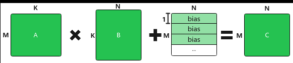
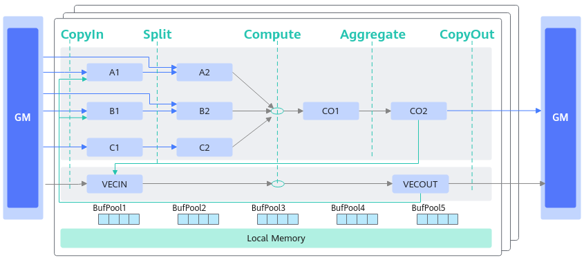
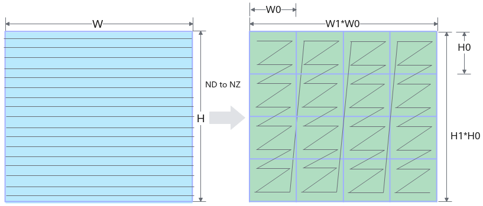
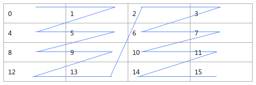
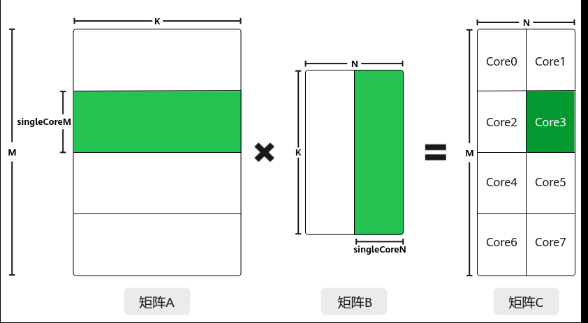

# 基础知识

> **Section**: 3.3.3.1  
> **PDF Pages**: 458–461  

---

<!-- page 458 -->

```cpp
uint64_t Mask0 = ((uint64_t)1 << BLOCK_ELEMENT_NUM) - 1; // mask mode controls only the first 4 elements do ReduceMin calculationuint64_t Mask[2] = {Mask0, 0};// main calculationfor (int i = 0;
 i < BLOCK_GROUP_NUM;
 i++) {    AscendC::ReduceMin<half>(outputLocal[i * BLOCKLEN_CEIL], inputLocal[i * BLOCKLEN_CEIL], workLocal, Mask, 1, 8, false);}outQueue.EnQue<half>(outputLocal);inQueue.FreeTensor(inputLocal);
```

计算后带冗余数据搬出的代码解释和样例二一致。

搬入时要保证32字节对齐，需要将输入的最后一行补齐到32字节对齐，防止访问非法数据；搬出时带冗余数据搬出，输出的最后一行也需要补齐到32字节对齐。main.cpp中对GM上输入输出的长度的定义如下：

```cpp
// copy in borrow the next (BLOCKLEN_CEIL - BLOCK_ELEMENT_NUM) elements of srcGMsize_t inputByteSize = 76 * sizeof(int16_t);// copy out atomic add extra (BLOCKLEN_CEIL - BLOCK_ELEMENT_NUM) zeros to dstGMsize_t outputByteSize = 76 * sizeof(int16_t);
```

## 3.3.3 矩阵编程（高阶API）

## 3.3.3.1 基础知识

说明

本节内容为使用高阶API进行矩阵乘法的编程指导。使用高阶API进行实际的矩阵编程时，需要通过API参考确认接口支持的产品型号。

矩阵乘法概述

Matmul的计算公式为：C = A * B + bias，其示意图如下。

●A、B为源操作数，A为左矩阵，形状为[M, K]；B为右矩阵，形状为[K, N]。

●C为目的操作数，存放矩阵乘结果的矩阵，形状为[M, N]。

●bias为矩阵乘偏置，形状为[1, N]。对A*B结果矩阵的每一行都采用该bias进行偏置。

图3-30 Matmul 矩阵乘示意图



矩阵乘法数据流

在了解矩阵乘法数据流之前，需要先回顾一下几个重要的存储逻辑位置的概念：

●搬入数据的存放位置：A1，用于存放整块A矩阵，可类比CPU多级缓存中的二级缓存；

●搬入数据的存放位置：B1，用于存放整块B矩阵，可类比CPU多级缓存中的二级缓存；

<!-- page 459 -->

●搬入数据的存放位置：C1，用于存放整块的矩阵乘偏置Bias矩阵，可类比CPU多级缓存中的二级缓存；

●搬入数据的存放位置：A2，用于存放切分后的小块A矩阵，可类比CPU多级缓存中的一级缓存；

●搬入数据的存放位置：B2，用于存放切分后的小块B矩阵，可类比CPU多级缓存中的一级缓存；

●搬入数据的存放位置：C2，用于存放切分后的小块矩阵乘偏置Bias矩阵，可类比CPU多级缓存中的一级缓存；

●结果数据的存放位置：CO1，用于存放小块结果C矩阵，可理解为Cube Out；

●结果数据的存放位置：CO2，用于存放整块结果C矩阵，可理解为Cube Out；

●搬入数据的存放位置：VECCALC，一般在计算需要临时变量时使用此位置。

矩阵乘法数据流指矩阵乘的输入输出在各存储位置间的流向。逻辑位置的数据流向如下图所示（为了简化描述，没有列出bias）：

●A矩阵从输入位置到A2的数据流如下（输入位置可以是GM或者VECOUT）：GM->A2，GM->A1->A2；VECOUT->A1->A2。

由于A1比A2的空间更大，数据从GM或VECOUT可以先搬入A1进行缓存，待该数据执行Cube计算前，数据直接从A1搬入A2，这样在搬运大量数据时可以减少计算前的等待时间，提升性能，只有在搬入数据较少的场景才可能使用GM->A2的数据流。

●B矩阵从输入位置到B2的数据流如下（输入位置可以是GM或者VECOUT）：GM->B2，GM->B1->B2；VECOUT->B1->B2。

由于B1比B2的空间更大，数据从GM或VECOUT可以先搬入B1进行缓存，待该数据执行Cube计算前，数据直接从B1搬入B2，这样在搬运大量数据时可以减少计算前的等待时间，提升性能，只有在搬入数据较少的场景才可能使用GM->B2的数据流。

●完成A2*B2=CO1计算。

●CO1数据汇聚到CO2：CO1->CO2。

●从CO2到输出位置（输出位置可以是GM或者VECIN）：CO2->GM/CO2->VECIN。



<!-- page 460 -->

数据格式

在完成Matmul矩阵乘法时，主要涉及到两种分形格式ND和NZ。其它的数据格式请参考数据排布格式。

●ND：普通格式，N维张量。

●NZ：为满足AI Core中Cube计算单元高性能计算的需要，引入该特殊格式。

ND –> NZ的变换过程为：

(..., N, H, W )->pad->(..., N, H1*H0, W1*W0)->reshape->(..., N, H1, H0, W1, W0)->transpose->(..., N, W1, H1, H0, W0)如下图所示（W，H）大小的矩阵被分为（H1*W1）个分形，按照列优先排布，形状如N字形；每个分形内部有（H0*W0）个元素，按照行优先排布，形状如z字形。所以这种数据格式称为NZ（大N小Z）格式。



下面我们再通过一个具体的例子来深入理解ND和NZ格式的数据排布区别。假设分形格式为2*2，如下图所示4*4的矩阵，ND（1，4，4）和NZ（1，2，2，2，2）格式存储的情况下，数据在内存中的排布格式分别为：

ND: 0, 1, 2, 3, 4, 5, 6, 7, 8, 9, 10, 11, 12, 13, 14, 15

NZ: 0, 1, 4, 5, 8, 9, 12, 13, 2, 3, 6, 7, 10, 11, 14, 15



关于矩阵ND到NZ格式转换的样例请参考Matmul输入矩阵ND到NZ格式转换的算子样例。

数据分块（Tiling）

●多核切分

为了实现多核并行，需要将矩阵数据进行切分，分配到不同的核上进行处理。切分策略如下图所示：

–对于A矩阵，沿着M轴进行切分，切分成多份的singleCoreM，单核上处理SingleCoreM * K大小的数据。

<!-- page 461 -->

–对于B矩阵，沿着N轴进行切分，切分成多份的singleCoreN，单核上处理K *SingleCoreN大小的数据。

–对于C矩阵，SingleCoreM * K大小的A矩阵和K * SingleCoreN大小的B矩阵相乘得到SingleCoreM * SingleCoreN大小的C矩阵，即为单核上输出的C矩阵大小。

比如，下图中共有8个核参与计算，将A矩阵沿着M轴划分为4块，将B矩阵沿着N轴切分为两块，单核上仅处理某一分块（比如图中绿色部分为core3上参与计算的数据）：SingleCoreM * K大小的A矩阵分块和SingleCoreN* K大小的B矩阵分块相乘得到SingleCoreM * SingleCoreN大小的C矩阵分块。



另外，单核上处理的K轴长度为SingleCoreK，对于K轴较大的场景，可以沿着K轴进行切分，切分成多份的singleCoreK，详细案例介绍请参考Matmul高阶API使能多核切K。

●核内切分

大多数情况下，Local Memory的存储，无法完整的容纳算子的输入与输出，需要每次搬运一部分输入进行计算然后搬出，再搬运下一部分输入进行计算，直到得到完整的最终结果，也就是需要做核内的输入切分。切分的策略如下所示：

–对于A矩阵，沿M轴进行切分，将singleCoreM切分成多份的baseM，切分成的份数对应图示的mIter；沿K轴进行切分，切分成多份的baseK。

–对于B矩阵，沿N轴进行切分，将singleCoreN切分成多份的baseN，切分成的份数对应图示的nIter；沿K轴进行切分，切分成多份的baseK。

–对于C矩阵，A矩阵中baseM*baseK大小的分块和B矩阵中baseK*baseN大小的分块相乘并累加，得到C矩阵中对应位置baseM*baseN大小的分块。比如，图中结果矩阵中的绿色矩阵块5是通过如下的累加过程得到的：a*a+b*b+c*c+d*d+e*e+f*f。
