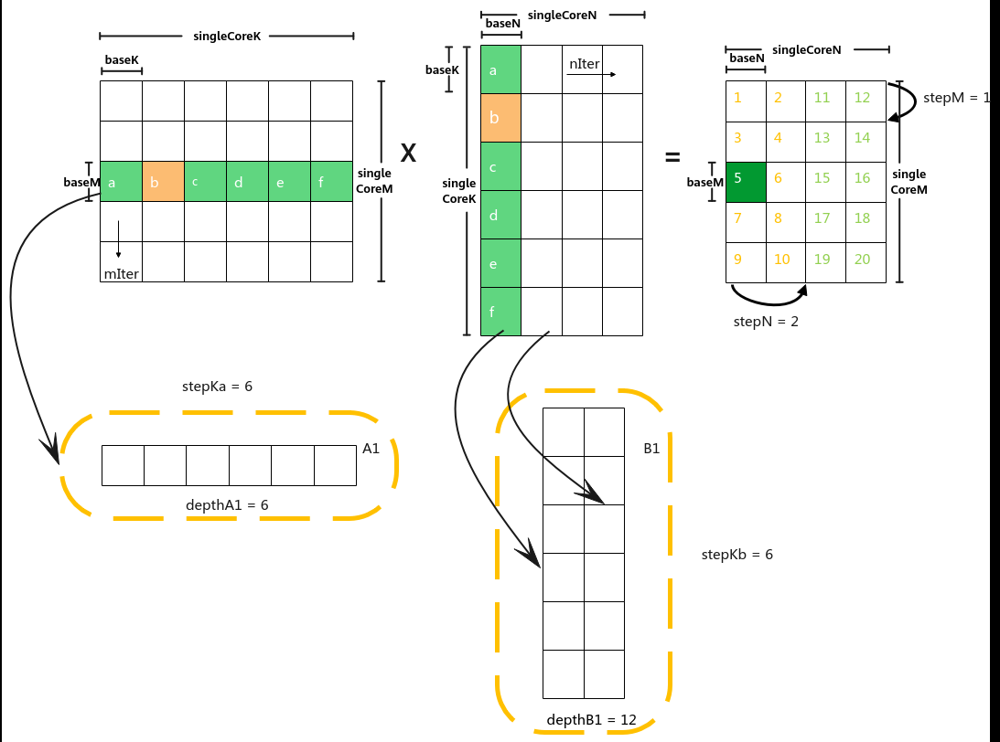
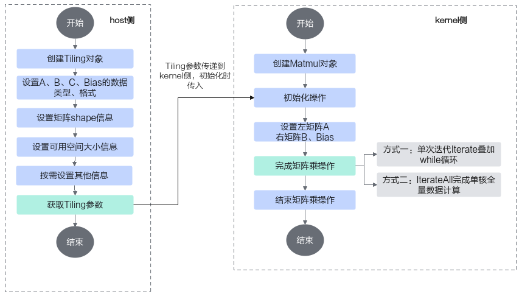
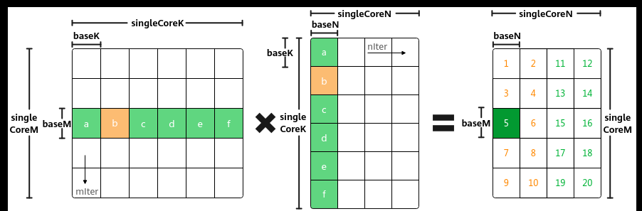
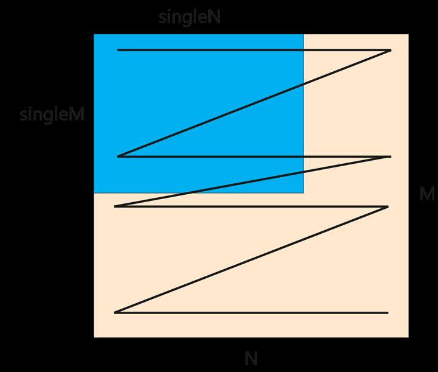

# 算子实现

> **Section**: 3.3.3.2  
> **PDF Pages**: 462–466  

---

<!-- page 462 -->



除了基本块形状baseM, baseN, baseK外，还有一些常用的tiling参数，其含义如下：

–iterateOrder：一次Iterate迭代计算出[baseM, baseN]大小的C矩阵分片。Iterate完成后，Matmul会自动偏移下一次Iterate输出的C矩阵位置，iterateOrder表示自动偏移的顺序。▪0代表先往M轴方向偏移再往N轴方向偏移；▪1代表先往N轴方向偏移再往M轴方向偏移。

在上图的示例中，iterateOrder取值为0。

–depthA1，depthB1：A1、B1上存储的矩阵片全载A2、B2的份数，A2、B2存储大小分别是baseM * baseK、baseN * baseK，即depthA1是A1矩阵切片含有baseM * baseK块的个数，depthB1是B1矩阵切片含有baseN * baseK块的个数。

–stepM，stepN：stepM为左矩阵在A1中缓存的buffer M方向上baseM的倍数，stepN为右矩阵在B1中缓存的buffer N方向上baseN的倍数。

–stepKa，stepKb：stepKa为左矩阵在A1中缓存的buffer K方向上baseK的倍数，stepKb为右矩阵在B1中缓存的buffer K方向上baseK的倍数。

## 3.3.3.2 算子实现

实现流程

上文介绍了Matmul矩阵乘的数据切分方案和数据流。Ascend C提供一组Matmul高阶API，封装了这些常用的切分和数据搬运、计算的算法逻辑，方便用户快速实现Matmul矩阵乘法的运算操作。开发者在host侧通过调用API自动获取Tiling参数，该参数传递到kernel侧后，在初始化操作时传入，通过几个简单的API即可完成矩阵乘操作。完整样例请参考LINK。

<!-- page 463 -->

图3-31矩阵编程流程示意图



host侧自动获取Tiling参数的关键步骤介绍如下：

步骤1创建Tiling对象。

```cpp
auto ascendcPlatform = platform_ascendc::PlatformAscendCManager::GetInstance();matmul_tiling::MultiCoreMatmulTiling tilingApi(*ascendcPlatform);
```

传入硬件平台信息创建PlatformAscendC对象，然后创建Tiling对象，硬件平台信息可以通过GetPlatformInfo获取。

步骤2设置参与Matmul运算的核数，A、B、Bias的内存逻辑位置、格式和数据类型。

```cpp
tilingApi.SetDim(ascendcPlatform->GetCoreNumAic());
  tilingApi.SetAType(AscendC::TPosition::GM, CubeFormat::ND, matmul_tiling::DataType::DT_FLOAT16);tilingApi.SetBType(AscendC::TPosition::GM, CubeFormat::ND, matmul_tiling::DataType::DT_FLOAT16);tilingApi.SetCType(AscendC::TPosition::GM, CubeFormat::ND, matmul_tiling::DataType::DT_FLOAT);tilingApi.SetBiasType(AscendC::TPosition::GM, CubeFormat::ND, matmul_tiling::DataType::DT_FLOAT);
```

步骤3设置矩阵shape信息。

tilingApi.SetShape(M, N, K);tilingApi.SetOrgShape(M, N, K); // 设置原始完整的形状M、N、K

步骤4设置可用空间大小信息。

设置Matmul计算时可用的L1 Buffer/L0C Buffer/Unified Buffer空间大小，-1表示AI处理器对应Buffer的大小。tilingApi.SetBufferSpace(-1, -1, -1);

步骤5按需设置其他参数，比如设置bias参与计算。

```cpp
tilingApi.EnableBias(true);
```

步骤6获取Tiling参数。

```cpp
int64_t res = tilingApi.GetTiling(tilingData);if (res == -1) {    std::cout << "gen tiling failed" << std::endl;}
```

步骤7Tiling参数的序列化保存等其他操作。

<!-- page 464 -->

```cpp
uint32_t tcubeTilingSize = tilingData.GetDataSize();tilingData.SaveToBuffer(tilingBuf, tcubeTilingSize);
```

**----结束**

kernel侧使用Matmul API矩阵乘运算的具体步骤如下：

步骤1创建Matmul对象

创建Matmul对象的示例如下：

●纯Cube模式（只有矩阵计算）场景下，建议在代码中定义ASCENDC_CUBE_ONLY宏，避免额外的性能开销。本节内容以纯Cube模式举例。

●默认为MIX模式（包含矩阵计算和矢量计算），该场景下通常不定义ASCENDC_CUBE_ONLY宏，如果在程序中使用了ASCENDC_CUBE_ONLY宏，则必须使用ASCEND_IS_AIC宏和ASCEND_IS_AIV宏将Cube计算和Vector计算隔离开，更多内容请参考3.3.5 融合算子编程。

// 纯Cube模式（只有矩阵计算）场景下，需要设置该代码宏，并且必须在#include "lib/matmul_intf.h"之前设置#define ASCENDC_CUBE_ONLY #include "lib/matmul_intf.h"typedef AscendC::MatmulType<AscendC::TPosition::GM, CubeFormat::ND, half> aType; typedef AscendC::MatmulType<AscendC::TPosition::GM, CubeFormat::ND, half> bType; typedef AscendC::MatmulType<AscendC::TPosition::GM, CubeFormat::ND, float> cType; typedef AscendC::MatmulType<AscendC::TPosition::GM, CubeFormat::ND, float> biasType; AscendC::Matmul<aType, bType, cType, biasType> mm;

创建对象时需要传入A、B、C、Bias的参数类型信息，类型信息通过MatmulType来定义，包括：内存逻辑位置、数据格式、数据类型。

步骤2初始化操作。

REGIST_MATMUL_OBJ(&pipe, GetSysWorkSpacePtr(), mm, &tiling); // 初始化

说明

Matmul高阶API内部实现时需要使用系统workspace（即对应本步骤中的GetSysWorkSpacePtr接口），开发者需要自行申请系统workspace的空间：

●在host侧Tiling实现时，设置总的workspace的数值大小（包含用户workspace和系统workspace），workspace空间由框架来申请并管理。系统workspace的空间大小通过6.4.2.1.13 GetLibApiWorkSpaceSize获取。size_t userWorkspaceSize = 0;size_t systemWorkspaceSize = static_cast<size_t>(ascendcPlatform.GetLibApiWorkSpaceSize());size_t *currentWorkspace = context->GetWorkspaceSizes(1);currentWorkspace[0] = userWorkspaceSize + systemWorkspaceSize;

●若算子工程不是自定义算子工程，也不是带有HAVE_WORKSPACE编译宏的Kernel直调算子工程，框架不会自动设置workspace，需要在kernel侧的Matmul初始化前，通过SetSysWorkSpace设置系统workspace。// 使用Matmul时必须设置workspace空间SetSysWorkspace(workspace);if (GetSysWorkSpacePtr() == nullptr) {    return;}

步骤3设置左矩阵A、右矩阵B、Bias。

mm.SetTensorA(gm_a);    // 设置左矩阵Amm.SetTensorB(gm_b);    // 设置右矩阵Bmm.SetBias(gm_bias);    // 设置Bias

步骤4完成矩阵乘操作。

●调用Iterate完成单次迭代计算，叠加while循环完成单核全量数据的计算。Iterate方式，可以自行控制迭代次数，完成所需数据量的计算，方式比较灵活。

<!-- page 465 -->

```cpp
while (mm.Iterate()) {       mm.GetTensorC(gm_c); }
```

●调用IterateAll完成单核上所有数据的计算。IterateAll方式，无需循环迭代，使用比较简单。mm.IterateAll(gm_c);

步骤5结束矩阵乘操作。

```cpp
mm.End();
```

**----结束**

设置Shape 信息

在实现Host Tiling时可以设置Shape信息，用于Tiling计算；kernel侧运行时也可以修改部分Shape信息，用于尾块设置、Matmul复用（多个Matmul计算复用一个Matmul对象）等场景。本节对涉及到的Shape概念进行介绍，并给出host侧和kernel侧设置Tiling信息的指导。

●orgShape：M、N、K

●singleCoreShape：singleCoreM、singleCoreN、singleCoreK

●singleShape：singleM、singleN、singleK

●baseShape：baseM、baseN、baseK

通过数据分块（Tiling）的介绍我们已经了解了orgShape(M、N、K)，singleCoreShape(singleCoreM、singleCoreN、singleCoreK)，baseShape(baseM、baseN、baseK)的概念，如下图所示：



除此之外，单核的Matmul Tiling时，实际参与Matmul计算的shape可以是原始shape中的一部分，singleM, singleN, singleK用于表达实际参与Matmul计算的shape，如下图所示。在单核的情况下，singleM, singleN, singleK会透传给singleCoreM,singleCoreN, singleCoreK。

<!-- page 466 -->



●Kernel运行时设置

–SetTail、SetSingleShape都是运行时修改singleCoreM、singleCoreN、singleCoreK，处理尾块时使用SetTail，Matmul复用（多个Matmul计算复用一个Matmul对象）的场景可以使用SetSingleShape重新设置。

–SetOrgShape是运行时修改M、N、K，Matmul复用的场景可以使用SetOrgShape重新设置。

●单核Tiling时设置

–SetOrgShape（必选）：设置M、N、K

–SetShape（非必选）：设置singleM、singleN、singleK，等同于设置singleCoreM、singleCoreN、singleCoreK

–SetFixSplit（非必选）：设置baseM、baseN、baseK

●多核Tiling时设置

–SetOrgShape（必选）：设置M、N、K

–SetShape（非必选）：设置singleM、singleN、singleK

–SetFixSplit（非必选）：设置baseM、baseN、baseK

–SetSingleShape(非必选)：设置singleCoreM、singleCoreN、singleCoreK

–SetSingleRange(非必选) ：设置singleCoreM、singleCoreN、singleCoreK的范围

设置format 格式

创建Matmul对象时需要传入A、B、C、Bias的参数类型信息，类型信息通过MatmulType来定义，包括：内存逻辑位置、数据格式、数据类型。示例如下：

```cpp
typedef AscendC::MatmulType<AscendC::TPosition::GM, CubeFormat::ND, half> aType;
 typedef AscendC::MatmulType<AscendC::TPosition::GM, CubeFormat::ND, half> bType;
```
