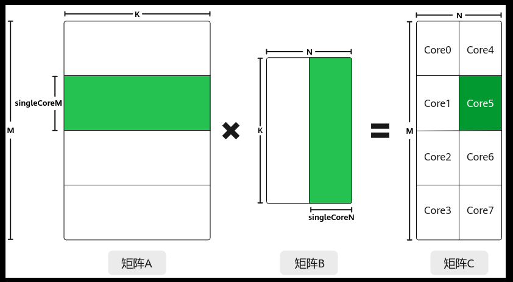
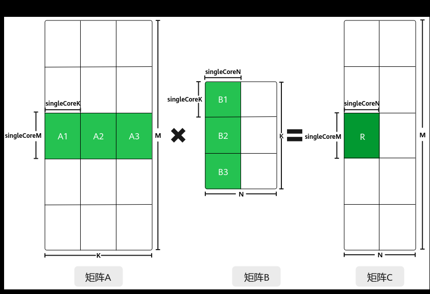

# 多核对齐切分

> **Section**: 3.3.3.3.2  
> **PDF Pages**: 468–469  

---

<!-- page 468 -->

特性描述功能简介

矩阵乘输出的N方向对齐

矩阵乘输出的N方向对齐，又称ND_ALIGN格式输出。指对数据格式为ND_ALIGN的输出C矩阵实现N方向32字节对齐的自动补齐及输出。

单次矩阵乘局部输出，又称Partial Output，指矩阵乘计算时不对单核K方向的计算结果做累加，直接输出计算结果。

单次矩阵乘局部输出

**AIC和AIV独立运行机制**

AIC和AIV独立运行机制，又称双主模式。MIX场景（包含矩阵计算和矢量计算）下AIC核和AIV核独立运行代码，不依赖消息驱动。

**MxMatmul场景带有量化系数的矩阵乘法，即左矩阵和右矩阵均有对应的量化系数矩阵，对左矩阵和右矩阵分别量化后再做矩阵乘计算。**

表3-5 BatchMatmu 功能l 特性表

特性描述功能简介

**Batch Matmul基础功能**

Batch Matmul基础功能，支持批量处理Matmul，调用一次IterateBatch接口，计算出多个singleCoreM * singleCoreN大小的C矩阵。

**Batch Matmul复用Bias矩阵**

每个Batch的Matmul计算复用同一个不带Batch轴的Bias矩阵。

## 3.3.3.3.2 多核对齐切分

功能介绍

为了实现多核并行，提升计算效率，需要将矩阵数据进行切分，分配到不同的核上进行处理。主要的切分策略有切分K轴和不切分K轴两种。

不切分K轴、仅切分M、N轴的策略如下：

●对于A矩阵，沿着M轴进行切分，切分成多份的singleCoreM，单核上处理SingleCoreM * K大小的数据。

●对于B矩阵，沿着N轴进行切分，切分成多份的singleCoreN，单核上处理K *SingleCoreN大小的数据。

●对于C矩阵，SingleCoreM * K大小的A矩阵和K * SingleCoreN大小的B矩阵相乘得到SingleCoreM * SingleCoreN大小的C矩阵，即为单核上输出的C矩阵大小。

比如，下图中共有8个核参与计算，将A矩阵沿着M轴划分为4块，将B矩阵沿着N轴切分为两块，单核上仅处理某一分块（比如图中绿色部分为core5上参与计算的数据）：SingleCoreM * K大小的A矩阵分块和SingleCoreN * K大小的B矩阵分块相乘得到SingleCoreM * SingleCoreN大小的C矩阵分块。

<!-- page 469 -->

切分M、N、K轴的策略如下图所示：

●对于A矩阵，沿着M轴进行切分，切分成多份的singleCoreM，沿着K轴切分，切分成多份的singleCoreK，单核上处理singleCoreM * singleCoreK大小的数据。

●对于B矩阵，沿着K轴进行切分，切分成多份的singleCoreK，沿着N轴进行切分，切分成多份的singleCoreN，单核上处理singleCoreK * singleCoreN大小的数据。

●对于C矩阵，singleCoreM * singleCoreK大小的A矩阵与singleCoreK *singleCoreN大小的B矩阵相乘并累加得到singleCoreM * singleCoreN大小的C矩阵分块。

比如下图中，C矩阵中的R矩阵块，是通过A1*B1+A2*B2+A3*B3累加得到的，其中，A1*B1、A2*B2、A3*B3可在多个核上并行计算。

