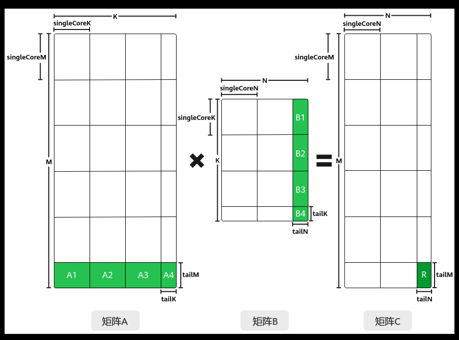

# 多核非对齐切分

> **Section**: 3.3.3.3.3  
> **PDF Pages**: 470–471  

---

<!-- page 470 -->

上述的切分策略会在Tiling参数中体现，比如SingleCoreM、SingleCoreN、SingleCoreK，开发者在host侧通过调用API自动获取Tiling参数，与单核场景的不同的是，多核Tiling需要使用MultiCoreMatmulTiling构造多核Tiling对象，并通过SetDim接口设置Matmul计算所用的核数。注意：这里设置的核数为Matmul计算可用的核数，仅在多核场景下设置，用于计算tiling参数；SetBlockDim为整个算子计算所用核数，是实际会加载的核数，是必须设置的。SetBlockDim的设置规则请参考numBlocks的说明。SetDim的设置规则如下：

●纯Cube模式（只有矩阵计算）场景，本节内容以纯Cube模式举例。

**SetDim设置当前AI处理器可用的核数，通过Tiling计算得到执行Matmul计算实际使用的核数，实际使用的核数小于等于AI处理器可用的核数。SetBlockDim按照实际使用的核数由用户进行配置。**

●MIX模式（包含矩阵计算和矢量计算）的设置规则请参考MIX场景核数设置规则。

使用场景

多核处理Matmul矩阵计算场景。

约束说明

无

调用示例

该场景的关键代码示例如下。Matmul多核对齐场景的完整样例请参考：多核切M、N的样例：Matmul多核Kernel直调样例；多核切K的样例：多核切K场景的算子样例。

// 构造多核Tiling对象auto ascendcPlatform = platform_ascendc::PlatformAscendCManager::GetInstance(socVersion);matmul_tiling::MultiCoreMatmulTiling cubeTiling(*ascendcPlatform);// 仅包含Cube计算的算子，设置可参与矩阵乘运算的核数为当前AI处理器上的Cube核数cubeTiling.SetDim(ascendcPlatform.GetCoreNumAic());cubeTiling.SetAType(matmul_tiling::TPosition::GM, matmul_tiling::CubeFormat::ND, matmul_tiling::DataType::DT_FLOAT16);cubeTiling.SetBType(matmul_tiling::TPosition::GM, matmul_tiling::CubeFormat::ND, matmul_tiling::DataType::DT_FLOAT16);cubeTiling.SetCType(matmul_tiling::TPosition::GM, matmul_tiling::CubeFormat::ND, matmul_tiling::DataType::DT_FLOAT);cubeTiling.SetBiasType(matmul_tiling::TPosition::GM, matmul_tiling::CubeFormat::ND, matmul_tiling::DataType::DT_FLOAT);cubeTiling.SetOrgShape(M, N, K);cubeTiling.SetShape(M, N, K);cubeTiling.EnableBias(isBias);optiling::TCubeTiling tilingData;  // 获取Tiling参数int ret = cubeTiling.GetTiling(tilingData);    // if ret = -1, gen tiling failed

## 3.3.3.3.3 多核非对齐切分

功能介绍

多核场景，对矩阵进行切分时，若M、N、K无法整除singleCoreM 、singleCoreN、singleCoreK时，就会出现尾块，即多核非对齐场景。如下图矩阵A、B的最后一行和最后一列的矩阵块：

<!-- page 471 -->

此时，C矩阵中的R矩阵块，依然是通过A1*B1+A2*B2+A3*B3+A4*B4累加得到的，处理A1*B1、A2*B2、A3*B3、A4*B4等尾块时，需在kernel侧设置尾块大小，在不改变原有tiling的情况下，调用SetTail接口重新设置本次计算的singleCoreM/singleCoreN/singleCoreK，在处理尾块的时候按照设置的值也就是tailM/tailN/tailK进行搬运和计算。

使用场景

多核处理Matmul矩阵计算，存在尾块的场景。

约束说明

处理尾块调用的SetTail接口，需要在Iterate/IterateAll之前调用。

调用示例

Matmul多核非对齐场景的完整样例请参考Matmul多核非对齐切分算子样例。该场景的关键代码示例如下。

// 处理尾块int tailM = tiling.M - mCoreIndex * tiling.singleCoreM;tailM = tailM < tiling.singleCoreM ? tailM : tiling.singleCoreM;int tailN = tiling.N - nCoreIndex * tiling.singleCoreN;tailN = tailN < tiling.singleCoreN ? tailN : tiling.singleCoreN;// 当tailM < singleCoreM 或 tailN < singleCoreN时被认为需要处理尾块，此时可以调用SetTail接口进行设置if (tailM < tiling.singleCoreM || tailN < tiling.singleCoreN) {    matmulObj.SetTail(tailM, tailN);}

