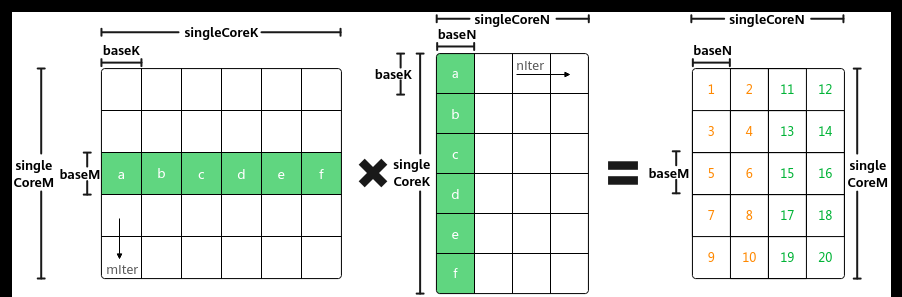

# 异步场景处理

> **Section**: 3.3.3.3.4  
> **PDF Pages**: 472–472  

---

<!-- page 472 -->

## 3.3.3.3.4 异步场景处理

功能介绍

Matmul的Iterate和IterateAll接口在MIX场景（包含矩阵计算和矢量计算）下提供了同步和异步两种模式，纯Cube场景（只有矩阵计算）下，只支持同步模式。

同步模式指的是程序执行时，需要等待某个操作完成后才能继续执行下一步操作。异步模式指的是程序执行时，不需要等待某个操作完成就可以继续执行下一步操作。

●Iterate&GetTensorC的同步和异步

–同步：执行完一次Iterate迭代计算后，执行GetTensorC搬运矩阵C分片，搬运完成后，才能进行下一次计算。如下图所示，C矩阵中，矩阵块1搬走后，才能计算矩阵块2，矩阵块2搬运完成后，才能计算矩阵块3。

Iterate&GetTensorC同步模式的关键代码示例如下：

while (mm.Iterate()) {    mm.GetTensorC(gm_c);}–异步：通过设置Iterate接口的模板参数开启异步模式。调用Iterate后，无需立即调用GetTensorC同步等待矩阵C分块搬运完成，可以先执行其它操作，待需要获取结果时再调用GetTensorC。异步模式可以减少同步等待，提高并行度，开发者对计算性能要求较高时，可以选用该方式。异步场景时，需要使用一块临时空间来缓存Iterate计算结果，否则会覆盖计算结果，调用GetTensorC时会在该临时空间中获取C的矩阵分片。临时空间通过SetWorkspace接口进行设置。SetWorkspace接口需要在Iterate接口之前调用。

Iterate&GetTensorC异步模式的关键代码示例如下：mm.SetWorkspace(workspace, size); // 其中，workspace为临时空间的物理地址，size为singleCoreM * singleCoreN的矩阵C大小// 异步模式mm.template Iterate<false>();…… // 执行其他操作auto mIter = Ceil(singleCoreM, baseM);auto nIter = Ceil(singleCoreN, baseN);for (int i = 0; i < mIter * nIter ; ++i) {    mm.GetTensorC<false> (gm_c);}

●IterateAll的同步和异步

–同步：后续操作需要同步等待IterateAll执行结束。

IterateAll同步模式的关键代码示例如下：

mm.SetTensorA(gm_a);    // 设置左矩阵Amm.SetTensorB(gm_b);    // 设置右矩阵Bmm.SetBias(gm_bias);    // 设置Biasmm.IterateAll(gm_c);// 后续操作...
