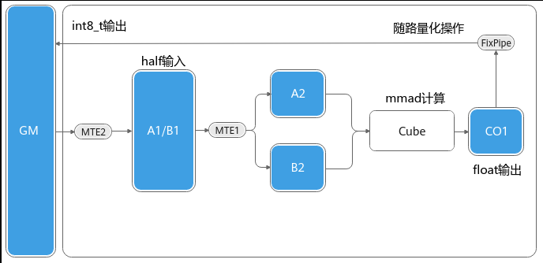
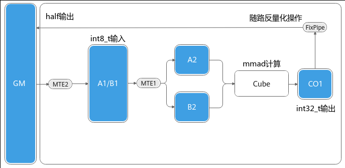

# 矩阵乘输出的量化/反量化

> **Section**: 3.3.3.3.5  
> **PDF Pages**: 473–476  

---

<!-- page 473 -->

–异步：后续操作不需要同步等待IterateAll执行结束，需要IterateAll的结果时，调用WaitIterateAll等待IterateAll异步接口返回。

IterateAll异步模式的关键代码示例如下：AscendC::Matmul<aType, bType, cType, biasType> mm;mm.SetTensorA(queryGm[tensorACoreOffset]);mm.SetTensorB(keyGm[tensorBCoreOffset + sInnerStart * singleProcessSInnerSize *      tilingData->attentionScoreOffsetStrideParams.matmulHead], true);mm.SetTail(singleProcessSOuterSize, mmNNum);mm.template IterateAll<false>(workspaceGm[tmp_block_idx * mmResUbSize * sInnerLoopTimes],0, false,true);// 执行其他操作mm.WaitIterateAll(); // 等待IterateAll完成DataCopy(dstUB, GM);  // 进行GM到UB的拷贝

使用场景

●Iterate&GetTensorC的同步：MIX场景（包含矩阵计算和矢量计算）、纯Cube场景（只有矩阵计算）。

●Iterate&GetTensorC的异步：仅MIX场景（包含矩阵计算和矢量计算）。

●IterateAll的同步：MIX场景（包含矩阵计算和矢量计算）、纯Cube场景（只有矩阵计算）。

●IterateAll的异步：仅MIX场景（包含矩阵计算和矢量计算）。

约束说明

●Iterate&GetTensorC的异步场景：

–传入的C矩阵地址空间大小需要保证不小于baseM * baseN。

–SetWorkspace接口需要在Iterate接口之前调用。

–支持只输出到VECIN、只输出到Global Memory，同时输出到GlobalMemory和VECIN三种输出方式。

–取出C矩阵到VECIN时，数据格式仅支持NZ；取出C矩阵到GM时，数据格式支持ND或NZ。

●IterateAll的异步场景：

–传入的C矩阵地址空间大小需要保证不小于singleCoreM * singleCoreN。

–仅支持连续输出至Global Memory。

调用示例

●Iterate&GetTensorC的异步场景的完整样例请参考异步场景样例、Iterate异步场景样例。

●IterateAll的异步场景的完整样例请参考IterateAll异步场景样例。

## 3.3.3.3.5 矩阵乘输出的量化/反量化

功能介绍

对于特定输入输出数据类型，Matmul支持将计算结果从CO1搬出到Global Memory时，对输出C矩阵元素执行数据量化或反量化操作。

●Matmul量化场景：Matmul计算时左矩阵A、右矩阵B为half或bfloat16_t数据类型，输出C矩阵为int8_t数据类型。该场景下，C矩阵的数据从CO1搬出到GlobalMemory时，会执行量化操作，将最终结果量化为int8_t类型，如下图所示。

<!-- page 474 -->

图3-32 Matmul 量化场景示意图

●Matmul反量化场景：Matmul计算时左矩阵A、右矩阵B为int8_t或int4b_t数据类型，输出C矩阵为half数据类型，或者左矩阵A、右矩阵B为int8_t数据类型，输出C矩阵为int8_t数据类型。该场景下，C矩阵的数据从CO1搬出到Global Memory时，会执行反量化操作，将最终结果反量化为对应的half类型或int8_t类型，如下图所示。

图3-33 Matmul 反量化场景示意图

Matmul量化/反量化包含两种模式：同一系数的量化/反量化模式、向量的量化/反量化模式，开发者在算子Tiling侧调用SetDequantType接口设置量化或反量化模式，这两种模式的具体区别为：

●同一系数的量化/反量化模式（PER_TENSOR模式）：整个C矩阵对应一个量化参数，量化参数的shape为[1]。开发者在算子Kernel侧调用接口SetQuantScalar设置量化参数。

●向量的量化/反量化模式（PER_CHANNEL模式）：C矩阵的shape为[m, n]，每个channel维度即C矩阵的每一列，对应一个量化参数，量化参数的shape为[n]。开发者在算子Kernel侧调用接口SetQuantVector设置量化参数。

<!-- page 475 -->

表3-6量化/反量化模式对应的接口配置

模式Tiling侧接口Kernel侧接口

SetDequantType(DequantType::SCALAR)

SetQuantScalar(gmScalar)

同一系数的量化/反量化

向量的量化/反量化

SetDequantType(DequantType::TENSOR)

SetQuantVector(gmTensor)

使用场景

需要对矩阵计算结果进行量化/反量化操作的场景，当前该场景下，Matmul输入输出矩阵支持的数据类型如下表所示。

表3-7 Matmul 量化/反量化支持的数据类型

**A矩阵B矩阵C矩阵支持平台**

halfhalfint8_tAtlas 350 加速卡

Atlas A3 训练系列产品/Atlas A3推理系列产品

Atlas A2 训练系列产品/Atlas A2推理系列产品

bfloat16_tbfloat16_tint8_tAtlas 350 加速卡

Atlas A3 训练系列产品/Atlas A3推理系列产品

Atlas A2 训练系列产品/Atlas A2推理系列产品

int8_tint8_thalfAtlas 350 加速卡

Atlas A3 训练系列产品/Atlas A3推理系列产品

Atlas A2 训练系列产品/Atlas A2推理系列产品

int4b_tint4b_thalfAtlas A3 训练系列产品/Atlas A3推理系列产品

Atlas A2 训练系列产品/Atlas A2推理系列产品

int8_tint8_tint8_tAtlas 350 加速卡

Atlas A3 训练系列产品/Atlas A3推理系列产品

Atlas A2 训练系列产品/Atlas A2推理系列产品

int8_tint8_tbfloat16_tAtlas 350 加速卡

<!-- page 476 -->

**A矩阵B矩阵C矩阵支持平台**

Atlas 350 加速卡

fp8_e4m3fn_t/fp8_e5m2_t

fp8_e4m3fn_t/fp8_e5m2_t

fp8_e4m3fn_t/half/bfloat16_t/float

Atlas 350 加速卡

hifloat8_thifloat8_thifloat8_t/half/bfloat16_t/float

注意：

输出为hifloat8_t时，采用Half toAway Round方式量化。

量化场景的输出为float类型时，该量化模式精度无法达到双万分之一，可以达到双千分之一。如果有双万分之一的精度要求，建议使用AscendDeQuant高阶API。

约束说明

●SetQuantScalar和SetQuantVector接口必须在Iterate或者IterateAll接口前调用。

●在Kernel侧与Tiling侧设置的量化/反量化模式需要保持一致：

–Kernel侧调用SetQuantScalar接口设置同一系数的量化/反量化模式，对应Tiling侧调用SetDequantType接口配置模式为DequantType::SCALAR。

–Kernel侧调用SetQuantVector接口设置向量的量化/反量化模式，对应Tiling侧调用SetDequantType接口配置模式为DequantType::TENSOR。

●当A、B矩阵为int8_t或int4b_t类型，C矩阵为half时，本节特性的输出结果不支持INF_NAN模式。若结果需要以INF_NAN输出，建议在调用Matmul API时将结果输出到TPosition::VECIN，同时将输出的数据类型设置为int32_t，再基于AIV核使用高阶API AscendDequant将该结果反量化为half类型。

调用示例

完整的算子样例请参考matmul_quant样例。

●Tiling实现

调用SetDequantType接口设置量化或反量化模式，其他实现内容与基础场景相同。auto ascendcPlatform = platform_ascendc::PlatformAscendC(context->GetPlatformInfo());matmul_tiling::MatmulApiTiling tiling(ascendcPlatform); tiling.SetAType(matmul_tiling::TPosition::GM, matmul_tiling::CubeFormat::ND, matmul_tiling::DataType::DT_INT8);tiling.SetBType(matmul_tiling::TPosition::GM, matmul_tiling::CubeFormat::ND, matmul_tiling::DataType::DT_INT8);   tiling.SetCType(matmul_tiling::TPosition::GM, matmul_tiling::CubeFormat::ND, matmul_tiling::DataType::DT_FLOAT16);   tiling.SetBiasType(matmul_tiling::TPosition::GM, matmul_tiling::CubeFormat::ND, matmul_tiling::DataType::DT_INT32);   tiling.SetShape(M, N, K);   tiling.SetOrgShape(M, N, K);  tiling.EnableBias(true);tiling.SetDequantType(DequantType::SCALAR);  // 设置同一系数的量化/反量化模式
