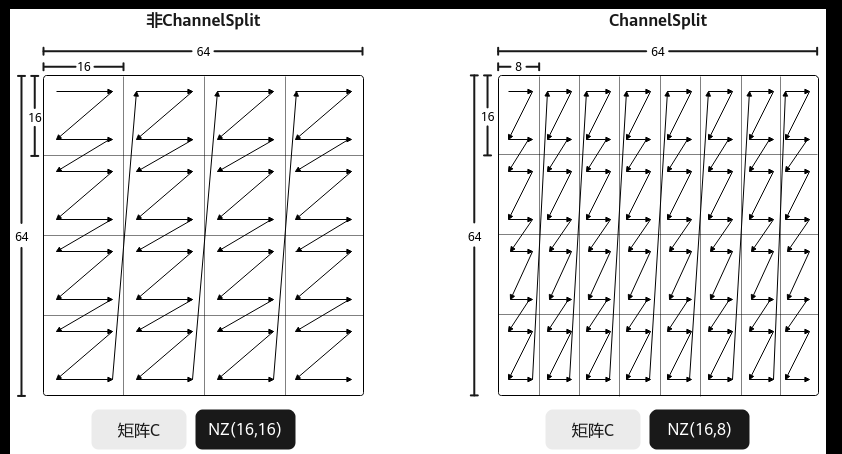

# 矩阵乘输出的Channel拆分

> **Section**: 3.3.3.3.6  
> **PDF Pages**: 477–478  

---

<!-- page 477 -->

// tiling.SetDequantType(DequantType::TENSOR);  // 设置向量的量化/反量化模式... // 执行其他配置

●Kernel实现

根据具体量化模式场景，调用SetQuantScalar或SetQuantVector接口设置量化参数。其他实现内容与基础场景相同。

–同一系数的量化/反量化模式REGIST_MATMUL_OBJ(&pipe, GetSysWorkSpacePtr(), mm, &tiling);float tmp = 0.1;  // 输出gm时会乘以0.1uint64_t ans = static_cast<uint64_t>(*reinterpret_cast<int32_t*>(&tmp)); // 浮点值量化系数转换为uint64_t类型进行设置mm.SetQuantScalar(ans);mm.SetTensorA(gm_a);mm.SetTensorB(gm_b);mm.SetBias(gm_bias);mm.IterateAll(gm_c);

–向量的量化/反量化模式GlobalTensor gmQuant;...REGIST_MATMUL_OBJ(&pipe, GetSysWorkSpacePtr(), mm, &tiling);mm.SetQuantVector(gmQuant);mm.SetTensorA(gm_a);mm.SetTensorB(gm_b);mm.SetBias(gm_bias);mm.IterateAll(gm_c);

## 3.3.3.3.6 矩阵乘输出的Channel 拆分

功能介绍

矩阵乘输出的Channel拆分，又称ChannelSplit。指当Matmul计算结果C矩阵的格式为NZ时，C矩阵采用分形存储，关于NZ格式的详细内容请参考数据格式。当C矩阵的物理排布格式为NZ、数据类型为float时，默认情况下，每个分形内部包含16*16个元素，即分形的大小为16*16。ChannelSplit的功能为将此场景下C矩阵的每个16*16的分形切分为16*8的分形，使得C矩阵按照16*8的分形进行存储。

由于1个float类型数据的大小为4字节，16*8的分形在内轴满足32字节对齐，内轴上的数据量与一条NPU矢量计算指令处理的数据单元一致，这便于后续的其它计算。ChannelSplit功能默认不启用，用户需通过设置MatmulConfig中的isEnableChannelSplit参数为true来开启此功能。

<!-- page 478 -->

图3-34 ChannelSplit 功能示意图

使用场景

对于NZ格式、float类型的C矩阵，需要按16*8的分形存储时，使用该功能。

约束说明

开启ChannelSplit功能需满足：

●C矩阵的数据排布格式为CubeFormat::NZ。

●C矩阵的数据类型为float。

●C矩阵的内存逻辑位置为Global Memory。

●矩阵乘结果CO1数据类型为float。

调用示例

完整的算子样例请参考matmul_channelsplit算子样例。

// 指定获取和修改的MatmulConfig模板constexpr static MatmulConfigMode configMode = MatmulConfigMode::CONFIG_NORM;// 修改模板参数isEnableChannelSplit=true，开启该MatmulConfig模板的ChannelSplit功能constexpr static MatmulFuncParams funcParamsChannelSplit{    false, false, false, false, 0, IterateOrder::ORDER_M, ScheduleType::INNER_PRODUCT, true, false, false, false, true/*isEnableChannelSplit*/};constexpr static MatmulConfig MM_CFG = GetMMConfig<configMode>(funcParamsChannelSplit);Matmul<A_TYPE, B_TYPE, C_TYPE, BIAS_TYPE, MM_CFG> mm;

// 常规Matmul计算，最后输出分形为16*8REGIST_MATMUL_OBJ(&pipe, GetSysWorkSpacePtr(), mm);mm.SetTensorA(gm_a);mm.SetTensorB(gm_b);mm.SetBias(gm_bias);mm.IterateAll(gm_c);
